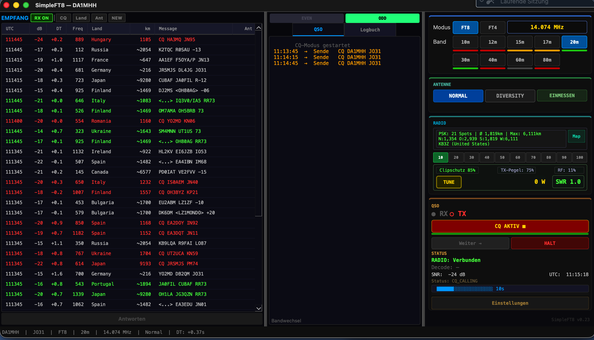
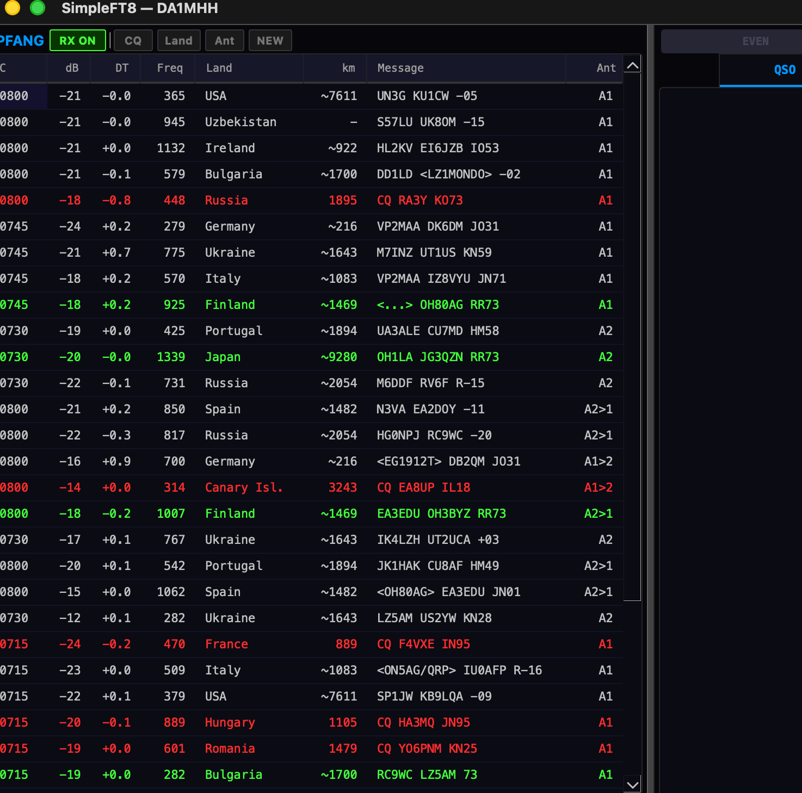

# SimpleFT8 — The Autonomous FT8/FT4/FT2 Client for FlexRadio

[English](#english) | [Deutsch](#deutsch)

[](https://opensource.org/licenses/MIT)
[](https://www.python.org/downloads/)
[](https://www.apple.com/macos/)
[](https://www.physics.princeton.edu/pulsar/k1jt/wsjtx.html)
[]()

> **No more manual ALC babysitting, no missed replies, no guessing the best antenna or frequency.**
> SimpleFT8 automates your entire FT8/FT4/FT2 workflow with closed-loop power control, dual-mode diversity scoring, automatic CQ frequency optimization, and intelligent caller queuing.

> **Every feature explained in detail:** How does it work? Why? Pros/Cons? Physics + formulas.
> German + English → **[docs/explained/](docs/explained/)** (5 features × 2 languages = 10 documents)
> In-app help: Press **?** in the status bar for built-in feature documentation with language switcher.

> **Optimize yes — Automate no.** SimpleFT8 is an operator-in-the-loop tool. All automated features — dead man's switch (15 min), semi-automatic CQ mode, manual hunt mode — ensure the operator retains final control. This reflects our commitment to responsible amateur radio software and regulatory compliance.

---

<a name="english"></a>
## English

### Why SimpleFT8 vs. WSJT-X?

| Feature | WSJT‑X / JS8Call | SimpleFT8 |
|:---|:---|:---|
| **Modes** | FT8 + FT4 | **FT8 + FT4 + FT2** (Decodium-compatible) |
| **TX Power Control** | Manual ALC monitoring | **Automatic closed‑loop** FWDPWR feedback |
| **Antenna Selection** | Manual switching | **Dual-mode Diversity** (Standard + DX scoring) |
| **CQ Frequency** | Manual waterfall scan | **Smart CQ** in 800–2000 Hz sweet spot |
| **Simultaneous Callers** | Second station ignored | **Queued & answered** (Grid + Report accepted) |
| **SmartSDR Required** | Yes (most clients) | **No — direct VITA‑49 + TCP** standalone |
| **Time Correction** | External NTP only | **DT auto-correction** per mode, stored & loaded |
| **RX Filter** | Manual | **Auto-switching** per mode (3100/4000 Hz) |

### Key Innovations

- **FT2 Mode** — Native Decodium-compatible FT2 decoder/encoder (3.8s cycles, 4-GFSK, 288 sps). Community frequencies pre-configured. QSOs successfully completed. Automatic RX filter widening to 4000 Hz.

- **DT Time Correction v2** — Cumulative correction from band consensus. 2-cycle measurement, 10-cycle operation, 70% damping. **Per-mode persistence**: correction values stored in `~/.simpleft8/dt_corrections.json` — instant good correction on mode switch. DT values typically ±0.1s after convergence.

- **Dual-Mode Diversity** — Two scoring strategies selectable at startup:
  - **Standard**: Counts total decoded stations — best for CQ operation (maximize QSOs)
  - **DX**: Counts weak stations (SNR < -10 dB) — best for DX hunting (Australia at -24 dB counts, local at +12 dB doesn't)
  - 8% threshold, median over 4 cycles, 70:30 or 50:50 ratio. Button shows "DIVERSITY DX" when in DX mode.

- **Auto TX Power Regulation** — Set target wattage, SimpleFT8 reads actual FWDPWR and adjusts proportionally. No overdrive, no weak signals after band change.

- **Smart CQ Frequency** — After diversity calibration, finds a free slot in the **800–2000 Hz sweet spot** (where most stations listen) instead of the empty upper range.

- **Caller Waitlist** — When multiple stations reply to CQ simultaneously, they are queued. Accepts both Grid and Report messages. After current QSO: auto-responds to next in queue.

- **RR73 Courtesy Repeat** — After QSO complete, if the other station keeps sending R-Report (didn't receive our RR73), we resend RR73 automatically (max 2×).

- **Even/Odd Slot Display** — [E]/[O] tags in both RX list and QSO panel. Immediately visible which slot each station uses and which slot we transmit in.

### Real-World Performance

Controlled test on 40m, same hardware (FLEX-8400M), 2 minutes apart:

| Metric | SimpleFT8 Normal | SimpleFT8 Diversity |
|--------|:---:|:---:|
| Stations decoded (good conditions) | 27 | **37 (+37%)** |
| Stations decoded (poor conditions, 4 min) | 9 | **13 (+44%)** |
| PSKReporter Spots (TX, 15 min) | — | **190** |
| Farthest RX | — | Kiribati ~13,000 km |
| Farthest TX | — | Indonesia 11,996 km |

### Screenshots

**CQ mode with DT correction, Propagation bars, Operator Presence timer, PSKReporter spots** — DT values ±0.2 (auto-corrected), 20m band:



| Diversity 20m (DT-corrected, A1/A2) | Comparison Test 40m (+37%) |
|:-:|:-:|
|  |  |

### All Features

**Tested & Working (v0.26):**
- ✅ **FT8 / FT4 / FT2 modes** — all three with dedicated frequencies, auto RX filter, mode-dependent timing
- ✅ **Auto TX Power Regulation**: Closed-loop FWDPWR feedback, clipping protection, per-band calibration
- ✅ **Dual-Mode Diversity**: Standard (station count) + DX (weak signal count), 8% threshold, 70:30/50:50
- ✅ **Smart Antenna Selection**: Per-station antenna preference during QSO — switches to best-SNR antenna per callsign. *Concept: DL2YMR*
- ✅ **DT Time Correction v2**: Per-mode persistence, 2-cycle measurement, 70% damping, ±0.1s convergence
- ✅ **Propagation Bars**: HamQSL solar data + time-of-day correction. Verified against HAM-Toolbox
- ✅ **Operator Presence (Anti-Bot)**: 15 min timeout, mouse reset, legal requirement DE
- ✅ **Smart CQ Frequency**: 800–2000 Hz sweet spot via spectrum histogram. Freq counter in status bar.
- ✅ **Caller Waitlist**: Queue for Grid + Report callers, auto-respond after QSO
- ✅ **RR73 Courtesy Repeat**: Auto-resend max 2× if other station didn't get it
- ✅ **Even/Odd Slot Display**: [E]/[O] in RX list + QSO panel *(FT2 3.75s display sync under investigation)*
- ✅ **Signal Processing**: 5-pass signal subtraction, spectral whitening, sinc anti-alias resampling
- ✅ **QSO State Machine**: Hunt + CQ mode, retry logic, ADIF 3.1.7 logging
- ✅ **Integrated Logbook**: Search, DXCC counter, QSO detail overlay, delete
- ✅ **Help Dialog**: Built-in feature docs (DE + EN) via ? button in status bar
- ✅ **132 Unit Tests**: QSO, diversity patterns, DT, propagation, OMNI-TX, ADIF, histograms
- ✅ **Station Statistics**: Per-cycle logging with hourly aggregation (Normal + Diversity), 60s warm-up exclusion. *Concept: DL2YMR*
- ✅ **Ant2 Superiority Counter**: Quantifies diversity gain (A2 > A1 frequency)
- ✅ **TX Safety**: TX halted immediately before Gain Measurement — no accidental transmit during calibration
- ✅ **Gain Measurement**: Audio input calibration tool (GAIN-MESSUNG button). Finds optimal RX level before statistics or diversity sessions.
- ✅ **UI Polish**: Info dialogs with "Don't show again" option. DT correction preserved across mode switches. Button labels reflect active state (e.g. "OMNI CQ" when active).
- ✅ **Debug Console**: Ctrl+D, live filter, font 11pt, Copy/Clear buttons

**In Field Test:**
- ⚠️ **AP-Lite v2.2**: Weak QSO rescue via coherent addition. Threshold 0.75 calibration in progress.
- ⚠️ **OMNI-TX**: Even/Odd CQ rotation for 100% operator reach (hidden Easter egg). Integrated, field validation pending.

### FT2 Frequencies (Decodium-compatible)

| Band | FT8 | FT4 | FT2 |
|------|-----|-----|-----|
| 80m | 3.573 | 3.575 | 3.578 |
| 40m | 7.074 | 7.047 | 7.052 |
| 20m | 14.074 | 14.080 | 14.084 |
| 15m | 21.074 | 21.140 | 21.144 |
| 10m | 28.074 | 28.180 | 28.184 |

### Installation

```bash
git clone https://github.com/mikewanne/SimpleFT8.git
cd SimpleFT8
python3 -m venv venv
source venv/bin/activate
pip install -r requirements.txt
python3 main.py
```

**Requirements:** macOS, Python 3.12+, FlexRadio SDR (FLEX-6000/8000 series). Two antenna ports for Diversity mode (optional).

### Architecture

```
SimpleFT8/
├── main.py                       # Entry point
├── config/settings.py            # Settings, band frequencies, language
├── core/
│   ├── decoder.py                # FT8/FT4/FT2 decode + signal subtraction
│   ├── encoder.py                # FT8/FT4/FT2 encode → VITA-49 TX
│   ├── qso_state.py              # QSO state machine (Hunt + CQ + Waitlist)
│   ├── station_accumulator.py    # Shared station logic (Normal + Diversity)
│   ├── diversity.py              # Diversity controller (Standard/DX scoring)
│   ├── ntp_time.py               # DT correction v2 (per-mode persistence)
│   ├── propagation.py            # Band conditions (HamQSL + time correction)
│   ├── ap_lite.py                # AP-Lite v2.2 (field test)
│   └── timing.py                 # UTC clock, mode-dependent cycle timing
├── radio/
│   ├── base_radio.py             # RadioInterface ABC
│   ├── radio_factory.py          # create_radio(settings) → FlexRadio
│   └── flexradio.py              # SmartSDR TCP + VITA-49 + auto RX filter
├── ft8_lib/                      # C library (MIT, FT8+FT4+FT2 native)
├── log/                          # ADIF writer, QRZ.com API
├── ui/
│   ├── main_window.py            # 3-panel layout + Mixins
│   ├── mw_cycle.py               # Cycle processing + diversity accumulation
│   ├── mw_qso.py                 # QSO callbacks, CQ, logbook
│   ├── mw_radio.py               # Radio, band, diversity, DX tuning
│   ├── help_dialog.py            # Feature docs viewer (DE/EN)
│   └── ...                       # Control panel, RX panel, QSO panel
├── docs/explained/               # 10 feature docs (5 × DE + EN)
├── tests/test_modules.py         # 116 unit tests
└── tests/test_patterns.py        # 16 pattern tests (diversity + OMNI-TX)
```

### Radio Compatibility

**Tested:** FLEX-8400M. **Expected compatible:** FLEX-6300/6400/6500/6600/6700/8400/8600 series.

**Radio-agnostic architecture (v0.28+):** New radios can be added by implementing a single file (`radio/ic7300.py` etc.). Currently prepared: **ICOM IC-7300** (CI-V + USB Audio).

### Detailed Feature Documentation

| Feature | Deutsch | English |
|---------|---------|---------|
| Signal Processing | [signal-processing_de.md](docs/explained/signal-processing_de.md) | [signal-processing.md](docs/explained/signal-processing.md) |
| AP-Lite (QSO Rescue) | [ap-lite_de.md](docs/explained/ap-lite_de.md) | [ap-lite.md](docs/explained/ap-lite.md) |
| DT Time Correction | [dt-correction_de.md](docs/explained/dt-correction_de.md) | [dt-correction.md](docs/explained/dt-correction.md) |
| Propagation Indicators | [propagation-indicators_de.md](docs/explained/propagation-indicators_de.md) | [propagation-indicators.md](docs/explained/propagation-indicators.md) |
| Operator Presence | [operator-presence_de.md](docs/explained/operator-presence_de.md) | [operator-presence.md](docs/explained/operator-presence.md) |

### License

MIT License (c) 2026 DA1MHH (Mike Hammerer)

---

<a name="deutsch"></a>
## Deutsch

### Warum SimpleFT8 statt WSJT-X?

| Funktion | WSJT‑X / JS8Call | SimpleFT8 |
|:---|:---|:---|
| **Modi** | FT8 + FT4 | **FT8 + FT4 + FT2** (Decodium-kompatibel) |
| **TX‑Leistungsregelung** | Manuelles ALC‑Monitoring | **Automatischer Regelkreis** mit FWDPWR‑Feedback |
| **Antennenwahl** | Manuelles Umschalten | **Dual-Mode Diversity** (Standard + DX Scoring) |
| **CQ‑Frequenzwahl** | Manueller Wasserfall‑Scan | **Smart CQ** im 800–2000 Hz Sweet Spot |
| **Gleichzeitige Anrufer** | Zweite Station ignoriert | **Warteliste** (Grid + Report akzeptiert) |
| **SmartSDR erforderlich** | Ja (die meisten Clients) | **Nein — direkt VITA‑49 + TCP** |
| **Zeitkorrektur** | Nur externes NTP | **DT-Autokorrektur** pro Modus, gespeichert |
| **RX-Filter** | Manuell | **Automatisch** pro Modus (3100/4000 Hz) |

### Die wichtigsten Innovationen

- **FT2-Modus** — Nativer Decodium-kompatibler FT2 Decoder/Encoder (3.8s Zyklen, 4-GFSK, 288 sps). Community-Frequenzen vorkonfiguriert. QSOs erfolgreich abgeschlossen. Automatische RX-Filterverbreiterung auf 4000 Hz.

- **DT-Zeitkorrektur v2** — Kumulative Korrektur aus Band-Konsens. 2-Zyklen-Messung, 10-Zyklen-Betrieb, 70% Daempfung. **Pro Modus gespeichert**: Korrekturwerte in `~/.simpleft8/dt_corrections.json` — sofort gute Korrektur beim Modus-Wechsel. DT-Werte typisch ±0.1s nach Konvergenz.

- **Dual-Mode Diversity** — Zwei Scoring-Strategien:
  - **Standard**: Zaehlt dekodierte Stationen — ideal fuer CQ-Betrieb
  - **DX**: Zaehlt schwache Stationen (SNR < -10 dB) — ideal fuer DX-Jagd (Australien bei -24 dB zaehlt, Bochum bei +12 dB nicht)
  - 8% Schwelle, Median ueber 4 Zyklen. Button zeigt "DIVERSITY DX" im DX-Modus.

- **Automatische TX-Leistungsregelung** — Zielwatt einstellen, SimpleFT8 regelt den FWDPWR-Wert automatisch.

- **Smart CQ-Frequenz** — Findet freien Platz im **800–2000 Hz Sweet Spot** statt im leeren oberen Bereich.

- **Warteliste** — Gleichzeitige Anrufer werden gequeued (Grid + Report). Nach QSO: automatische Antwort an naechste Station.

- **RR73-Hoeflichkeit** — Nach QSO: wenn Gegenstation weiter R-Report sendet, wird RR73 nochmal gesendet (max 2×).

- **Even/Odd Anzeige** — [E]/[O] Tags in RX-Liste + QSO-Panel. Sofort sichtbar welcher Slot aktiv ist.

### Alle Funktionen

**Getestet & funktionsfaehig (v0.26):**
- ✅ **FT8 / FT4 / FT2** — alle drei Modi mit eigenen Frequenzen, Auto-RX-Filter, modus-abhaengigem Timing
- ✅ **Auto TX-Leistungsregelung**: Regelkreis mit FWDPWR-Feedback, Clipping-Schutz
- ✅ **Dual-Mode Diversity**: Standard (Stationsanzahl) + DX (schwache Signale), 8% Schwelle
- ✅ **Smart Antenna Selection**: Pro-Station Antennen-Praeferenz waehrend QSO — wechselt auf beste SNR-Antenne je Callsign. *Konzept: DL2YMR*
- ✅ **DT-Zeitkorrektur v2**: Pro Modus gespeichert, 2-Zyklen-Messung, 70% Daempfung
- ✅ **Propagation-Balken**: HamQSL-Solardaten + Tageszeit-Korrektur. Geprueft gegen HAM-Toolbox
- ✅ **Operator-Praesenz (Anti-Bot)**: 15 Min Timeout, gesetzl. Pflicht DE
- ✅ **Smart CQ-Frequenz**: 800–2000 Hz Sweet Spot via Histogramm. Freq-Zaehler in Statusleiste.
- ✅ **Warteliste**: Grid + Report, automatische Antwort nach QSO
- ✅ **RR73-Hoeflichkeit**: Automatisch max 2× wiederholen
- ✅ **Even/Odd Anzeige**: [E]/[O] in RX-Liste + QSO-Panel *(FT2 3.75s Sync in Untersuchung)*
- ✅ **Signalverarbeitung**: 5-Pass Subtraction, Whitening, Sinc-Resampling
- ✅ **QSO-Zustandsmaschine**: Hunt + CQ, Retry, ADIF 3.1.7
- ✅ **Logbuch**: Suche, DXCC, Detail-Overlay, Loeschen
- ✅ **Hilfe-Dialog**: Feature-Doku (DE + EN) via ? Button in Statusleiste
- ✅ **132 Unit Tests**: QSO, Diversity-Patterns, DT, Propagation, OMNI-TX, ADIF, Histogramme
- ✅ **Stations-Statistik**: Pro-Zyklus Logging mit Stundenaggregation (Normal + Diversity), 60s Warmup-Ausschluss. *Konzept: DL2YMR*
- ✅ **Ant2 Superiority Counter**: Quantifiziert Diversity-Gewinn (Ant2 > Ant1)
- ✅ **TX-Sicherheit**: TX stoppt sofort vor Gain-Messung — kein versehentliches Senden bei Kalibrierung
- ✅ **Gain-Messung**: Audio-Eingangspegel kalibrieren (Button "GAIN-MESSUNG"). Findet optimalen RX-Pegel vor Statistik- oder Diversity-Sitzungen.
- ✅ **UI-Verbesserungen**: Info-Dialoge mit "Nicht mehr anzeigen". DT-Korrektur bleibt beim Modus-Wechsel erhalten. Button-Labels spiegeln den aktiven Zustand (z.B. "OMNI CQ" wenn aktiv).
- ✅ **Debug-Konsole**: Ctrl+D, Live-Filter, Schrift 11pt, Copy/Clear

**Im Feldtest:**
- ⚠️ **AP-Lite v2.2**: Schwache QSOs retten via kohaerenter Addition. Schwellwert-Kalibrierung laeuft.
- ⚠️ **OMNI-TX**: Even/Odd CQ-Rotation fuer 100% Reichweite (verstecktes Easter Egg). Integriert, Feld-Validierung ausstehend.

### FT2-Frequenzen (Decodium-kompatibel)

| Band | FT8 | FT4 | FT2 |
|------|-----|-----|-----|
| 80m | 3.573 | 3.575 | 3.578 |
| 40m | 7.074 | 7.047 | 7.052 |
| 20m | 14.074 | 14.080 | 14.084 |
| 15m | 21.074 | 21.140 | 21.144 |
| 10m | 28.074 | 28.180 | 28.184 |

### Installation

```bash
git clone https://github.com/mikewanne/SimpleFT8.git
cd SimpleFT8
python3 -m venv venv
source venv/bin/activate
pip install -r requirements.txt
python3 main.py
```

**Voraussetzungen:** macOS, Python 3.12+, FlexRadio SDR (FLEX-6000/8000 Serie). Zwei Antennenanschluesse fuer Diversity (optional).

### Architektur

```
SimpleFT8/
├── main.py                       # Einstiegspunkt
├── config/settings.py            # Einstellungen, Frequenzen, Sprache
├── core/
│   ├── decoder.py                # FT8/FT4/FT2 Decode + Signal Subtraction
│   ├── encoder.py                # FT8/FT4/FT2 Encode → VITA-49 TX
│   ├── qso_state.py              # QSO-Zustandsmaschine (Hunt + CQ + Warteliste)
│   ├── station_accumulator.py    # Gemeinsame Station-Logik (Normal + Diversity)
│   ├── diversity.py              # Diversity Controller (Standard/DX Scoring)
│   ├── ntp_time.py               # DT-Korrektur v2 (pro Modus gespeichert)
│   ├── propagation.py            # Bandbedingungen (HamQSL + Tageszeit)
│   └── timing.py                 # UTC-Takt, modus-abhaengige Zyklen
├── radio/
│   ├── base_radio.py             # RadioInterface ABC
│   ├── radio_factory.py          # create_radio(settings) → FlexRadio
│   └── flexradio.py              # SmartSDR TCP + VITA-49 + Auto RX-Filter
├── ft8_lib/                      # C-Library (MIT, FT8+FT4+FT2 nativ)
├── log/                          # ADIF Writer, QRZ.com API
├── ui/
│   ├── main_window.py            # 3-Panel Layout + Mixins
│   ├── help_dialog.py            # Feature-Doku (DE/EN)
│   └── ...                       # Control Panel, RX, QSO, Logbuch
├── docs/explained/               # 10 Feature-Docs (5 × DE + EN)
└── tests/                        # 132 unit tests (test_modules.py + test_patterns.py)
```

### Radio-Kompatibilitaet

**Getestet:** FLEX-8400M. **Voraussichtlich kompatibel:** FLEX-6300/6400/6500/6600/6700/8400/8600.

**Radio-agnostische Architektur (v0.28+):** Neue Radios durch eine Datei (`radio/ic7300.py` etc.) hinzufuegbar. Vorbereitet: **ICOM IC-7300** (CI-V + USB Audio).

### Lizenz

MIT License (c) 2026 DA1MHH (Mike Hammerer)

---

## Acknowledgments / Danksagungen

- [ft8_lib](https://github.com/kgoba/ft8_lib) — FT8/FT4 encode/decode C library (MIT)
- [Decodium / IU8LMC](https://www.ft2.it/) — FT2 protocol reference
- [FlexRadio Systems](https://www.flexradio.com/) — SmartSDR TCP API
- [WSJT-X](https://wsjt.sourceforge.io/) — Pioneering digital weak-signal modes
- DL2YMR — Station Statistics and Smart Antenna Selection concept

---

*SimpleFT8: Because weak signals deserve a fighting chance. / Weil schwache Signale eine faire Chance verdienen.*
