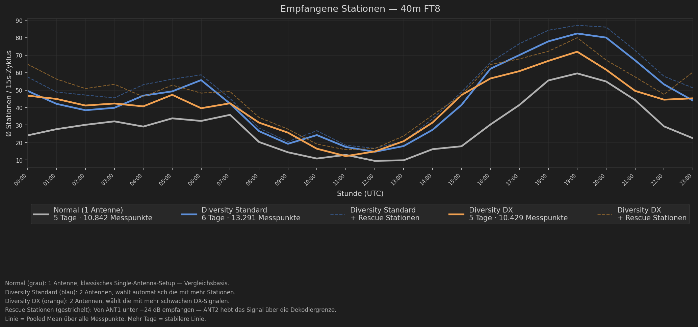
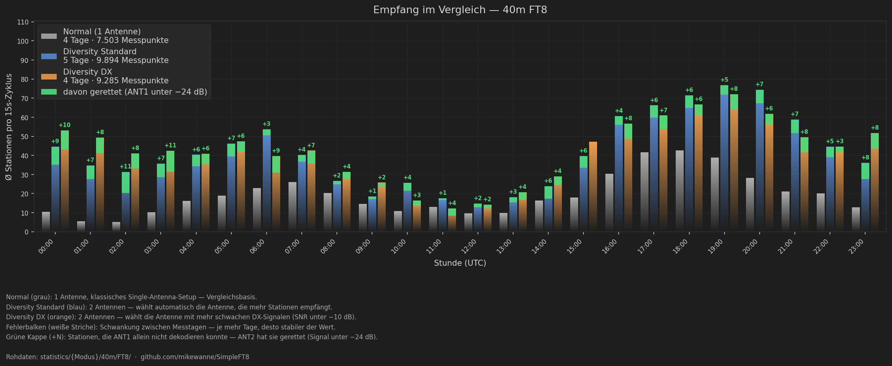
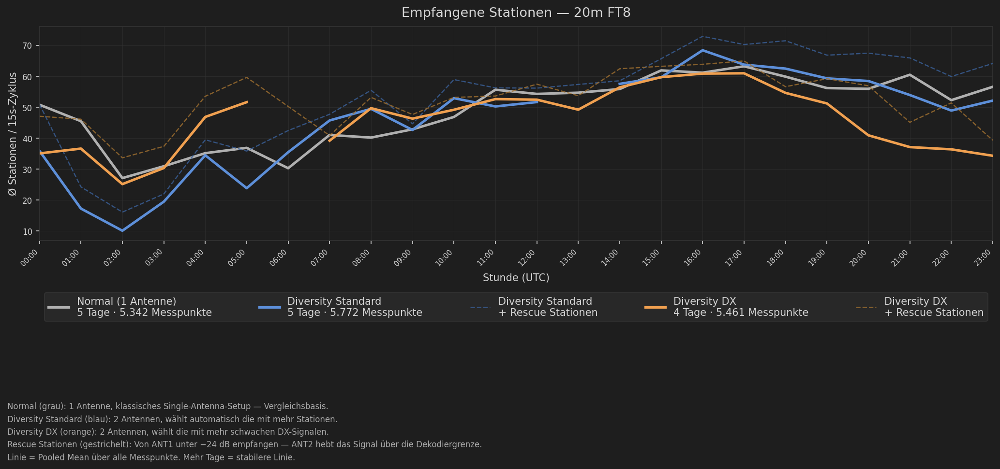
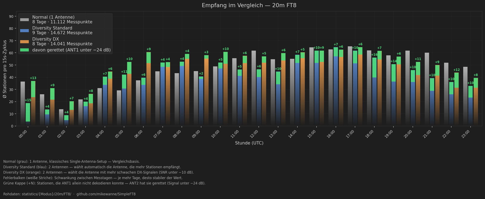
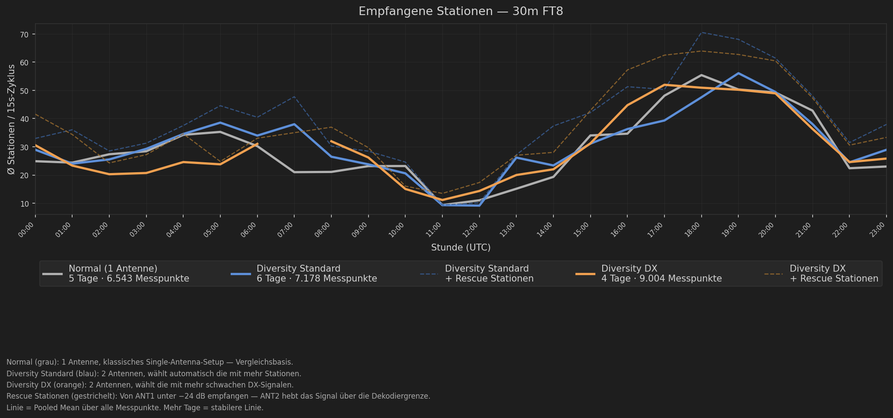
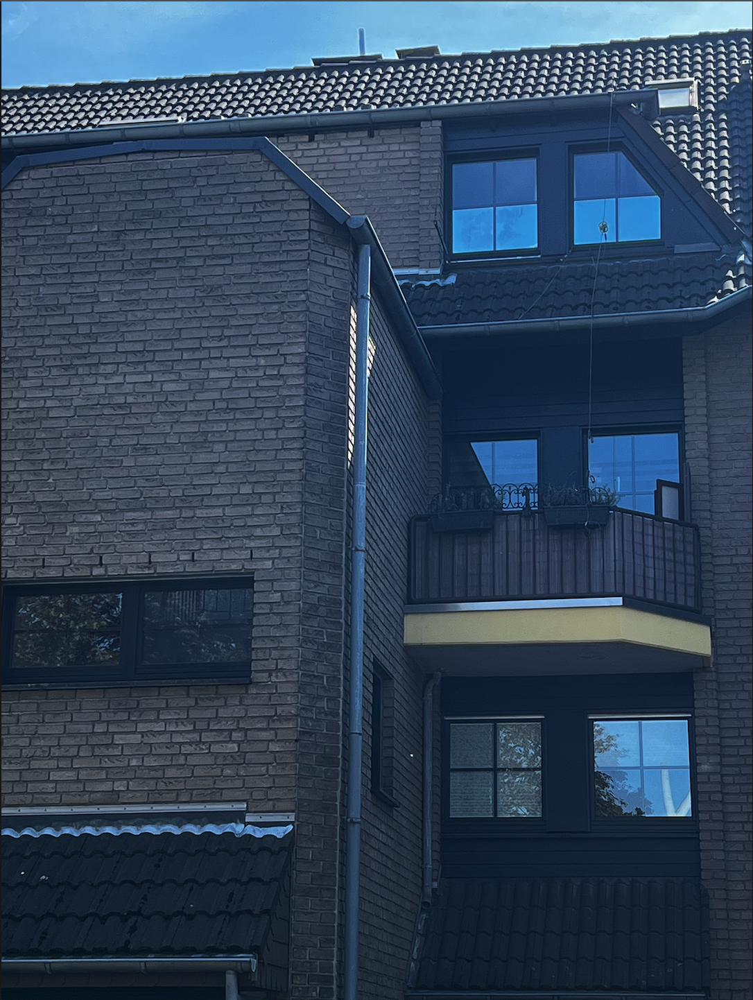
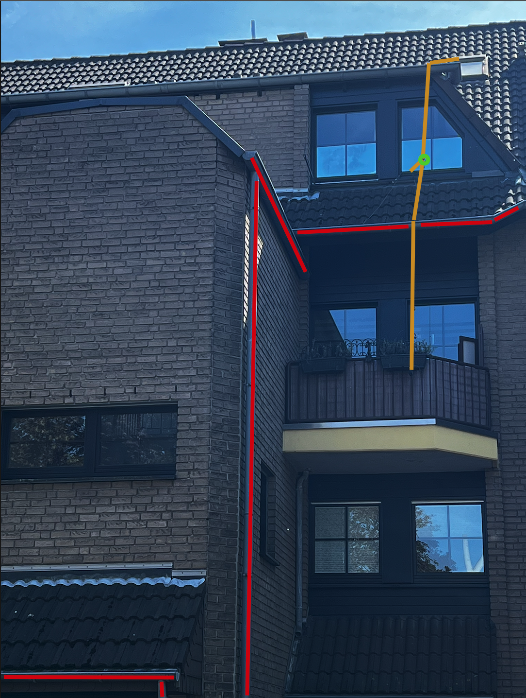
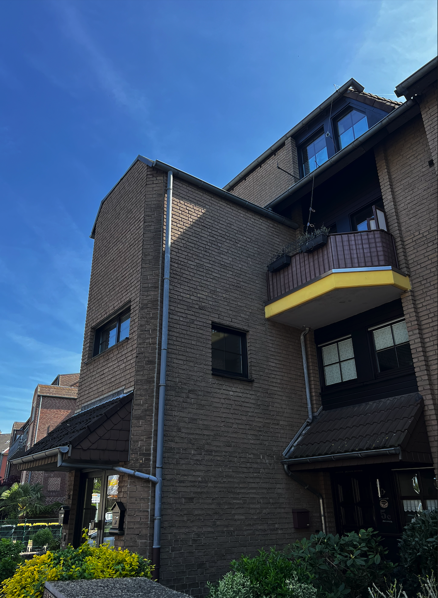
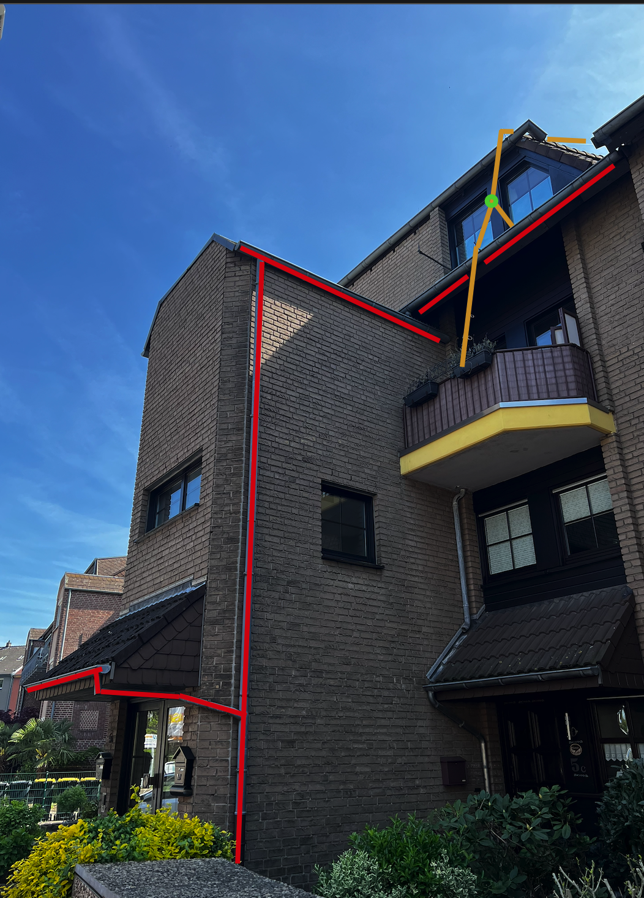
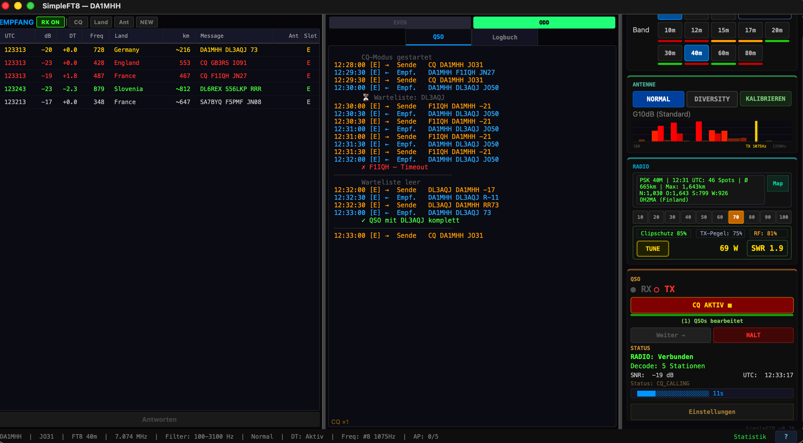

# SimpleFT8 — The Autonomous FT8/FT4/FT2 Client for FlexRadio

[English](#english) | [Deutsch](#deutsch)

[](https://opensource.org/licenses/MIT)
[](https://www.python.org/downloads/)
[](https://www.apple.com/macos/)
[](https://www.physics.princeton.edu/pulsar/k1jt/wsjtx.html)
[]()

> ⚠️  **Disclaimer / Haftungsausschluss**
>
> *EN:* SimpleFT8 is a private feasibility study and personal hobby project. Use at your own risk. No liability is accepted for damage to hardware (radio, PA, antennas), data loss, or regulatory violations. The software is provided "AS IS" without warranty of any kind — see [LICENSE](LICENSE) (MIT) for full terms.
>
> *DE:* SimpleFT8 ist eine private Machbarkeitsstudie und ein persoenliches Hobby-Projekt. Nutzung auf eigene Gefahr. Es wird keine Haftung uebernommen fuer Schaeden an Hardware (Funkgeraet, PA, Antennen), Datenverlust oder regulatorische Verstoesse. Die Software wird "AS IS" ohne jegliche Garantie bereitgestellt — siehe [LICENSE](LICENSE) (MIT) fuer vollstaendige Bedingungen.

> **No more manual ALC babysitting, no missed replies, no guessing the best antenna or frequency.**
> SimpleFT8 automates your entire FT8/FT4/FT2 workflow with closed-loop power control, dual-mode diversity scoring, automatic CQ frequency optimization, and intelligent caller queuing.

> **Every feature explained in detail:** How does it work? Why? Pros/Cons? Physics + formulas.
> German + English → **[docs/explained/](docs/explained/)** (5 features × 2 languages = 10 documents)
> In-app help: Press **?** in the status bar for built-in feature documentation with language switcher.

> **Optimize yes — Automate no.** SimpleFT8 is an operator-in-the-loop tool. All automated features — dead man's switch (15 min), semi-automatic CQ mode, manual hunt mode — ensure the operator retains final control. This reflects our commitment to responsible amateur radio software and regulatory compliance.

---

https://github.com/user-attachments/assets/7504bb60-2ab1-465f-92e3-0bf042a74f3a

*Live globe visualization: 16-sector propagation wedges per decoded station, color-coded by antenna (ANT1 / ANT2 / rescue), with 60-minute history retention. Recorded during a 40m FT8 session.*
*Live-Karte mit 16 Richtungs-Sektor-Wedges pro Decode, Antennen-Farbcodierung (ANT1 / ANT2 / Rescue), 60-Min-Historie. Aufgenommen waehrend einer 40m-FT8-Session.*

---

<a name="english"></a>
## English

### Why SimpleFT8?

SimpleFT8 was built for the after-work operator. No endless configuration,
no manual antenna switching, no staring at ALC levels. It talks directly to
the FlexRadio, automatically picks the better of two antennas, regulates TX
power in a closed loop, and finds a clear CQ frequency on its own. Multiple
callers are queued and answered in turn. There's a live map with a rotatable
globe showing where you're being heard, and a locator cache that remembers
stations across app restarts. Fire it up, make a few QSOs, call it a day.

> **How is this different?** Focuses on live propagation visualization and
> locator mining without configuration overhead. Not a WSJT-X replacement —
> runs alongside it.

### Key Innovations

- **FT2 Mode** — Native Decodium-compatible FT2 decoder/encoder (3.8s cycles, 4-GFSK, 288 sps). Community frequencies pre-configured. QSOs successfully completed. Automatic RX filter widening to 4000 Hz.

- **DT Time Correction v2** — Cumulative correction from band consensus. 2-cycle measurement, 10-cycle operation, 70% damping. **Per-mode persistence**: correction values stored in `~/.simpleft8/dt_corrections.json` — instant good correction on mode switch. DT values typically ±0.1s after convergence.

- **Dual-Mode Diversity** — Two scoring strategies selectable at startup:
  - **Standard**: Counts total decoded stations — best for CQ operation (maximize QSOs)
  - **DX**: Counts weak stations (SNR < -10 dB) — best for DX hunting (Australia at -24 dB counts, local at +12 dB doesn't)
  - 8% threshold, median over 4 cycles, 70:30 or 50:50 ratio. Button shows "DIVERSITY DX" when in DX mode.
  - **Antenna Memory (learning)**: Every decode cycle, the system records per callsign which antenna heard it better and by how many dB. When you start a QSO with that callsign, the best antenna is selected automatically — overlaying the global Diversity rhythm for the duration of the QSO. No timeout, no persistence: a station you can hear *right now* is always the most precise value. The QSO panel shows "Calling DL3AQJ (ANT2, +6.3 dB)".

- **Bandpilot (v0.87)** — On band change SimpleFT8 picks the RX mode (Normal / Diversity Standard / Diversity DX) that historically yielded the highest pooled-mean station count on that band. Aggregation: Normal vs (Diversity_Normal + Diversity_DX) / 2. Manual override per band, lazy 24h cache. ⚠️ In field test.

- **Live Locator Mining (no other FT8 client does this)** — While decoding, SimpleFT8 extracts Maidenhead grid squares **directly from CQ calls and grid-reply messages** (`CQ R9CA LO97`, `RA4ALY DL6YJB JO31`) and writes them to a persistent JSON database (`~/.simpleft8/locator_cache.json`). Source priority: `cq_6 > psk_6 > qso_log_6 > _4-Variants` — a 6-digit locator from a live CQ call is never overwritten by a 4-digit ADIF entry. The map shows **exact station positions**, not country centroids. Bootstrap via ADIF bulk-import (LotW, QRZ, your own log) at startup. Auto-save every 5 min + on close — survives hard kill. Currently 9,366 calls and growing with every session.

- **Auto TX Power Regulation** — Set target wattage, SimpleFT8 reads actual FWDPWR and adjusts proportionally. No overdrive, no weak signals after band change.

- **Smart CQ Frequency** — After diversity calibration, finds a free slot in the **800–2000 Hz sweet spot** (where most stations listen) instead of the empty upper range.

- **Caller Waitlist** — When multiple stations reply to CQ simultaneously, they are queued. Accepts both Grid and Report messages. After current QSO: auto-responds to next in queue.

- **RR73 Courtesy Repeat** — After QSO complete, if the other station keeps sending R-Report (didn't receive our RR73), we resend RR73 automatically (max 2×).

- **Even/Odd Slot Display** — [E]/[O] tags in both RX list and QSO panel. Immediately visible which slot each station uses and which slot we transmit in.

### Live Diversity Analysis — Current Data *(collection in progress)*

> Generated automatically from live session data via `scripts/generate_plots.py`.
> X-axis = UTC hour of day, averaged across all measurement days. Data grows with every session.

**Live measurement results — 40m FT8, 8–9 measurement days, 27,200 cycles:**

| Mode | Stations/15s (Pooled Mean) | vs Normal | Days | Cycles |
|------|:---:|:---:|:---:|:---:|
| Normal | 18.7 | — | 8 | 7,743 |
| Diversity Standard | 42.2 | **+126%** | 9 | 10,172 |
| Diversity DX | 41.6 | **+123%** | 6 | 9,285 |

*Pooled mean over all cycles and all hours — not cherry-picked, not a single good day.*
*Rescue stations (ANT1 below −24 dB, saved by ANT2) are included in the Diversity totals.
Detailed breakdown with rescue-only analysis: PDF report (p.3).*

> **Note on methodology**
> All cycles from all measurement days and all hours of the day are pooled directly —
> no time-of-day filter, no cherry-picking. The result is the typical station count per
> 15-second cycle averaged across a full operating day. The more measurement days, the
> more stable the numbers. The PDF report (p.3) shows the full hourly breakdown.

> **Note on Interpretation**
> ANT1 (Kelemen DP-201510) is operated off-band on 40m and therefore significantly
> less efficient on this band. ANT2 (house gutter, ~15m) falls between λ/4 and λ/2
> for 40m and works comparatively well. The measured gains (+88%/+123% stations)
> represent an **upper bound** for off-band operation — with two well-matched
> 40m-optimized antennas, a lower but still significant diversity gain is expected.
> The exact opposite happens when ANT1 is on its resonant band — see the 20m results below.

**Station timeline — 40m FT8, all three modes over 24h UTC:**
*(Dashed lines = Rescue Stations: received by ANT1 below −24 dB — ANT2 boosts the signal above the decoding threshold)*



**Direct mode comparison — stations per cycle, per hour:**



| Diagram | Description |
|---------|-------------|
| [📊 Diagram 1 — Stations 40m FT8](auswertung/stationen_40m_FT8.png) | Station count over 24h UTC — Normal vs Diversity Normal vs Diversity DX. Line = mean, dashed = + Rescue Stations (ANT1 below −24 dB, saved by ANT2). |
| [📊 Diagram 2 — Diversity Analysis 40m FT8](auswertung/diversity_40m_FT8.png) | Station count per cycle: Normal (grey), Diversity Standard (blue), Diversity DX (orange) + green rescue caps (+N) = stations ANT1 couldn't decode but ANT2 saved. |
| [📊 Detailed PDF Report](auswertung/Auswertung-40m-FT8.pdf) | Full analysis report with summary table, all diagrams, and methodology notes. Auto-updated with each session. |
| [🗂 Raw Data (statistics/)](statistics/) | All raw cycle data as Markdown files — one file per hour per mode. Format: `statistics/<Mode>/<Band>/<Protocol>/YYYY-MM-DD_HH.md`. 214 files, every single cycle logged. Reproduce any number yourself. |

> **📊 Statistics in progress — target: 5 measurement days per mode/band slot for reliable results.**
> Current: 4–5 days. Charts and PDF update automatically with each new session. The more days, the more stable the lines.

---

#### 20m FT8 — when ANT1 is on its design band

**Live measurement results — 20m FT8, 7–9 measurement days, 19,936 cycles:**

| Mode | Stations/15s (Pooled Mean) | vs Normal | Days | Cycles |
|------|:---:|:---:|:---:|:---:|
| Normal | 51.1 | — | 9 | 5,959 |
| Diversity Standard | 47.9 | **−6%** | 7 | 6,290 |
| Diversity DX | 47.1 | **−8%** | 7 | 7,687 |

*Note: Earlier readings (fewer days) showed −18%/−22%. With more measurement days now
covering all times of day, the numbers have stabilized at a smaller loss. Still negative
— the resonant ANT1 advantage on 20m is real — but the picture is more nuanced.*

> **Note on Interpretation — 20m**
> On 20m, the Kelemen DP-201510 operates within its **design band** as a resonant
> half-wave dipole. ANT1 alone is already very efficient — Diversity overlays this
> good antenna with a non-optimized gutter (ANT2). The result is a slight **loss**
> in raw station count.
>
> **But the picture is more nuanced:** in direct A1↔A2 comparisons the ANT2 wins
> in **79–86 % of cases** with an average **+4 dB** advantage — pure polarization
> and pattern diversity. Faraday rotation scales with f² → polarization diversity
> works *stronger* on 20m than on 40m. The benefit is qualitative (different
> stations, especially weak DX) rather than quantitative.
>
> **The honest takeaway:** Diversity is **asymmetric** with this antenna setup.
> On off-band-ANT1 bands (40m, 30m, 17m, 80m) it compensates the weak ANT1 →
> large station gain. On resonant-ANT1 bands (20m, 15m, 10m) it overlays an
> already strong ANT1 → small station loss but qualitative pol-diversity gain.

**Station timeline — 20m FT8, all three modes over 24h UTC:**



**Direct mode comparison — stations per cycle, per hour:**



| Diagram | Description |
|---------|-------------|
| [📊 Detailed PDF Report — 20m](auswertung/Auswertung-20m-FT8.pdf) | Full 20m analysis with the differential narrative — ANT2 win-rate, Faraday rotation theory, asymmetric advantage. |
| [🗂 Raw Data (statistics/)](statistics/) | All raw cycle data per mode/band/hour — reproduce any number yourself. |

#### 30m FT8 — off-band ANT1, early data *(in progress)*

**Live measurement results — 30m FT8, preliminary data:**

| Mode | Stations/15s (Pooled Mean) | vs Normal | Days | Cycles |
|------|:---:|:---:|:---:|:---:|
| Normal | 15.0 | — | 3 | 452 |
| Diversity Standard | 25.3 | **+69%** | 3 | 1,386 |
| Diversity DX | 23.9 | **+59%** *(preliminary)* | 1 | 214 |

> **Note:** 30m data collection just started. Normal and Diversity Standard have 3 days
> each — already showing the expected off-band pattern (large gain, ANT1 suboptimal on 10 MHz).
> Diversity DX has only 1 day — not yet reliable. Data growing with each session.



#### Why this matters for other operators

If your station has **one resonant antenna covering 1–2 bands** plus everything
else via tuner — **exactly the situation Mike has on 40m** — Diversity is likely
to bring a substantial gain on the tuner-fed bands and a slight loss on your
resonant bands. The 40m measurement is the "tuner-fed" archetype, the 20m
measurement is the "resonant" archetype.

#### Roadmap — more bands measuring

- **30m** (off-band ANT1, data collection started — 3 days Normal/Standard, 1 day DX): confirmed gain pattern, see above
- **17m** (off-band ANT1): data collection in progress, expected gain like 40m
- **15m / 10m** (resonant): expected to lose like 20m
- **80m / 60m / 12m**: pending

Each new band confirms or refutes the off-band/resonant hypothesis. All raw
data lives in `statistics/`, all PDFs auto-update with `python3 scripts/generate_plots.py`.

---

### Antenna Setup

| Photo | Annotated |
|:-----:|:---------:|
|  |  |
| Frontview — gutter downspout (ANT2) on the left, feed point of ANT1 upper right at the dormer. | Yellow = Kelemen DP-201510 (vertical half-wave dipole, green dot = feed point). Red = complete gutter path (roof → downspout → entrance). |
|  |  |
| Sideview — second perspective showing the diagonal extent of ANT1 from roof ridge down to balcony. | Same color coding: yellow = ANT1 dipole arms with feed point, red = ANT2 gutter path. |

**ANT1 — Kelemen DP-201510 (multiband trap dipole for 20m / 15m / 10m)**
A center-fed multiband dipole with coaxial trap resonators (Sperrkreise) — *not* a
fan dipole. Each band uses only the wire section up to the corresponding trap, all
three bands resonant on 50 Ω directly via a 1:1 balun (no tuner needed). Feed point
at the dormer window, 3rd floor: one arm runs diagonally up to the roof ridge, the
other diagonally down via the porch roof to the balcony — a vertically-oriented
half-wave dipole with the feed point at the center.
*On 40m this antenna operates off its design band — see interpretation note above.*

**ANT2 — House gutter (random wire antenna, ~15m)**
Never installed as an antenna — just clamped on. The gutter runs ~5m horizontal along
the roof edge, ~8m vertical as the downspout, ~2m horizontal toward the front entrance.
This L-shape falls between λ/4 and λ/2 for 40m (7 MHz). Different geometry, different
polarization, building-coupled mounting — the ideal complement for diversity reception.

---

### Screenshots

**CQ mode with DT correction, Propagation bars, Operator Presence timer, PSKReporter spots** — DT values ±0.2 (auto-corrected), 20m band:


| Diversity 20m (DT-corrected, A1/A2) | Comparison Test 40m (+37%) |
|:-:|:-:|
|  |  |

**Caller Waitlist in action** — F1IQH calls while QSO with DL3AQJ is in progress → automatically queued → served next. Real QSO, 40m FT8. *(Screenshot courtesy of DL3AQJ — thank you!)*



### All Features

**Tested & Working (v0.87):**
- ✅ **FT8 / FT4 / FT2 modes** — all three with dedicated frequencies, auto RX filter, mode-dependent timing
- ✅ **Auto TX Power Regulation**: Closed-loop FWDPWR feedback, clipping protection, per-band calibration
- ✅ **Dual-Mode Diversity**: Standard (station count) + DX (weak signal count), 8% threshold, 70:30/50:50
- ✅ **Smart Antenna Selection**: Per-station antenna preference during QSO — switches to best-SNR antenna per callsign.
- ✅ **DT Time Correction v2**: Per-mode persistence, 2-cycle measurement, 70% damping, ±0.1s convergence
- ✅ **Propagation Bars**: HamQSL solar data + time-of-day correction. Verified against HAM-Toolbox
- ✅ **Operator Presence (Anti-Bot)**: 15 min timeout, mouse reset, legal requirement DE
- ✅ **Smart CQ Frequency**: 800–2000 Hz sweet spot via spectrum histogram. Freq counter in status bar.
- ✅ **Caller Waitlist**: Queue for Grid + Report callers, auto-respond after QSO
- ✅ **RR73 Courtesy Repeat**: Auto-resend max 2× if other station didn't get it
- ✅ **Even/Odd Slot Display**: [E]/[O] in RX list + QSO panel *(FT2 3.75s display sync under investigation)*
- ✅ **Signal Processing**: 5-pass signal subtraction, spectral whitening, sinc anti-alias resampling
- ✅ **QSO State Machine**: Hunt + CQ mode, retry logic, ADIF 3.1.7 logging
- ✅ **Integrated Logbook**: Search, DXCC counter, QSO detail overlay, delete
- ✅ **Help Dialog**: Built-in feature docs (DE + EN) via ? button in status bar
- ✅ **Direction Map with Live Propagation Sectors (v0.66/v0.71/v0.72)**: Rotatable 3D globe (orthographic projection) with **16 directional sector wedges** that visualize where propagation is *actually* opening *right now*: in RX-mode wedge length = unique stations heard from that bearing, in TX-mode wedge length = max distance reached in that direction (v0.71 — a single VK6 spot at 16,000 km counts more than 50 Iberian spots). Antenna color-coding (ANT1/ANT2/rescue) makes diversity contributions instantly visible. **One look at the map tells you "no vector pointing west today — don't bother trying NA on this band right now"** — operational insight, not just decoration. Aurora + Dark theme toggle (v0.72), persistent.
- ✅ **Live Locator Mining (v0.67/v0.70 — no other FT8 client does this)**: While decoding, Maidenhead locators are extracted **directly from CQ calls and QSO replies** (`CQ R9CA LO97`, `RA4ALY DL6YJB JO31`) and written to a persistent JSON database (`~/.simpleft8/locator_cache.json`). Source priority: `cq_6 > psk_6 > qso_log_6 > _4-variants` — a 6-digit locator from a live CQ call is never overwritten by a 4-digit ADIF entry. The map therefore shows **exact station positions** instead of country centroids. Bootstrap via ADIF bulk-import (LotW, QRZ, your own log) at startup. Auto-save every 5 min + on close — survives hard kill. Currently 9,366 calls, growing with every session.
- ✅ **616 Unit Tests**: QSO, diversity patterns, DT, propagation, OMNI-TX, ADIF, histograms, locator-DB, threading, protocol, diversity merger, mode-recommender, help-dialog
- ✅ **Station Statistics**: Per-cycle logging (Normal + Diversity), 6-cycle warm-up exclusion. Raw Markdown data, no in-file summaries — analyzed by `scripts/generate_plots.py`.
- ✅ **Diversity Analysis Plots**: `python3 scripts/generate_plots.py` → `auswertung/` — dark-theme PNGs: station timeline (Normal vs Diversity) + ANT2 wins + Rescue-Events per hour. [→ Aktuelle Auswertungen](auswertung/)
- ✅ **Per-Station SNR Logging**: Every A1↔A2 comparison logged with both SNR values, Δ dB, winner and ★ Saved-Event when one antenna is below FT8 decode threshold (−24 dB) and the other above. Proves "ANT2 made this QSO possible."
- ✅ **Ant2 Superiority Counter**: Quantifies diversity gain (A2 > A1 frequency)
- ✅ **TX Safety**: TX halted immediately before Gain Measurement — no accidental transmit during calibration
- ✅ **Gain Measurement**: Audio input calibration tool (GAIN-MESSUNG button). Finds optimal RX level before statistics or diversity sessions.
- ✅ **Auto-Hunt (v0.75)**: Automatically selects the next CQ station from the waitlist and initiates QSO without manual clicking. Independent dead man's switch (not mouse-triggered — bot protection). Diversity-only mode: visible only when Diversity is active, stops automatically on mode switch.
- ✅ **Auto-Close Calibration Dialog (v0.83)**: After gain measurement completes, the confirmation dialog closes automatically after 3 seconds — no click required.
- ✅ **Double-Report Bug Fix (v0.82)**: Fixed: app used to resend the signal report after already receiving RR73. Root cause was decoder signal ordering (`cycle_finished` must fire after all `message_decoded` events). Fully resolved and confirmed in real QSO.
- ✅ **Diversity Tertile Analysis (v0.84)**: Statistics plots show 33rd/67th percentile shaded band (actual slot-to-slot variation) instead of flat min/max bars.
- ✅ **UI Polish**: Info dialogs with "Don't show again" option. DT correction preserved across mode switches. Button labels reflect active state.
- ✅ **Debug Console**: Ctrl+D, live filter, font 11pt, Copy/Clear buttons

**In Field Test:**
- ⚠️ **AP-Lite v2.2**: Weak QSO rescue via coherent addition of two failed decode attempts. Threshold 0.75 calibration in progress.
- ⚠️ **OMNI-TX**: Even/Odd CQ rotation for 100% time-slot coverage (hidden Easter egg). Integrated, field validation pending.
- ⚠️ **Bandpilot (v0.87)**: Auto-pick best RX mode per band from statistics. 28 unit tests passing, live validation over extended operating time pending.

### FT2 Frequencies (Decodium-compatible)

| Band | FT8 | FT4 | FT2 |
|------|-----|-----|-----|
| 80m | 3.573 | 3.575 | 3.578 |
| 40m | 7.074 | 7.047 | 7.052 |
| 20m | 14.074 | 14.080 | 14.084 |
| 15m | 21.074 | 21.140 | 21.144 |
| 10m | 28.074 | 28.180 | 28.184 |

### Installation

```bash
git clone https://github.com/mikewanne/SimpleFT8.git
cd SimpleFT8
python3 -m venv venv
source venv/bin/activate
pip install -r requirements.txt
python3 main.py
```

**Requirements:** macOS, Python 3.12+, FlexRadio SDR (FLEX-6000/8000 series). Two antenna ports for Diversity mode (optional).

### Architecture

```
SimpleFT8/
├── main.py                       # Entry point
├── config/settings.py            # Settings, band frequencies, language
├── core/
│   ├── decoder.py                # FT8/FT4/FT2 decode + signal subtraction
│   ├── encoder.py                # FT8/FT4/FT2 encode → VITA-49 TX
│   ├── qso_state.py              # QSO state machine (Hunt + CQ + Waitlist)
│   ├── protocol.py               # FT8/FT4/FT2 protocol constants (frozen dataclass)
│   ├── station_accumulator.py    # Shared station logic (Normal + Diversity)
│   ├── station_stats.py          # Async cycle + per-station SNR logging
│   ├── diversity.py              # Diversity controller (Standard/DX scoring)
│   ├── diversity_merger.py       # Merge ANT1+ANT2 decodes, SNR-winner selection
│   ├── diversity_cache.py        # 2h preset cache (skip re-calibration)
│   ├── locator_db.py             # Persistent Maidenhead locator cache (JSON)
│   ├── antenna_pref.py           # Per-callsign antenna preference (1 dB hysteresis)
│   ├── ntp_time.py               # DT correction v2 (per-mode persistence)
│   ├── propagation.py            # Band conditions (HamQSL + time correction)
│   ├── ap_lite.py                # AP-Lite v2.2 (field test)
│   └── timing.py                 # UTC clock, mode-dependent cycle timing
├── radio/
│   ├── base_radio.py             # RadioInterface ABC
│   ├── radio_factory.py          # create_radio(settings) → FlexRadio
│   └── flexradio.py              # SmartSDR TCP + VITA-49 + auto RX filter
├── ft8_lib/                      # C library (MIT, FT8+FT4+FT2 native)
├── log/                          # ADIF writer, QRZ.com API
├── ui/
│   ├── main_window.py            # 3-panel layout + Mixins
│   ├── mw_cycle.py               # Cycle processing + diversity accumulation
│   ├── mw_qso.py                 # QSO callbacks, CQ, logbook
│   ├── mw_radio.py               # Radio, band, diversity, DX tuning
│   ├── help_dialog.py            # Feature docs viewer (DE/EN)
│   └── ...                       # Control panel, RX panel, QSO panel
├── docs/explained/               # 10 feature docs (5 × DE + EN)
├── scripts/generate_plots.py     # Auswertungs-Script: statistics/ → auswertung/ PNGs
├── auswertung/                   # Generierte Diagramme (stationen_*.png, diversity_*.png)
└── tests/                        # 563 unit tests (QSO, Diversity, Protocol, AP-Lite, Threading, ...)
```

### Radio Compatibility

**Tested:** FLEX-8400M. **Expected compatible:** FLEX-6300/6400/6500/6600/6700/8400/8600 series.

**Radio-agnostic architecture (v0.28+):** New radios can be added by implementing a single file (`radio/ic7300.py` etc.). Currently prepared: **ICOM IC-7300** (CI-V + USB Audio).

### Detailed Feature Documentation

| Feature | Deutsch | English |
|---------|---------|---------|
| Caller Waitlist | [waitlist_de.md](docs/explained/waitlist_de.md) | [waitlist.md](docs/explained/waitlist.md) |
| Per-Station Antenna Preference | [antenna-preference_de.md](docs/explained/antenna-preference_de.md) | [antenna-preference.md](docs/explained/antenna-preference.md) |
| AP-Lite Rescue | [ap-lite_de.md](docs/explained/ap-lite_de.md) | [ap-lite.md](docs/explained/ap-lite.md) |
| Auto-Hunt | [auto-hunt_de.md](docs/explained/auto-hunt_de.md) | [auto-hunt.md](docs/explained/auto-hunt.md) |
| Bandpilot ⚠️ field test | [bandpilot_de.md](docs/explained/bandpilot_de.md) | [bandpilot.md](docs/explained/bandpilot.md) |
| CQ Frequency (Histogram) | [cq-frequency_de.md](docs/explained/cq-frequency_de.md) | [cq-frequency.md](docs/explained/cq-frequency.md) |
| Diversity Modes (Standard/DX) | [diversity-modes_de.md](docs/explained/diversity-modes_de.md) | [diversity-modes.md](docs/explained/diversity-modes.md) |
| DT Time Correction | [dt-correction_de.md](docs/explained/dt-correction_de.md) | [dt-correction.md](docs/explained/dt-correction.md) |
| DX Tuning (Antenna Measurement) | [dx-tuning_de.md](docs/explained/dx-tuning_de.md) | [dx-tuning.md](docs/explained/dx-tuning.md) |
| FT2 Mode (Decodium) | [ft2-mode_de.md](docs/explained/ft2-mode_de.md) | [ft2-mode.md](docs/explained/ft2-mode.md) |
| Gain Measurement (audio level) | [gain-measurement_de.md](docs/explained/gain-measurement_de.md) | [gain-measurement.md](docs/explained/gain-measurement.md) |
| Live Locator Mining | [locator-mining_de.md](docs/explained/locator-mining_de.md) | [locator-mining.md](docs/explained/locator-mining.md) |
| Logbook & QRZ | [logbook_de.md](docs/explained/logbook_de.md) | [logbook.md](docs/explained/logbook.md) |
| OMNI-TX (Slot Rotation) ⚠️ field test | [omni-tx_de.md](docs/explained/omni-tx_de.md) | [omni-tx.md](docs/explained/omni-tx.md) |
| Operator Presence | [operator-presence_de.md](docs/explained/operator-presence_de.md) | [operator-presence.md](docs/explained/operator-presence.md) |
| Power Regulation | [power-regulation_de.md](docs/explained/power-regulation_de.md) | [power-regulation.md](docs/explained/power-regulation.md) |
| Propagation Indicators | [propagation-indicators_de.md](docs/explained/propagation-indicators_de.md) | [propagation-indicators.md](docs/explained/propagation-indicators.md) |
| QSO Flow (Hunt/CQ) | [qso-flow_de.md](docs/explained/qso-flow_de.md) | [qso-flow.md](docs/explained/qso-flow.md) |
| Direction Map (3D Globe) | [direction-map_de.md](docs/explained/direction-map_de.md) | [direction-map.md](docs/explained/direction-map.md) |
| Signal Processing | [signal-processing_de.md](docs/explained/signal-processing_de.md) | [signal-processing.md](docs/explained/signal-processing.md) |

### License

MIT License (c) 2026 DA1MHH (Mike Hammerer)

---

<a name="deutsch"></a>
## Deutsch

### Warum gibt es SimpleFT8?

SimpleFT8 ist für den Feierabend-Funk entstanden. Kein stundenlanges
Konfigurieren, kein manuelles Antennen-Rangieren, kein Dauer-Blick auf den
ALC-Pegel. Die Software spricht direkt mit dem FlexRadio, wählt automatisch
die bessere von zwei Antennen aus, regelt die Sendeleistung im geschlossenen
Regelkreis und sucht sich selbstständig eine freie CQ-Frequenz. Mehrere
Anrufer landen in einer Warteschlange und werden nacheinander bedient. Dazu
gibt's eine Live-Karte mit drehbarem Globus, die zeigt, wo man gehört wird —
und ein Locator-Cache, der Stationen auch nach einem Neustart nicht vergisst.
Einfach anschalten, ein paar QSOs machen, Feierabend.

> **Was ist anders?** Fokus auf Live-Propagations-Visualisierung und
> Locator-Mining ohne Konfigurations-Overhead. Kein WSJT-X-Ersatz —
> laeuft daneben.

### Live Diversity Auswertung — Aktuelle Daten *(Datensammlung läuft)*

> Automatisch generiert aus Live-Sitzungsdaten via `scripts/generate_plots.py`.
> X-Achse = UTC-Stunde des Tages, gemittelt über alle Messtage. Daten wachsen mit jeder Session.

**Live-Messergebnisse — 40m FT8, 8–9 Messtage, 27.200 Zyklen:**

| Modus | Stationen/15s (Pooled Mean) | vs Normal | Tage | Zyklen |
|-------|:---:|:---:|:---:|:---:|
| Normal | 18,7 | — | 8 | 7.743 |
| Diversity Standard | 42,2 | **+126%** | 9 | 10.172 |
| Diversity DX | 41,6 | **+123%** | 6 | 9.285 |

*Pooled Mean über alle Zyklen und alle Tageszeiten — kein Cherry-Picking, kein einzelner guter Tag.*
*Rescue-Stationen (ANT1 unter −24 dB, von ANT2 gerettet) sind in den Diversity-Werten enthalten.
Detaillierte Aufschlüsselung mit Rescue-only-Analyse: PDF-Bericht (S.3).*

> **Hinweis zur Methodik**
> Alle Messzyklen aus allen Messtagen und allen Tageszeiten werden direkt zusammengezählt und gemittelt —
> kein Stunden-Filter, kein Cherry-Picking. Das Ergebnis ist die typische Stationsanzahl pro
> 15-Sekunden-Zyklus, gemittelt über einen ganzen Betriebstag. Je mehr Messtage, desto stabiler
> die Zahlen. Der PDF-Bericht (S.3) zeigt die vollständige stündliche Aufschlüsselung.

> **Hinweis zur Interpretation**
> ANT1 (Kelemen DP-201510) ist auf 40m außerhalb seines Auslegungsbandes und damit
> deutlich suboptimal für diesen Frequenzbereich. ANT2 (Regenrinne, ~15m) liegt
> zwischen λ/4 und λ/2 für 40m und arbeitet dort vergleichsweise gut. Die gemessenen
> Gewinne (+88%/+123% Stationen) sind als **Obergrenze für Off-Band-Betrieb** zu
> verstehen — bei zwei gleichwertigen, für 40m optimierten Antennen ist ein geringerer,
> aber dennoch signifikanter Diversity-Gewinn zu erwarten.
> Auf einem resonanten Band kehrt sich das Bild um — siehe 20m-Ergebnisse weiter unten.

**Stationen über 24h UTC — 40m FT8, alle drei Modi:**
*(Gestrichelte Linien = Rescue Stationen: von ANT1 unter −24 dB empfangen — ANT2 hebt das Signal über die Dekodiergrenze)*


**Direktvergleich — Stationen pro Zyklus, stündlich:**


| Diagramm | Beschreibung |
|----------|-------------|
| [📊 Diagramm 1 — Stationen 40m FT8](auswertung/stationen_40m_FT8.png) | Stationszahl über 24h UTC — Normal vs Diversity Normal vs Diversity DX. Linie = Mittelwert, gestrichelt = + Rescue Stationen (ANT1 unter −24 dB, von ANT2 gerettet). |
| [📊 Diagramm 2 — Diversity Analyse 40m FT8](auswertung/diversity_40m_FT8.png) | Stationen/Zyklus: Normal (grau), Diversity Standard (blau), Diversity DX (orange) + grüne Rescue-Kappen (+N) = Stationen die ANT1 nicht decodieren konnte, aber ANT2 rettete. |
| [📊 Ausführlicher PDF-Bericht](auswertung/Auswertung-40m-FT8.pdf) | Vollständiger Auswertungsbericht mit Zusammenfassungstabelle, allen Diagrammen und Methodik-Hinweisen. Wird automatisch mit jeder Session aktualisiert. |
| [🗂 Rohdaten (statistics/)](statistics/) | Alle Rohdaten als Markdown-Dateien — eine Datei pro Stunde pro Modus. Format: `statistics/<Modus>/<Band>/<Protokoll>/YYYY-MM-DD_HH.md`. 214 Dateien, jeder einzelne Zyklus geloggt. Jede Zahl ist nachrechenbar. |

> **📊 Statistiken in Arbeit — Ziel: 5 Messtage pro Modus/Band-Slot für belastbare Ergebnisse.**
> Aktuell: 4–5 Tage. Diagramme und PDF aktualisieren sich automatisch mit jeder neuen Session. Je mehr Tage, desto stabiler die Linien.

---

#### 20m FT8 — wenn ANT1 auf seinem Auslegungsband arbeitet

**Live-Messergebnisse — 20m FT8, 7–9 Messtage, 19.936 Zyklen:**

| Modus | Stationen/15s (Pooled Mean) | vs Normal | Tage | Zyklen |
|-------|:---:|:---:|:---:|:---:|
| Normal | 51,1 | — | 9 | 5.959 |
| Diversity Standard | 47,9 | **−6%** | 7 | 6.290 |
| Diversity DX | 47,1 | **−8%** | 7 | 7.687 |

*Hinweis: Frühere Messungen (weniger Tage) zeigten −18%/−22%. Mit mehr Messtagen, die alle
Tageszeiten abdecken, haben sich die Zahlen bei einem kleineren Verlust eingependelt. Negativ
bleibt es — der resonante ANT1-Vorteil auf 20m ist real — aber das Bild ist differenzierter.*

> **Hinweis zur Interpretation — 20m**
> Auf 20m arbeitet der Kelemen DP-201510 in seinem **Auslegungsband** als
> resonanter Halbwellen-Dipol. ANT1 ist alleine schon sehr effizient —
> Diversity überlagert eine bereits gute Antenne mit der nicht-optimierten
> Regenrinne (ANT2). Resultat: leichter **Verlust** in der reinen Stationsanzahl.
>
> **Aber das Bild ist differenzierter:** in direkten A1↔A2-Doppelempfängen gewinnt
> ANT2 in **79–86 % der Fälle** mit Ø **+4 dB** Vorteil — reine Polarisations-
> und Pattern-Diversity. Faraday-Rotation skaliert mit f² → Pol-Diversity wirkt
> auf 20m *stärker* als auf 40m. Der Nutzen ist qualitativ (andere Stationen,
> insbesondere schwaches DX), nicht quantitativ.
>
> **Die ehrliche Erkenntnis:** Diversity ist mit diesem Antennen-Setup
> **asymmetrisch**. Auf Off-Band-ANT1-Bändern (40m, 30m, 17m, 80m) gleicht sie
> die schwache ANT1 aus → großer Stations-Gewinn. Auf Resonant-ANT1-Bändern
> (20m, 15m, 10m) überlagert sie eine bereits starke ANT1 → kleiner Stations-
> Verlust, aber qualitativer Pol-Diversity-Gewinn.

**Stationen über 24h UTC — 20m FT8, alle drei Modi:**


**Direktvergleich — Stationen pro Zyklus, stündlich:**


| Diagramm | Beschreibung |
|----------|-------------|
| [📊 Ausführlicher PDF-Bericht — 20m](auswertung/Auswertung-20m-FT8.pdf) | Vollständige 20m-Analyse mit dem differenzierten Narrativ — ANT2-Win-Rate, Faraday-Rotations-Theorie, asymmetrischer Vorteil. |
| [🗂 Rohdaten (statistics/)](statistics/) | Alle Rohdaten pro Modus/Band/Stunde — jede Zahl ist nachrechenbar. |

#### 30m FT8 — off-band ANT1, erste Daten *(läuft)*

**Live-Messergebnisse — 30m FT8, vorläufige Daten:**

| Modus | Stationen/15s (Pooled Mean) | vs Normal | Tage | Zyklen |
|-------|:---:|:---:|:---:|:---:|
| Normal | 15,0 | — | 3 | 452 |
| Diversity Standard | 25,3 | **+69%** | 3 | 1.386 |
| Diversity DX | 23,9 | **+59%** *(vorläufig)* | 1 | 214 |

> **Hinweis:** 30m-Datensammlung läuft erst seit Kurzem. Normal und Diversity Standard haben
> je 3 Messtage — zeigen bereits das erwartete Off-Band-Muster (großer Gewinn, ANT1 auf 10 MHz
> suboptimal). Diversity DX hat erst 1 Tag — noch nicht belastbar. Daten wachsen mit jeder Session.


#### Warum das für andere Operator interessant ist

Wenn deine Station **eine resonante Antenne für 1–2 Bänder** hat plus alles andere
über Tuner — **genau Mike's Situation auf 40m** — wird Diversity auf den Tuner-
Bändern wahrscheinlich einen substanziellen Gewinn bringen, auf den resonanten
Bändern einen leichten Verlust. Die 40m-Messung ist der „Tuner-Archetyp",
die 20m-Messung ist der „Resonant-Archetyp".

#### Roadmap — weitere Bänder in Arbeit

- **30m** (off-band ANT1, Datensammlung gestartet — 3 Tage Normal/Standard, 1 Tag DX): bestätigt Gewinn-Muster, siehe oben
- **17m** (off-band ANT1): Datensammlung läuft, erwarteter Gewinn wie 40m
- **15m / 10m** (resonant): erwarteter Verlust wie 20m
- **80m / 60m / 12m**: anstehend

Jedes neue Band bestätigt oder widerlegt die Off-Band/Resonant-Hypothese.
Alle Rohdaten in `statistics/`, alle PDFs aktualisieren sich automatisch
mit `python3 scripts/generate_plots.py`.

---

### Antennensetup

| Foto | Annotiert |
|:----:|:---------:|
|  |  |
| Vorderansicht — Regenrinnen-Fallrohr (ANT2) links, Einspeisepunkt ANT1 oben rechts an der Dachgaube. | Gelb = Kelemen DP-201510 (vertikal gespannter Halbwellendipol, grüner Punkt = Einspeisepunkt). Rot = vollständiger Regenrinnen-Verlauf (Dachkante → Fallrohr → Hauseingang). |
|  |  |
| Seitenansicht — zweite Perspektive zeigt die diagonale Spannweite von ANT1 vom Dachfirst bis zum Balkon. | Gleiche Farbcodierung: gelb = ANT1-Dipol-Arme mit Einspeisepunkt, rot = ANT2-Regenrinnen-Verlauf. |

**ANT1 — Kelemen DP-201510 (Multiband-Sperrkreisdipol für 20m / 15m / 10m)**
Ein zentral gespeister Multiband-Dipol mit koaxialen Sperrkreisen (Trap-Dipol) —
*kein* Fächer-Dipol. Pro Band wirkt nur der Drahtabschnitt bis zum jeweils
resonanten Sperrkreis, alle drei Bänder direkt 50 Ω über einen 1:1-Balun (kein
Tuner nötig). Einspeisepunkt an der Dachgaube im 3. OG: ein Arm führt schräg
nach oben zur Dachspitze, der andere schräg nach unten über das Vordach zum
Balkon — vertikal gespannter Halbwellendipol mit Einspeisepunkt in der Mitte.
*Auf 40m arbeitet diese Antenne außerhalb ihres Auslegungsbandes — siehe Interpretationshinweis oben.*

**ANT2 — Regenrinne des Hauses (Zufalls-Längenantenne, ~15m)**
Nie als Antenne installiert — einfach angeklemmt. Die Regenrinne verläuft ~5m waagerecht
entlang der Dachkante, ~8m senkrecht als Fallrohr, ~2m waagerecht zum Hauseingang.
Diese L-Form liegt zwischen λ/4 und λ/2 für das 40m-Band (7 MHz). Andere Geometrie,
andere Polarisierung, gebäudegebundene Befestigung — die ideale Ergänzung für Diversity.

---

### Die wichtigsten Innovationen

- **FT2-Modus** — Nativer Decodium-kompatibler FT2 Decoder/Encoder (3.8s Zyklen, 4-GFSK, 288 sps). Community-Frequenzen vorkonfiguriert. QSOs erfolgreich abgeschlossen. Automatische RX-Filterverbreiterung auf 4000 Hz.

- **DT-Zeitkorrektur v2** — Kumulative Korrektur aus Band-Konsens. 2-Zyklen-Messung, 10-Zyklen-Betrieb, 70% Daempfung. **Pro Modus gespeichert**: Korrekturwerte in `~/.simpleft8/dt_corrections.json` — sofort gute Korrektur beim Modus-Wechsel. DT-Werte typisch ±0.1s nach Konvergenz.

- **Dual-Mode Diversity** — Zwei Scoring-Strategien:
  - **Standard**: Zaehlt dekodierte Stationen — ideal fuer CQ-Betrieb
  - **DX**: Zaehlt schwache Stationen (SNR < -10 dB) — ideal fuer DX-Jagd (Australien bei -24 dB zaehlt, Bochum bei +12 dB nicht)
  - 8% Schwelle, Median ueber 4 Zyklen. Button zeigt "DIVERSITY DX" im DX-Modus.
  - **Lernendes Antennen-Gedaechtnis**: Nach jedem Dekodier-Zyklus merkt sich das System pro Rufzeichen, welche Antenne besser empfangen hat und um wieviel dB. Beim QSO-Aufbau wird automatisch die beste Antenne gewaehlt — das ueberlagert den globalen Diversity-Rhythmus fuer die QSO-Dauer. Kein Timeout, keine Persistenz: eine Station die du *gerade jetzt* hoerst, ist immer der praeziseste Wert. Das QSO-Fenster zeigt z.B. "Antworte DL3AQJ (ANT2, +6.3 dB)".

- **Automatische TX-Leistungsregelung** — Zielwatt einstellen, SimpleFT8 regelt den FWDPWR-Wert automatisch.

- **Smart CQ-Frequenz** — Findet freien Platz im **800–2000 Hz Sweet Spot** statt im leeren oberen Bereich.

- **Warteliste** — Gleichzeitige Anrufer werden gequeued (Grid + Report). Nach QSO: automatische Antwort an naechste Station.

- **RR73-Hoeflichkeit** — Nach QSO: wenn Gegenstation weiter R-Report sendet, wird RR73 nochmal gesendet (max 2×).

- **Even/Odd Anzeige** — [E]/[O] Tags in RX-Liste + QSO-Panel. Sofort sichtbar welcher Slot aktiv ist.

- **Bandpilot (v0.87)** — Bei Bandwechsel waehlt SimpleFT8 automatisch den RX-Modus (Normal / Diversity Standard / Diversity DX), der auf diesem Band historisch die hoechste Pooled-Mean-Stationsanzahl geliefert hat. Aggregation: Normal vs (Diversity_Normal + Diversity_DX) / 2. Manueller Override pro Band, lazy 24h-Cache. ⚠️ Im Feldtest.

### Alle Funktionen

**Getestet & funktionsfaehig (v0.87):**
- ✅ **FT8 / FT4 / FT2** — alle drei Modi mit eigenen Frequenzen, Auto-RX-Filter, modus-abhaengigem Timing
- ✅ **Auto TX-Leistungsregelung**: Regelkreis mit FWDPWR-Feedback, Clipping-Schutz
- ✅ **Dual-Mode Diversity**: Standard (Stationsanzahl) + DX (schwache Signale), 8% Schwelle
- ✅ **Bandpilot (v0.87)**: RX-Modus-Empfehlung pro Band aus Statistik (siehe oben, im Feldtest)
- ✅ **Smart Antenna Selection**: Pro-Station Antennen-Praeferenz waehrend QSO — wechselt auf beste SNR-Antenne je Callsign.
- ✅ **DT-Zeitkorrektur v2**: Pro Modus gespeichert, 2-Zyklen-Messung, 70% Daempfung
- ✅ **Propagation-Balken**: HamQSL-Solardaten + Tageszeit-Korrektur. Geprueft gegen HAM-Toolbox
- ✅ **Operator-Praesenz (Anti-Bot)**: 15 Min Timeout, gesetzl. Pflicht DE
- ✅ **Smart CQ-Frequenz**: 800–2000 Hz Sweet Spot via Histogramm. Freq-Zaehler in Statusleiste.
- ✅ **Warteliste**: Grid + Report, automatische Antwort nach QSO
- ✅ **RR73-Hoeflichkeit**: Automatisch max 2× wiederholen
- ✅ **Even/Odd Anzeige**: [E]/[O] in RX-Liste + QSO-Panel *(FT2 3.75s Sync in Untersuchung)*
- ✅ **Signalverarbeitung**: 5-Pass Subtraction, Whitening, Sinc-Resampling
- ✅ **QSO-Zustandsmaschine**: Hunt + CQ, Retry, ADIF 3.1.7
- ✅ **Logbuch**: Suche, DXCC, Detail-Overlay, Loeschen
- ✅ **Hilfe-Dialog**: Feature-Doku (DE + EN) via ? Button in Statusleiste
- ✅ **Richtungs-Karte mit Live-Propagations-Sektoren (v0.66/v0.71/v0.72)**: Drehbarer 3D-Globus (Orthographic-Projection) mit **16 Richtungs-Sektor-Wedges** die zeigen wohin die Ausbreitung *gerade jetzt* geht: im RX-Modus = Wedge-Laenge nach Anzahl gehoerter Stationen aus dieser Richtung, im TX-Modus = Wedge-Laenge nach max-Reichweite (v0.71 — ein einziger VK6-Spot mit 16.000 km zaehlt mehr als 50 Iberien-Spots). Antennen-Farbcodierung (ANT1/ANT2/Rescue) macht Diversity-Beitraege sofort sichtbar. **Ein Blick auf die Karte sagt: „kein Vektor nach Westen heute — auf diesem Band brauche ich NA gar nicht erst zu versuchen"** — operative Information, keine Deko. Aurora + Dark Theme-Toggle (v0.72), persistent.
- ✅ **Live Locator Mining (v0.67/v0.70 — kein anderer FT8-Client macht das)**: Während des Empfangs werden Maidenhead-Locators **direkt aus CQ-Rufen und QSO-Antworten** (`CQ R9CA LO97`, `RA4ALY DL6YJB JO31`) extrahiert und in einer persistenten JSON-Datenbank (`~/.simpleft8/locator_cache.json`) gespeichert. Source-Prioritaet: `cq_6 > psk_6 > qso_log_6 > _4-Varianten` — ein 6-stelliger Locator aus einem Live-CQ wird nie von einem 4-stelligen ADIF-Eintrag ueberschrieben. Die Karte zeigt damit **exakte Stationspositionen** statt Land-Mittelpunkte. Bootstrap via ADIF-Bulk-Import (LotW, QRZ, eigenes Logbuch) beim Start. Auto-Save alle 5 Min + bei Schliessen — uebersteht Hard-Kill. Aktuell 9.366 Calls, waechst mit jeder Session.
- ✅ **616 Unit Tests**: QSO, Diversity-Patterns, DT, Propagation, OMNI-TX, ADIF, Histogramme, Locator-DB, Threading, Protocol, Diversity Merger, Mode-Recommender (Bandpilot), Help-Dialog
- ✅ **Stations-Statistik**: Pro-Zyklus Logging (Normal + Diversity), 6-Zyklen Warmup-Ausschluss. Rohdaten im Markdown, keine In-File-Zusammenfassungen — Auswertung via `scripts/generate_plots.py`.
- ✅ **Diversity Auswertungs-Diagramme**: `python3 scripts/generate_plots.py` → `auswertung/` — Dark-Theme PNGs: Stationen-Zeitverlauf (Normal vs Diversity) + ANT2-Wins + Rescue-Events. [→ Aktuelle Auswertungen](auswertung/)
- ✅ **Per-Station SNR-Logging**: Jeder A1↔A2 Vergleich wird mit beiden SNR-Werten, Δ dB, Gewinner und ★ Saved-Event geloggt — wenn eine Antenne unter der FT8-Dekodierschwelle (−24 dB) liegt und die andere darüber. Beweist: "ANT2 hat dieses QSO erst möglich gemacht."
- ✅ **Ant2 Superiority Counter**: Quantifiziert Diversity-Gewinn (Ant2 > Ant1)
- ✅ **TX-Sicherheit**: TX stoppt sofort vor Gain-Messung — kein versehentliches Senden bei Kalibrierung
- ✅ **Gain-Messung**: Audio-Eingangspegel kalibrieren (Button "GAIN-MESSUNG"). Findet optimalen RX-Pegel vor Statistik- oder Diversity-Sitzungen.
- ✅ **Auto-Hunt (v0.75)**: Wählt automatisch die nächste CQ-Station aus der Warteliste und startet QSO ohne manuellen Klick. Eigener Totmannschalter (nicht mausausgelöst — Bot-Schutz). Diversity-only: sichtbar nur bei aktivem Diversity, stoppt automatisch bei Modus-Wechsel.
- ✅ **Auto-Close Kalibrierungs-Dialog (v0.83)**: Nach abgeschlossener Gain-Messung schließt der Bestätigungs-Dialog automatisch nach 3 Sekunden — kein Klick nötig.
- ✅ **Doppel-Report-Bug behoben (v0.82)**: Behoben: App sendete Signal-Report erneut, nachdem bereits RR73 empfangen wurde. Ursache war die Decoder-Reihenfolge (`cycle_finished` muss nach allen `message_decoded`-Events feuern). Im echten QSO bestätigt.
- ✅ **Diversity Tertile-Analyse (v0.84)**: Statistik-Diagramme zeigen 33./67.-Perzentil Schattierung (echte Slot-zu-Slot-Streuung) statt flacher Min/Max-Balken.
- ✅ **UI-Verbesserungen**: Info-Dialoge mit "Nicht mehr anzeigen". DT-Korrektur bleibt beim Modus-Wechsel erhalten. Button-Labels spiegeln aktiven Zustand.
- ✅ **Debug-Konsole**: Ctrl+D, Live-Filter, Schrift 11pt, Copy/Clear

**Im Feldtest:**
- ⚠️ **AP-Lite v2.2**: Schwache QSOs retten via kohaerenter Addition zweier fehlgeschlagener Dekodier-Versuche. Schwellwert-Kalibrierung laeuft.
- ⚠️ **OMNI-TX**: Even/Odd CQ-Rotation fuer 100% Zeitschlitz-Abdeckung (verstecktes Easter Egg). Integriert, Feld-Validierung ausstehend.
- ⚠️ **Bandpilot (v0.87)**: Auto-Wahl des besten RX-Modus pro Band aus Statistik. 28 Unit-Tests gruen, Live-Validierung ueber laengere Funkzeit ausstehend.

### FT2-Frequenzen (Decodium-kompatibel)

| Band | FT8 | FT4 | FT2 |
|------|-----|-----|-----|
| 80m | 3.573 | 3.575 | 3.578 |
| 40m | 7.074 | 7.047 | 7.052 |
| 20m | 14.074 | 14.080 | 14.084 |
| 15m | 21.074 | 21.140 | 21.144 |
| 10m | 28.074 | 28.180 | 28.184 |

### Installation

```bash
git clone https://github.com/mikewanne/SimpleFT8.git
cd SimpleFT8
python3 -m venv venv
source venv/bin/activate
pip install -r requirements.txt
python3 main.py
```

**Voraussetzungen:** macOS, Python 3.12+, FlexRadio SDR (FLEX-6000/8000 Serie). Zwei Antennenanschluesse fuer Diversity (optional).

### Architektur

```
SimpleFT8/
├── main.py                       # Einstiegspunkt
├── config/settings.py            # Einstellungen, Frequenzen, Sprache
├── core/
│   ├── decoder.py                # FT8/FT4/FT2 Decode + Signal Subtraction
│   ├── encoder.py                # FT8/FT4/FT2 Encode → VITA-49 TX
│   ├── qso_state.py              # QSO-Zustandsmaschine (Hunt + CQ + Warteliste)
│   ├── protocol.py               # FT8/FT4/FT2 Protokoll-Konstanten (frozen dataclass)
│   ├── station_accumulator.py    # Gemeinsame Station-Logik (Normal + Diversity)
│   ├── station_stats.py          # Async Zyklus- + Per-Station SNR-Logging
│   ├── diversity.py              # Diversity Controller (Standard/DX Scoring)
│   ├── diversity_merger.py       # ANT1+ANT2 Decodes zusammenfuehren, SNR-Gewinner
│   ├── locator_db.py             # Persistenter Maidenhead Locator-Cache (JSON)
│   ├── antenna_pref.py           # Pro-Callsign Antennen-Praeferenz (1 dB Hysterese)
│   ├── ntp_time.py               # DT-Korrektur v2 (pro Modus gespeichert)
│   ├── propagation.py            # Bandbedingungen (HamQSL + Tageszeit)
│   └── timing.py                 # UTC-Takt, modus-abhaengige Zyklen
├── radio/
│   ├── base_radio.py             # RadioInterface ABC
│   ├── radio_factory.py          # create_radio(settings) → FlexRadio
│   └── flexradio.py              # SmartSDR TCP + VITA-49 + Auto RX-Filter
├── ft8_lib/                      # C-Library (MIT, FT8+FT4+FT2 nativ)
├── log/                          # ADIF Writer, QRZ.com API
├── ui/
│   ├── main_window.py            # 3-Panel Layout + Mixins
│   ├── help_dialog.py            # Feature-Doku (DE/EN)
│   └── ...                       # Control Panel, RX, QSO, Logbuch
├── docs/explained/               # 10 Feature-Docs (5 × DE + EN)
└── tests/                        # 563 unit tests (QSO, Diversity, Protocol, AP-Lite, Threading, ...)
```

### Radio-Kompatibilitaet

**Getestet:** FLEX-8400M. **Voraussichtlich kompatibel:** FLEX-6300/6400/6500/6600/6700/8400/8600.

**Radio-agnostische Architektur (v0.28+):** Neue Radios durch eine Datei (`radio/ic7300.py` etc.) hinzufuegbar. Vorbereitet: **ICOM IC-7300** (CI-V + USB Audio).

### Lizenz

MIT License (c) 2026 DA1MHH (Mike Hammerer)

---

## Acknowledgments / Danksagungen

- [ft8_lib](https://github.com/kgoba/ft8_lib) — FT8/FT4 encode/decode C library (MIT)
- [Decodium / IU8LMC](https://www.ft2.it/) — FT2 protocol reference
- [FlexRadio Systems](https://www.flexradio.com/) — SmartSDR TCP API
- [WSJT-X](https://wsjt.sourceforge.io/) — Pioneering digital weak-signal modes


---

*SimpleFT8: Because weak signals deserve a fighting chance. / Weil schwache Signale eine faire Chance verdienen.*
