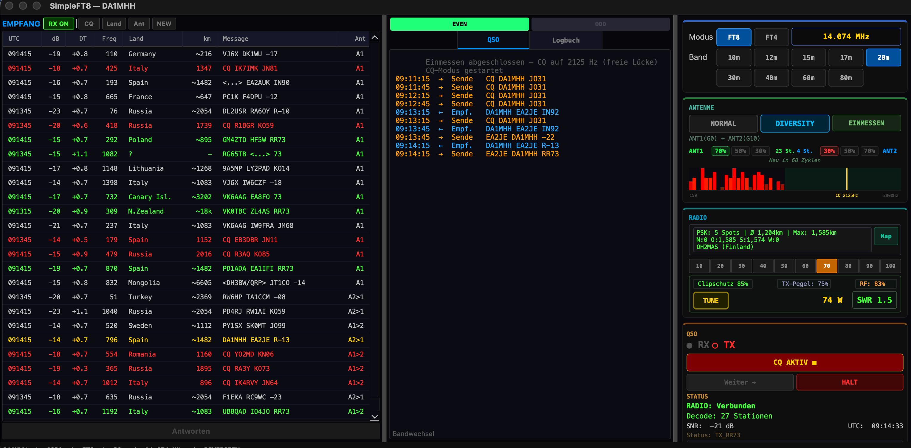
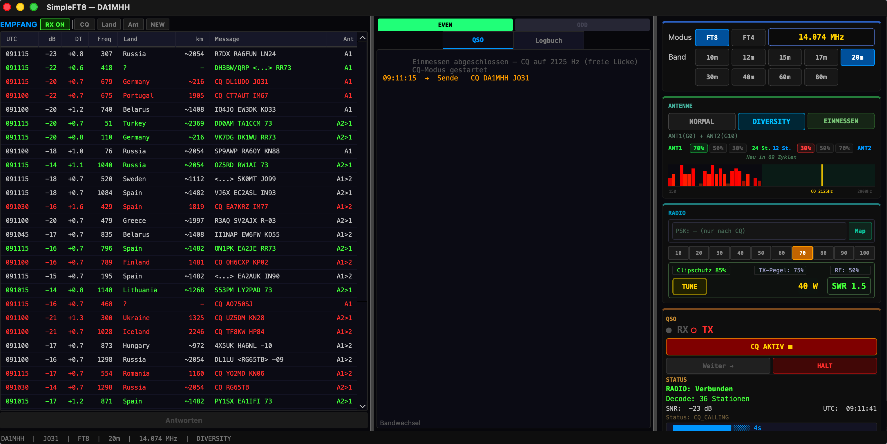

# SimpleFT8 — The Autonomous FT8/FT4 Client for FlexRadio

[English](#english) | [Deutsch](#deutsch)

[](https://opensource.org/licenses/MIT)
[](https://www.python.org/downloads/)
[](https://www.apple.com/macos/)
[](https://www.physics.princeton.edu/pulsar/k1jt/wsjtx.html)

> **No more manual ALC babysitting, no missed replies, no guessing the best antenna or frequency.**
> SimpleFT8 automates your entire FT8/FT4 workflow with closed-loop power control, reinforcement learning antenna selection, automatic CQ frequency optimization, and intelligent caller queuing.

> **Every feature explained in detail:** How does it work? Why? Pros/Cons? Physics + formulas.
> German + English → **[docs/explained/](docs/explained/)** (7 features × 2 languages = 14 documents)

---

<a name="english"></a>
## English

### Why SimpleFT8 vs. WSJT-X?

| Feature | WSJT‑X / JS8Call | SimpleFT8 |
|:---|:---|:---|
| **TX Power Control** | Manual ALC monitoring<br>❌ Requires user attention | **Automatic closed‑loop**<br>✅ FWDPWR feedback, real‑time adjustment |
| **Antenna Selection** | Manual switching<br>❌ One antenna at a time | **Automatic via UCB1 reinforcement learning**<br>✅ Temporal Polarization Diversity (ANT1=TX, ANT2=RX‑only) |
| **CQ Frequency Selection** | Manual waterfall scan<br>❌ Visual search required | **Automatic via spectrum histogram**<br>✅ Finds widest clear gap (>150 Hz) |
| **Simultaneous Callers** | Second station ignored<br>❌ Missed opportunities | **Queued & answered automatically**<br>✅ FIFO waitlist after first QSO |
| **SmartSDR Required** | Yes (most clients)<br>❌ Depends on GUI | **No — direct VITA‑49 + TCP**<br>✅ Standalone, no GUI needed |
| **Band‑Change Calibration** | Manual recalibration<br>❌ Per‑band adjustment by hand | **Automatic per‑band calibration**<br>✅ Stores & loads gain/power settings per band |

### Key Innovations

- **Auto TX Power Regulation** — Set your target wattage (e.g. 50W), SimpleFT8 reads the actual FWDPWR from the radio and adjusts rfpower proportionally until the target is hit. No more overdrive, no more weak signal on band changes. Works automatically every QSO cycle.

- **Temporal Polarization Diversity** — Cycles between two antennas every FT8 cycle and uses the UCB1 multi-armed bandit algorithm to learn which antenna/polarization performs better. After 80 cycles it re-evaluates and adjusts the ratio (70:30, 50:50, 30:70). Accumulates decoded stations from both antennas. **Important:** The 70:30 ratio is a calculated mix across both even AND odd slots — not a fixed even=ANT1/odd=ANT2 assignment. A 10-cycle pattern (`A1,A1,A2,A1,A1,A2,A1,A1,A2,A1`) ensures both antennas cover both slot types proportionally.

- **Automatic CQ Frequency Selection** — After diversity calibration, a 50 Hz bin histogram of all occupied frequencies is built. The widest clear gap (>150 Hz) is automatically chosen as the CQ frequency. No more manually hunting for a free slot.

- **Caller Waitlist** — When two stations reply to your CQ simultaneously, the second is placed in a queue. After the first QSO completes, SimpleFT8 automatically responds to the queued station without sending another CQ. More QSOs per hour.

- **Fully Standalone** — No SmartSDR GUI, no virtual audio cables, no DAX panel needed. Direct VITA-49 UDP audio streaming + SmartSDR TCP API.

### Real-World Performance

Controlled test on 40m, same hardware (FLEX-8400M), 2 minutes apart:

| Metric | SimpleFT8 Normal | SimpleFT8 Diversity |
|--------|:---:|:---:|
| Stations decoded (good conditions) | 27 | **37 (+37%)** |
| Stations decoded (poor conditions, 4 min) | 9 | **13 (+44%)** |
| PSKReporter Spots (TX, 15 min) | — | **190** |
| Farthest RX | — | Kiribati ~13,000 km |
| Farthest TX | — | Indonesia 11,996 km |

See [test screenshots and methodology](docs/DIVERSITY.md) for details.

### Screenshots

**All features running simultaneously** — active QSO (EA2JE, R-13→RR73), Diversity 70:30 (ANT1/ANT2/A1>2/A2>1 visible in RX list), CQ frequency histogram with yellow marker at 2125 Hz (free gap), 74W output, SWR 1.5, Clipguard 85%, PSKReporter 5 spots, 68 cycles until re-calibration:



| Diversity 20m (DT-corrected, A1/A2) | Comparison Test 40m (+37%) |
|:-:|:-:|
|  |  |

**Automatic CQ Frequency Selection** — 50 Hz bin histogram, green = free gap, yellow marker = auto-selected CQ frequency:



### All Features

**Tested & Working:**
- **Auto TX Power Regulation**: Proportional closed-loop FWDPWR feedback, clipping protection (audio level capped at 0.75), per-band calibration
- **Temporal Polarization Diversity** with UCB1 adaptive antenna ratio (70:30, 50:50, 30:70), auto re-measurement every 60 cycles. Fixed even/odd slot alignment: both antennas cover both slot types (A1-A1-A2-A2 block pattern)
- **Automatic CQ Frequency** via spectrum histogram after diversity calibration
- **Caller Waitlist**: Queue simultaneous callers, respond automatically after current QSO
- **DX Tuning**: Automated 18-cycle gain measurement, per-band presets saved
- **Signal Processing**: 5-pass signal subtraction, spectral whitening, sinc anti-alias resampling, 50 LDPC iterations
- **QSO State Machine**: Hunt mode + CQ mode, even/odd slot management, retry logic, ADIF 3.1.7 logging
- **Integrated Logbook**: Sortable table, search, DXCC counter, QSO detail overlay
- **QRZ.com**: Callsign lookup + logbook upload
- **PSKReporter** integration with spot statistics and distance display

**Implemented — Field Test Pending (⚠️ UNTESTED):**
- ⚠️ **RMS Auto-Gain Control** *(v0.27, untested)*: Automatic input level regulation before decoder pipeline. Target: −12 dBFS RMS. EMA smoothing (α=0.02), ±3 dB hysteresis to prevent pumping, gain limits [−20 dB … +12 dB]. Prevents decoder overload on crowded bands (40m evenings).
- ⚠️ **AP-Lite v2.2** *(v0.26, untested)*: Weak QSO rescue via coherent addition of two failed decode attempts. Costas-array alignment (±8 samples / ±1.5 Hz), normalized cross-correlation + Costas-weighted scoring, threshold 0.75. Expected gain: ~4–5 dB SNR. Disabled by default (`AP_LITE_ENABLED = False`), enable after field-test calibration.
- ⚠️ **DT Time Correction** *(v0.21, untested)*: Median DT from decoded stations used to detect and correct local clock drift. 50 ms dead-band, EMA smoothing factor 0.3, minimum 5 stations. Needs field validation: sign, smoothing, threshold.
- ⚠️ **Propagation Bars** *(v0.23, untested)*: 4px color indicator under each band button — HamQSL solar data + time-of-day correction for Central Europe. Colors: green/yellow/orange/red. Appears ~3s after app start. Field validation pending: colors plausible?
- ⚠️ **Frequency Drift Compensation** *(v0.30, untested)*: Extra decode passes with linear drift correction (±0.5 / ±1.5 Hz/s) for drifting QRP stations. Analytic signal (Hilbert) with quadratic phase correction. Expected gain: +5–10% decodes from cheap VFOs.

**Operator Presence (Anti-Bot):**
- **Legal requirement (DE)**: Operator must be present at the radio — no unattended bot operation
- Fixed 15-minute timeout, not configurable, not bypassable
- 4px countdown bar below CQ button (green → yellow → red)
- Reset by mouse/keyboard activity inside SimpleFT8 window
- On timeout: CQ stops, no new TX — active QSOs always finish cleanly

### Installation

```bash
git clone https://github.com/mikewanne/SimpleFT8.git
cd SimpleFT8
python3 -m venv venv
source venv/bin/activate
pip install -r requirements.txt
python3 main.py
```

**Requirements:** macOS, Python 3.12+, FlexRadio SDR (FLEX-6000/8000 series) with SmartSDR TCP API. Two antenna ports for Diversity mode (optional — single antenna works fine in normal mode).

### Configuration

Settings via GUI or directly in `~/.simpleft8/config.json`: callsign, locator, band, power preset, QRZ API key.

**Radio IP — leave blank for auto-discovery:** SimpleFT8 automatically finds your FlexRadio on the local network via UDP broadcast. No IP address needs to be configured. If auto-discovery fails or you have multiple radios, set the IP manually in Settings.

### Architecture

```
SimpleFT8/
├── main.py               # Entry point
├── config/settings.py    # Settings, band frequencies, radio_type
├── core/
│   ├── decoder.py        # FT8 decode + RMS AGC + signal subtraction + whitening
│   ├── encoder.py        # FT8 encode → VITA-49 TX + reference wave generation
│   ├── ap_lite.py        # AP-Lite v2.2 ⚠️ UNTESTED (coherent addition rescue)
│   ├── ntp_time.py       # DT-based clock correction ⚠️ UNTESTED
│   ├── propagation.py    # Band propagation bars ⚠️ UNTESTED
│   ├── diversity.py      # Diversity controller (measure/operate phases)
│   └── timing.py         # UTC clock, 15s cycle timing
├── radio/
│   ├── base_radio.py     # RadioInterface ABC (contract for future radios)
│   ├── radio_factory.py  # create_radio(settings) → FlexRadio | IC7300 (future)
│   ├── presets.py        # PREAMP_PRESETS per band (radio-agnostic)
│   └── flexradio.py      # SmartSDR TCP + VITA-49 RX/TX audio streaming
├── log/                  # ADIF writer, QRZ.com API
└── ui/                   # PySide6 GUI (3-panel dark theme)
```

### Radio Compatibility

**Tested:** FLEX-8400M. **Expected compatible:** FLEX-6300/6400/6500/6600/6700/8400/8600 series.

### Detailed Feature Documentation

Each feature has its own in-depth explanation (DE + EN) — with physics, formulas, pros/cons:

| Feature | Deutsch | English |
|---------|---------|---------|
| Signal Processing | [signal-processing_de.md](docs/explained/signal-processing_de.md) | [signal-processing.md](docs/explained/signal-processing.md) |
| RMS Auto-Gain | [rms-agc_de.md](docs/explained/rms-agc_de.md) | [rms-agc.md](docs/explained/rms-agc.md) |
| Drift Compensation | [drift-compensation_de.md](docs/explained/drift-compensation_de.md) | [drift-compensation.md](docs/explained/drift-compensation.md) |
| AP-Lite (QSO Rescue) | [ap-lite_de.md](docs/explained/ap-lite_de.md) | [ap-lite.md](docs/explained/ap-lite.md) |
| DT Time Correction | [dt-correction_de.md](docs/explained/dt-correction_de.md) | [dt-correction.md](docs/explained/dt-correction.md) |
| Propagation Indicators | [propagation-indicators_de.md](docs/explained/propagation-indicators_de.md) | [propagation-indicators.md](docs/explained/propagation-indicators.md) |
| Operator Presence | [operator-presence_de.md](docs/explained/operator-presence_de.md) | [operator-presence.md](docs/explained/operator-presence.md) |

### License

MIT License (c) 2026 DA1MHH (Mike Hammerer)

---

<a name="deutsch"></a>
## Deutsch

### Warum SimpleFT8 statt WSJT-X?

| Funktion | WSJT‑X / JS8Call | SimpleFT8 |
|:---|:---|:---|
| **TX‑Leistungsregelung** | Manuelles ALC‑Monitoring<br>❌ Erfordert Benutzer‑Eingriff | **Automatischer Regelkreis**<br>✅ FWDPWR‑Feedback, Echtzeit‑Anpassung |
| **Antennenwahl** | Manuelles Umschalten<br>❌ Immer nur eine Antenne aktiv | **Automatisch via UCB1 Reinforcement Learning**<br>✅ Temporal Polarization Diversity (ANT1=TX, ANT2=nur RX) |
| **CQ‑Frequenzwahl** | Manueller Wasserfall‑Scan<br>❌ Visuelle Suche nötig | **Automatisch via Frequenz‑Histogramm**<br>✅ Findet breiteste freie Lücke (>150 Hz) |
| **Gleichzeitige Anrufer** | Zweite Station ignoriert<br>❌ Verpasste Kontakte | **Warteliste & automatische Antwort**<br>✅ FIFO‑Queue nach erstem QSO |
| **SmartSDR erforderlich** | Ja (die meisten Clients)<br>❌ Abhängig von GUI | **Nein — direkt via VITA‑49 + TCP**<br>✅ Standalone, keine GUI nötig |
| **Leistungs‑Rekalibrierung nach Bandwechsel** | Manuelle Neueinmessung<br>❌ Pro Band manuell justieren | **Automatisch pro Band**<br>✅ Speichert & lädt Gain‑/Leistungseinstellungen pro Band |

### Die wichtigsten Innovationen

- **Automatische TX-Leistungsregelung** — Zielwatt einstellen (z.B. 50W), SimpleFT8 liest den tatsächlichen FWDPWR-Wert vom Radio und regelt den rfpower-Wert proportional nach — aufwärts und abwärts. Kein manuelles ALC, keine Übersteuerung, keine zu schwachen Signale nach dem Bandwechsel.

- **Temporale Polarisations-Diversity** — Wechselt pro FT8-Zyklus zwischen zwei Antennen und nutzt den UCB1 Multi-Armed-Bandit-Algorithmus um zu lernen, welche Antenne/Polarisation besser ist. Nach 80 Zyklen wird neu eingemessen und das Verhältnis angepasst (70:30, 50:50, 30:70). **Wichtig:** Das Verhältnis 70:30 ist ein berechneter prozentualer Mix über gerade UND ungerade Slots — keine feste Zuordnung even=ANT1/odd=ANT2. Ein 10-Zyklen-Muster (`A1,A1,A2,A1,A1,A2,A1,A1,A2,A1`) stellt sicher dass beide Antennen beide Slot-Typen proportional abdecken.

- **Automatische CQ-Frequenzwahl** — Nach dem Einmessen wird aus einem 50-Hz-Bin-Histogramm aller belegten Frequenzen die breiteste freie Lücke (>150 Hz) automatisch als CQ-Frequenz gewählt. Kein manuelles Suchen nach freiem Platz im Wasserfall.

- **Warteliste für gleichzeitige Anrufer** — Wenn zwei Stationen gleichzeitig auf dein CQ antworten, kommt die zweite in eine Warteschlange. Nach dem ersten QSO antwortet SimpleFT8 automatisch der wartenden Station — ohne neues CQ.

- **Komplett eigenständig** — Kein SmartSDR GUI, keine virtuellen Audiokabel, kein DAX-Panel. Direktes VITA-49 UDP Audio-Streaming + SmartSDR TCP API.

### Praxis-Ergebnisse

Kontrollierter Test auf 40m, gleiche Hardware (FLEX-8400M), 2 Minuten Abstand:

| Messwert | SimpleFT8 Normal | SimpleFT8 Diversity |
|----------|:---:|:---:|
| Dekodierte Stationen (gute Bedingungen) | 27 | **37 (+37%)** |
| Dekodierte Stationen (schlechte Bedingungen, 4 min) | 9 | **13 (+44%)** |
| PSKReporter Spots (TX, 15 min) | — | **190** |
| Weitester RX | — | Kiribati ~13.000 km |
| Weitester TX | — | Indonesien 11.996 km |

Siehe [Test-Screenshots und Methodik](docs/DIVERSITY_DE.md) für Details.

**Alle Features gleichzeitig** — laufendes QSO (EA2JE, R-13→RR73), Diversity 70:30 (ANT1/ANT2/A1>2/A2>1 sichtbar), CQ-Histogramm mit gelbem Marker bei 2125 Hz, 74W, SWR 1.5, Clipschutz 85%, PSKReporter 5 Spots, 68 Zyklen bis zur Neueinmessung:


**Automatische CQ-Frequenzwahl** — 50-Hz-Histogramm, grün = freie Lücke, gelber Marker = automatisch gewählte CQ-Frequenz:


### Alle Funktionen

**Getestet & funktionsfähig:**
- **Automatische TX-Leistungsregelung**: Proportionaler Regelkreis mit FWDPWR-Feedback, Clipping-Schutz, Kalibrierung pro Band
- **Temporale Polarisations-Diversity** mit UCB1 adaptivem Verhältnis (70:30, 50:50, 30:70), automatische Neueinmessung alle 60 Zyklen. Bugfix: A1-A1-A2-A2 Block-Muster → beide Antennen decken Even- UND Odd-Slots ab
- **Automatische CQ-Frequenz** via Frequenz-Histogramm nach dem Einmessen
- **Warteliste**: Gleichzeitige Anrufer werden gequeued, nach aktuellem QSO automatisch beantwortet
- **DX Tuning**: Automatisierte 18-Zyklen Gain-Messung, Presets pro Band
- **Signalverarbeitung**: 5-Pass Signal Subtraction, Spectral Whitening, Sinc-Resampling, 50 LDPC-Iterationen
- **QSO-Zustandsmaschine**: Hunt-Modus + CQ-Modus, Even/Odd-Slot-Verwaltung, Retry-Logik, ADIF 3.1.7 Logging
- **Integriertes Logbuch**: Sortierbare Tabelle, Suche, DXCC-Zähler, QSO-Detail-Overlay
- **QRZ.com**: Rufzeichen-Lookup + Logbuch-Upload
- **PSKReporter**-Integration mit Spot-Statistik und Entfernungsanzeige

**Implementiert — Feldtest ausstehend (⚠️ UNGETESTET):**
- ⚠️ **RMS Auto-Gain Control** *(v0.27, ungetestet)*: Automatische Eingangspegelregelung vor der Decoder-Pipeline. Ziel: −12 dBFS RMS. EMA-Glättung (α=0,02), ±3 dB Hysterese (kein Pumpen), Gain-Grenzen [−20 dB … +12 dB]. Verhindert Decoder-Übersteuerung auf belebten Bändern (40m abends).
- ⚠️ **AP-Lite v2.2** *(v0.26, ungetestet)*: Schwache QSOs retten via kohärenter Addition zweier fehlgeschlagener Dekodierversuche. Costas-Alignment (±8 Samples / ±1,5 Hz), normalisierte Kreuzkorrelation + Costas-Gewichtung, Schwellwert 0,75. Erwarteter Gewinn: ~4–5 dB SNR. Standardmäßig deaktiviert (`AP_LITE_ENABLED = False`), nach Feldtest-Kalibrierung aktivieren.
- ⚠️ **DT-Zeitkorrektur** *(v0.21, ungetestet)*: Median-DT aus dekodierten Stationen zur Erkennung und Korrektur der lokalen Uhrdrift. 50 ms Totband, EMA-Faktor 0,3, Minimum 5 Stationen. Feldvalidierung ausstehend: Vorzeichen, Glättung, Schwellwert.
- ⚠️ **Propagation-Balken** *(v0.23, ungetestet)*: 4px Farbindikator unter jedem Bandbutton — HamQSL-Solardaten + bandspezifische Tageszeit-Korrektur für Mitteleuropa. Farben: grün/gelb/orange/rot. Erscheint ~3s nach App-Start. Feldvalidierung ausstehend: Farben plausibel?

### Installation

```bash
git clone https://github.com/mikewanne/SimpleFT8.git
cd SimpleFT8
python3 -m venv venv
source venv/bin/activate
pip install -r requirements.txt
python3 main.py
```

**Voraussetzungen:** macOS, Python 3.12+, FlexRadio SDR (FLEX-6000/8000 Serie) mit SmartSDR TCP API. Zwei Antennenanschlüsse für Diversity-Modus (optional — Einzelantenne läuft im Normal-Modus problemlos).

### Konfiguration

Einstellungen über die GUI oder direkt in `~/.simpleft8/config.json`: Rufzeichen, Locator, Band, Leistungs-Preset, QRZ API-Key.

**Radio-IP — leer lassen für Auto-Discovery:** SimpleFT8 findet das FlexRadio automatisch im lokalen Netzwerk per UDP-Broadcast. Es muss keine IP-Adresse eingetragen werden. Falls Auto-Discovery fehlschlägt oder mehrere Radios im Netz sind, kann die IP manuell in den Einstellungen gesetzt werden.

### Architektur

```
SimpleFT8/
├── main.py               # Einstiegspunkt
├── config/settings.py    # Einstellungen, Band-Frequenzen
├── core/                 # Decoder, Encoder, QSO-Zustandsmaschine, Diversity, Timing
├── radio/flexradio.py    # SmartSDR TCP + VITA-49 RX/TX Audio-Streaming
├── log/                  # ADIF Writer, QRZ.com API
└── ui/                   # PySide6 GUI (3-Panel Dark Theme)
```

### Radio-Kompatibilität

**Getestet:** FLEX-8400M. **Voraussichtlich kompatibel:** FLEX-6300/6400/6500/6600/6700/8400/8600 Serie.

### Lizenz

MIT License (c) 2026 DA1MHH (Mike Hammerer)

---

## Acknowledgments / Danksagungen

- [ft8_lib](https://github.com/kgoba/ft8_lib) — FT8/FT4 encode/decode C library (MIT)
- [FlexRadio Systems](https://www.flexradio.com/) — SmartSDR TCP API
- [WSJT-X](https://wsjt.sourceforge.io/) — Pioneering digital weak-signal modes

---

*SimpleFT8: Because weak signals deserve a fighting chance. / Weil schwache Signale eine faire Chance verdienen.*
