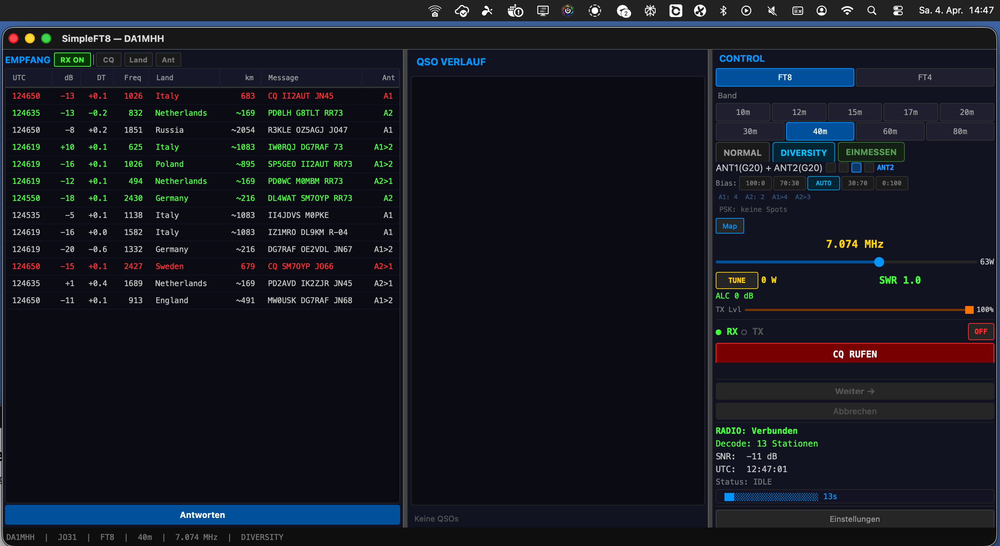
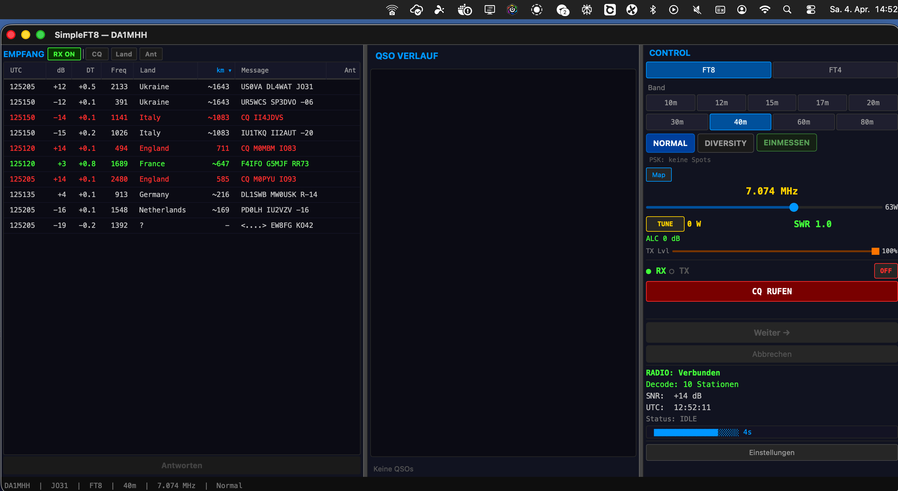
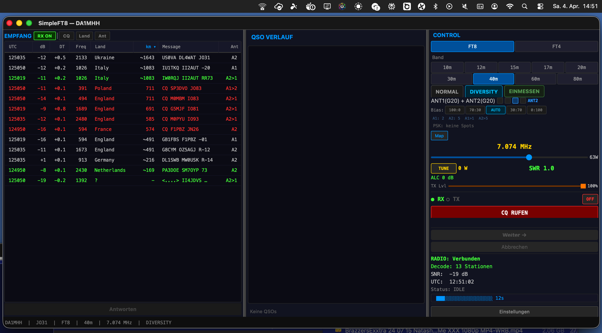
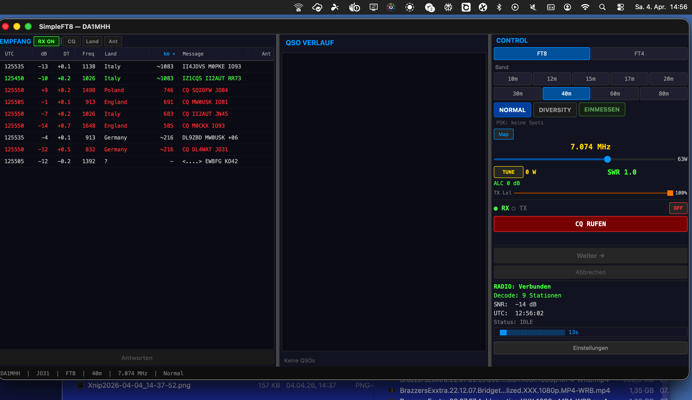

# SimpleFT8 — Temporal Antenna Diversity for FT8

🇬🇧 **English** | [🇩🇪 Deutsch](#deutsch)

---

**A standalone FT8 client for FlexRadio (8400M/6xxx/8600M) that automatically switches between two antennas every 15 seconds — hearing far more stations than any single-antenna setup.**

> **Up to 5x more stations** compared to single-antenna operation.
> Measured: Normal 10 stations → Diversity 13 stations (40m, poor conditions, 04.04.2026).
> Peak: 63 stations on 20m (typically 10–20 per cycle). Rain gutter as 2nd antenna confirmed working.

---

## First QSO completed!

**DA1MHH worked YL2TM (Latvia) on 20m FT8 — 05 April 2026, 17:31 UTC.**
Thanks YL2TM for the first SimpleFT8 QSO!

```
17:31 → CQ DA1MHH JO31
17:31 ← DA1MHH YL2TM -19
17:31 → YL2TM DA1MHH R-12
17:32 → YL2TM DA1MHH RR73
17:32 ← DA1MHH YL2TM RR73
       ✓ QSO complete — logged to ADIF
```

- ✅ **TX working** — 155+ PSKReporter spots worldwide, up to 12,000 km
- ✅ **CQ + Auto mode** — Call CQ, auto-respond to callers, full QSO sequence
- ✅ **Hunt mode** — Click a station, auto-sequence through QSO
- ✅ **ADIF logging** — QSOs logged automatically

**QSO features:** Auto mode (CQ + Hunt), configurable call attempts (3/5/7/99), even/odd slot correction, TX frequency 1500 Hz (WSJT-X standard), deferred reply pattern, station switching.

---

## What is Temporal Antenna Diversity?

Most radios have two antenna sockets but only one receiver — you normally have to pick one antenna and stick with it.

**SimpleFT8 does something clever:** FT8 transmits in fixed 15-second slots. Each station on the air stays active for several minutes. So SimpleFT8 listens on ANT1 during slot 1, then ANT2 during slot 2, then merges the results. You see stations from *both* antennas in one combined list.

```
Slot 1 (ANT1):  14 stations decoded
Slot 2 (ANT2):  17 stations decoded  ← some new ones ANT1 couldn't hear
Slot 3 (ANT1):  12 stations decoded
Slot 4 (ANT2):  15 stations decoded
                ──────────────────
Combined list:  40+ unique stations  (vs ~15 with one antenna)
```

**Why does it work?** Two antennas with different physical orientation and placement have different characteristics. A station sitting in the "dead zone" of ANT1 might be perfectly audible on ANT2. A signal buried under local noise on ANT1 might be clean on ANT2. By alternating every 15 seconds, you systematically capture both.

**The rain gutter thing:** ANT2 here is a metal rain gutter on the roof — horizontal, 0 ohm matching, completely untuned. It works because it couples into the entire house structure (downpipes, ground system). Together with the vertical dipole (different polarization), it forms a surprisingly effective diversity pair. Peak result: **New Zealand, 18,000 km received on the rain gutter.**

---

## Three RX Modes

| Mode | What it does |
|------|-------------|
| **NORMAL** | Single antenna, stations accumulate over 2 minutes |
| **DIVERSITY** | Alternates ANT1/ANT2 every cycle, merges results |
| **DX TUNING** | Automatic 18-cycle measurement: finds best antenna + gain per band |

### AUTO Mode — The Smart Switcher

When DIVERSITY is active and bias is set to **AUTO**, SimpleFT8 uses the **UCB1 algorithm** (from reinforcement learning) to decide which antenna to use next.

Instead of a fixed pattern, UCB1 tracks how many stations each antenna decodes and gradually favors the better one — while always exploring the other enough to notice when conditions change. No manual tuning, no bias spirals, no resets needed.

The stats line shows the current learning state: `UCB: A1=0.34(42) A2=0.51(38)` means ANT2 is currently scoring better (0.51 reward/cycle over 38 cycles).

### DX Tuning (Automatic Measurement)

Click **EINMESSEN** to start an 18-cycle interleaved measurement:
- ANT1 and ANT2 are compared at the same gain settings, in alternating cycles (fair comparison)
- Three gain levels (0/10/20 dB) are tested per antenna
- Best antenna + gain saved as preset for this band
- Preset loads automatically on band change

Result is stored per band — once measured, diversity just works.

---

## Measured Results

| Date | Band | Conditions | NORMAL | DIVERSITY | Notes |
|------|------|-----------|--------|-----------|-------|
| 03.04.2026 | 20m | Poor | ~15 stations/cycle | **63 stations accumulated** | Indonesia 12,000 km |
| 03.04.2026 | 40m | Normal | ~15 stations/cycle | **37 stations accumulated** | +37% |
| 04.04.2026 | 40m | Poor | 10 stations/cycle | **13 stations accumulated** | Russia 2054 km vs Ukraine 1643 km |

*Reference: IC-7300 + WSJT-X on same location same time: 13–22 stations (single cycle, single antenna). SimpleFT8 typically decodes 10–20 stations per cycle on 20m/40m.*

**Two effects work together:**
1. **Accumulation** — stations persist for 75s instead of resetting every 15s. This alone roughly doubles visible count vs. a single WSJT-X snapshot.
2. **Antenna diversity** — ANT2 adds stations invisible to ANT1. Together: up to 5x more stations than a single-cycle single-antenna decode.

---

## What Works

- Full FT8 RX/TX via FlexRadio VITA-49 protocol (no SmartSDR needed)
- 3 RX modes: Normal / Diversity / DX Tuning
- UCB1 adaptive antenna selection in AUTO mode
- Advanced decoder: AP decoding (known calls/grids), signal subtraction (5 passes), spectral whitening
- Country detection + distance calculation for 100+ prefixes
- **QSO state machine** with CQ mode and Hunt mode (click a station to call)
- **155 PSKReporter spots** worldwide, stations respond to CQ calls
- Configurable call attempts (3/5/7/99) with auto-abort
- TX queue for incoming responses during CQ
- Even/odd slot correction, TX frequency 1500 Hz (WSJT-X standard)
- Station switch aborts running QSO cleanly
- Info buttons in Settings with reset to defaults
- SWR alarm in status bar only (no popup interruptions)
- ADIF log export
- PSKReporter integration
- Auto-reconnect (exponential backoff, unlimited retries)
- Band-specific antenna presets (saved after DX Tuning)
- Filter by country, filter by antenna
- Splitter sizes saved/restored on restart

## What's Missing

- First complete QSO not yet logged (stations respond, sequence runs, completion imminent)
- FT4 mode (7.5s cycles) not implemented
- Buttons not yet disabled when radio is disconnected
- ~20% of exotic callsign prefixes missing

---

## Screenshots

**Diversity mode — 63 stations on 20m (Indonesia 11,000 km, New Zealand 18,000 km):**


**Direct comparison — same band (40m), same evening, 2 minutes apart:**

| Normal — 27 stations | Diversity — 37 stations |
|---|---|
|  |  |

**40m test 04.04.2026 (poor conditions, 4 min each):**

| Diversity — 13 stations (14:47–14:51) | Normal — 9 stations (14:52–14:56) |
|---|---|
|  |  |
|  |  |

---

## Installation

```bash
git clone https://github.com/mikewanne/SimpleFT8.git
cd SimpleFT8
python3.12 -m venv venv
source venv/bin/activate
pip install -r requirements.txt
./venv/bin/python3 main.py
```

**Requires:** FlexRadio 8400M / 6xxx / 8600M with SmartSDR TCP API. No SmartSDR software needed — SimpleFT8 connects directly.

---

## Technical Details (for the curious)

| Component | Technology |
|-----------|-----------|
| Language | Python 3.12 |
| GUI | PySide6 (Qt6) |
| FT8 Codec | PyFT8 2.6.1 |
| Audio RX/TX | VITA-49 UDP, int16 mono 24kHz |
| Rig Control | SmartSDR TCP API (Port 4992) |
| Config | ~/.simpleft8/config.json |

**Decoder pipeline:** VITA-49 → Anti-alias filter → Resample 12kHz → Spectral whitening → FT8 decode (LDPC 50 iter) → Signal subtraction (5 passes) → AP/OSD decode → Merge

**Performance:** 2.71s per full decode cycle on M4 Pro. Every cycle decoded, no skipping.

**Diversity algorithm:** UCB1 (Upper Confidence Bound) adaptive antenna selection. Reward = SNR-weighted decode count per cycle. Reset on band change.

---

## License

MIT License — free for everyone. Use it, modify it, build on it.

---

---

<a name="deutsch"></a>
# 🇩🇪 SimpleFT8 — Temporal Antenna Diversity für FT8

**Ein eigenständiger FT8-Client für FlexRadio (8400M/6xxx/8600M), der automatisch alle 15 Sekunden zwischen zwei Antennen wechselt — und dabei deutlich mehr Stationen hört als jedes Einzelantennen-Setup.**

> **Bis zu 5x mehr Stationen** im Vergleich zum Betrieb mit nur einer Antenne.
> Gemessen: Normal 10 Stationen → Diversity 13 Stationen (40m, schlechte Bedingungen, 04.04.2026).
> Spitzenwert: 63 Stationen auf 20m (typisch 10–20 pro Zyklus). Regenrinne als zweite Antenne bestätigt funktionierend.

---

## Erstes QSO geschafft!

**DA1MHH hat YL2TM (Lettland) auf 20m FT8 gearbeitet — 05. April 2026, 17:31 UTC.**
Danke YL2TM fuer das erste SimpleFT8 QSO!

```
17:31 → CQ DA1MHH JO31
17:31 ← DA1MHH YL2TM -19
17:31 → YL2TM DA1MHH R-12
17:32 → YL2TM DA1MHH RR73
17:32 ← DA1MHH YL2TM RR73
       ✓ QSO komplett — ins ADIF-Log geschrieben
```

- ✅ **TX funktioniert** — 155+ PSKReporter-Spots weltweit, bis 12.000 km
- ✅ **CQ + Auto-Modus** — CQ rufen, automatisch auf Anrufer antworten, komplette QSO-Sequenz
- ✅ **Hunt-Modus** — Station anklicken, QSO-Sequenz laeuft automatisch
- ✅ **ADIF-Logging** — QSOs werden automatisch geloggt

**QSO-Features:** Auto-Modus (CQ + Hunt), einstellbare Anrufversuche (3/5/7/99), Even/Odd Slot-Korrektur, TX-Frequenz 1500 Hz (WSJT-X Standard), Deferred Reply Pattern, Station-Wechsel.

---

## Was ist Temporal Antenna Diversity?

Die meisten Radios haben zwei Antennenanschlüsse aber nur einen Empfänger — normalerweise muss man eine Antenne wählen und dabei bleiben.

**SimpleFT8 macht etwas Cleveres:** FT8 sendet in festen 15-Sekunden-Slots. Jede Station bleibt mehrere Minuten aktiv. Also hört SimpleFT8 im ersten Slot auf ANT1, im zweiten Slot auf ANT2 und fügt die Ergebnisse zusammen. Man sieht Stationen von *beiden* Antennen in einer kombinierten Liste.

```
Slot 1 (ANT1):  14 Stationen dekodiert
Slot 2 (ANT2):  17 Stationen dekodiert  ← einige neue die ANT1 nicht hörte
Slot 3 (ANT1):  12 Stationen dekodiert
Slot 4 (ANT2):  15 Stationen dekodiert
                ───────────────────────
Kombinierte Liste:  40+ einzigartige Stationen  (vs ~15 mit einer Antenne)
```

**Warum funktioniert das?** Zwei Antennen mit unterschiedlicher Ausrichtung haben unterschiedliche Eigenschaften. Eine Station im "toten Winkel" von ANT1 ist auf ANT2 vielleicht gut hörbar. Ein Signal im Rauschen auf ANT1 kann auf ANT2 sauber sein. Durch den Wechsel alle 15 Sekunden werden systematisch beide erfasst.

**Die Regenrinnen-Sache:** ANT2 hier ist eine Metall-Regenrinne auf dem Dach — horizontal, kein Matching, völlig unabgestimmt. Sie funktioniert weil sie sich an die gesamte Hausstruktur ankoppelt (Fallrohre, Erdungsanlage). Zusammen mit dem vertikalen Dipol (andere Polarisation) bildet sie ein überraschend effektives Diversity-Paar. Spitzenresultat: **Neuseeland, 18.000 km über die Regenrinne empfangen.**

---

## Drei RX-Modi

| Modus | Was er macht |
|-------|-------------|
| **NORMAL** | Eine Antenne, Stationen akkumulieren über 2 Minuten |
| **DIVERSITY** | Wechselt ANT1/ANT2 jeden Zyklus, führt Ergebnisse zusammen |
| **EINMESSEN** | Automatische 18-Zyklus-Messung: findet beste Antenne + Gain pro Band |

### AUTO-Modus — Der schlaue Umschalter

Wenn DIVERSITY aktiv ist und Bias auf **AUTO** steht, nutzt SimpleFT8 den **UCB1-Algorithmus** (aus dem Reinforcement Learning) um zu entscheiden, welche Antenne als nächstes dran ist.

Statt eines festen Musters verfolgt UCB1 wie viele Stationen jede Antenne dekodiert und bevorzugt allmählich die bessere — während er die andere immer genug abtastet um zu merken wenn sich die Bedingungen ändern. Kein manuelles Einstellen, keine Bias-Spiralen, kein Reset nötig.

Die Stats-Zeile zeigt den aktuellen Lernstand: `UCB: A1=0.34(42) A2=0.51(38)` bedeutet ANT2 schneidet gerade besser ab (0.51 Reward/Zyklus über 38 Zyklen).

### DX Tuning (Automatische Messung)

Klick auf **EINMESSEN** startet eine 18-Zyklus-Interleaved-Messung:
- ANT1 und ANT2 werden bei gleichen Gain-Einstellungen in abwechselnden Zyklen verglichen (fairer Vergleich)
- Drei Gain-Stufen (0/10/20 dB) werden pro Antenne getestet
- Beste Antenne + Gain als Preset für dieses Band gespeichert
- Preset wird bei Bandwechsel automatisch geladen

Das Ergebnis wird pro Band gespeichert — einmal eingemessen, dann funktioniert Diversity einfach.

---

## Messergebnisse

| Datum | Band | Bedingungen | NORMAL | DIVERSITY | Anmerkungen |
|-------|------|------------|--------|-----------|-------------|
| 03.04.2026 | 20m | Schlecht | ~15 Stationen/Zyklus | **63 Stationen akkumuliert** | Indonesien 12.000 km |
| 03.04.2026 | 40m | Normal | ~15 Stationen/Zyklus | **37 Stationen akkumuliert** | +37% |
| 04.04.2026 | 40m | Schlecht | 10 Stationen/Zyklus | **13 Stationen akkumuliert** | Russland 2054 km vs Ukraine 1643 km |

*Referenz: IC-7300 + WSJT-X am gleichen Standort zur gleichen Zeit: 13–22 Stationen (einzelner Zyklus, einzelne Antenne). SimpleFT8 dekodiert typisch 10–20 Stationen pro Zyklus auf 20m/40m.*

**Zwei Effekte zusammen:**
1. **Akkumulation** — Stationen bleiben 75s sichtbar statt alle 15s zurückzusetzen. Das allein verdoppelt die sichtbare Anzahl vs. einem WSJT-X-Snapshot.
2. **Antennen-Diversity** — ANT2 liefert Stationen die ANT1 nicht hört. Zusammen: bis zu 5x mehr Stationen als ein Einzel-Zyklus Einzel-Antennen-Decode.

---

## Was funktioniert

- Vollständiger FT8 RX/TX über FlexRadio VITA-49 Protokoll (kein SmartSDR nötig)
- 3 RX-Modi: Normal / Diversity / Einmessen
- UCB1 adaptive Antennen-Auswahl im AUTO-Modus
- Erweiterter Decoder: AP-Dekodierung (bekannte Calls/Grids), Signal Subtraction (5 Passes), Spectral Whitening
- Ländererkennung + Entfernungsberechnung für 100+ Präfixe
- **QSO State Machine** mit CQ-Modus und Hunt-Modus (Station anklicken zum Anrufen)
- **155 PSKReporter-Spots** weltweit, Stationen antworten auf CQ-Rufe
- Einstellbare Anrufversuche (3/5/7/99) mit Auto-Abbruch
- TX-Queue für eingehende Antworten während CQ
- Even/Odd Slot-Korrektur, TX-Frequenz 1500 Hz (WSJT-X Standard)
- Station-Wechsel bricht laufendes QSO sauber ab
- Info-Buttons in Settings mit Reset auf Standardwerte
- SWR-Alarm nur in Statusbar (keine Popup-Unterbrechungen)
- ADIF-Log-Export
- PSKReporter-Integration
- Auto-Reconnect (Exponential Backoff, unbegrenzte Versuche)
- Band-spezifische Antennen-Presets (nach Einmessen gespeichert)
- Filter nach Land, Filter nach Antenne
- Splitter-Breiten beim Start wiederhergestellt

## Was noch fehlt

- Erstes komplettes QSO noch nicht geloggt (Stationen antworten, Sequenz läuft, Abschluss steht bevor)
- FT4-Modus (7,5s Zyklen) nicht implementiert
- Buttons noch nicht deaktiviert wenn Radio getrennt
- ~20% exotischer Callsign-Präfixe fehlen noch

---

## Screenshots

**Diversity-Modus — 63 Stationen auf 20m (Indonesien 11.000 km, Neuseeland 18.000 km):**


**Direktvergleich — gleiche Band (40m), gleicher Abend, 2 Minuten Abstand:**

| Normal — 27 Stationen | Diversity — 37 Stationen |
|---|---|
|  |  |

**40m Test 04.04.2026 (schlechte Bedingungen, je 4 Minuten):**

| Diversity — 13 Stationen (14:47–14:51) | Normal — 9 Stationen (14:52–14:56) |
|---|---|
|  |  |
|  |  |

---

## Installation

```bash
git clone https://github.com/mikewanne/SimpleFT8.git
cd SimpleFT8
python3.12 -m venv venv
source venv/bin/activate
pip install -r requirements.txt
./venv/bin/python3 main.py
```

**Voraussetzung:** FlexRadio 8400M / 6xxx / 8600M mit SmartSDR TCP API. Kein SmartSDR-Software nötig — SimpleFT8 verbindet sich direkt.

---

## Technische Details (für Interessierte)

| Komponente | Technologie |
|-----------|-----------|
| Sprache | Python 3.12 |
| GUI | PySide6 (Qt6) |
| FT8 Codec | PyFT8 2.6.1 |
| Audio RX/TX | VITA-49 UDP, int16 mono 24kHz |
| Rig Control | SmartSDR TCP API (Port 4992) |
| Config | ~/.simpleft8/config.json |

**Decoder-Pipeline:** VITA-49 → Anti-Alias-Filter → Resample 12kHz → Spectral Whitening → FT8 Decode (LDPC 50 Iter) → Signal Subtraction (5 Passes) → AP/OSD-Decode → Zusammenführen

**Performance:** 2,71s pro vollständigem Dekodierzyklus auf M4 Pro. Jeder Zyklus wird dekodiert, kein Überspringen.

**Diversity-Algorithmus:** UCB1 (Upper Confidence Bound) adaptive Antennen-Auswahl. Reward = SNR-gewichtete Dekodiermenge pro Zyklus. Reset bei Bandwechsel.

---

## Lizenz

MIT-Lizenz — frei für alle. Nutzen, ändern, einbauen.

---

## Über dieses Projekt

**Konzept & Implementierung:** Mike Hammerer, DA1MHH (JO31, Herne, Deutschland)
**KI-Unterstützung:** Claude (Anthropic) + DeepSeek
**Datum:** März/April 2026

Das Temporal Antenna Diversity Konzept wird hier als Prior Art veröffentlicht — frei für jeden zum Nutzen, Bewerten oder Einbauen in eigene Software.

73 de DA1MHH
