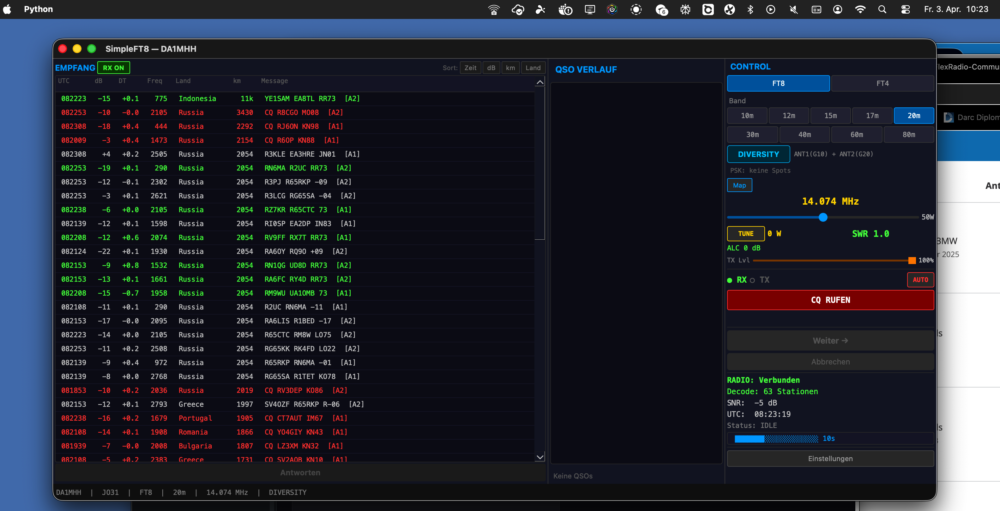
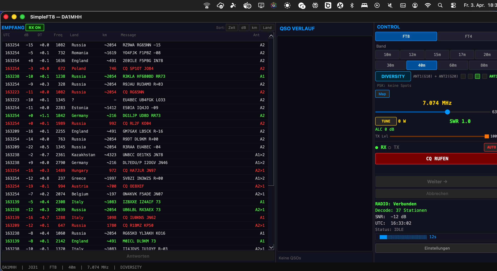

# SimpleFT8 — Temporal Antenna Diversity for FT8

🇬🇧 **English** | [🇩🇪 Deutsch](#deutsch)

---

**A functional FT8 client implementing Temporal Antenna Diversity — a novel technique that significantly increases weak signal decoding on any single-receiver dual-antenna radio.**

> **Up to 2–3x more unique stations visible** in the same 2-minute window compared to accumulated single-antenna operation under poor conditions.
> When compared to the standard single-cycle WSJT-X snapshot (15 seconds), the combined effect of accumulation + polarization diversity can show 4x more stations at once.
> Tested on FlexRadio 8400M with a multiband dipole + rain gutter as second antenna.

**Status:** Full RX/TX operational. Diversity, DX Tuning, AP/OSD decoders, auto-reconnect, ADIF logging — all functional. QSO chain end-to-end and FT4 mode remain for future implementation.

### Screenshots

**Diversity mode — 63 stations on 20m (Indonesia 11,000 km, New Zealand 18,000 km):**



**Direct comparison — same band (40m), same evening (2026-04-03), 2 minutes apart:**

| Normal — 27 stations | Diversity — 37 stations |
|---|---|
|  |  |

*+10 stations (+37%) with diversity active. ANT column shows which antenna heard each station (A1, A2, A1>2, A2>1). 4-cycle even/odd pattern ensures both antennas cover both FT8 phases.*

---

## The Concept: Temporal Antenna Diversity

### The Problem

FT8 stations are decoded from 15-second audio windows. A single antenna has one fixed radiation pattern and noise profile. Stations whose arrival direction, radiation angle or local noise floor doesn't favor your antenna are weak or invisible.

Most SDR radios with two antenna ports (like the FlexRadio 8400M) have only **one receiver (SCU)** — so you can't listen on both antennas simultaneously. True simultaneous diversity requires expensive dual-receiver models.

### The Solution

**Switch antennas every FT8 cycle (15 seconds) and accumulate stations across cycles.**

```
Cycle 1 (ANT1): Decode → 12 stations found
Cycle 2 (ANT2): Decode → 14 stations found (some overlap, some new)
Cycle 3 (ANT1): Decode → 11 stations found
Cycle 4 (ANT2): Decode → 13 stations found
                          ─────────────────
Accumulated unique:       48 stations (vs 14 with single antenna)
```

Key rules:
- **Accumulate, don't replace**: New cycle results merge with existing stations
- **Keep best SNR**: When a station is heard on both antennas, keep the stronger reading
- **Age out stale entries**: Stations not heard for >75s are removed
- **Mark antenna source**: `[A1]`, `[A2]`, `[A1>2]` (ANT1 stronger), `[A2>1]` (ANT2 stronger)
- **TX always on ANT1**: Never switch antenna during transmit
- **Non-blocking antenna commands**: Sent in a separate thread so keepalive and audio stream are never interrupted
- **No second slice needed**: Uses the same single slice/receiver — just switches the antenna input
- **Single decoder**: One decoder instance, one audio stream

### Simply Explained

FT8 transmits in fixed 15-second slots. Each station transmits for several minutes — so it's still there in the next slot.

SimpleFT8 exploits exactly this: Slot 1 listens on ANT1, Slot 2 on ANT2. Both slots are decoded and the stations are merged.

**Why does this help so much?**

Two antennas with different physical orientation and placement have different radiation patterns and noise profiles. Some stations sit in the null of ANT1 but in the main lobe of ANT2 — and vice versa. Some signals that are buried in local noise on ANT1 are above the noise floor on ANT2. These characteristics are **stable per station** — a station that's better on ANT2 will consistently be better on ANT2. By alternating antennas every 15-second slot, you systematically capture both populations.

**The special thing:** Normally, antenna diversity requires two complete receiver units — expensive. SimpleFT8 does it with just one, because FT8 naturally works in slots. The software does the rest.

This works on **any radio with two antenna ports**, even single-receiver models. No hardware modification needed.

### Measured Results (2026-04-02/03, 20m band, POOR conditions)

| Mode | Stations | Window | Setup |
|------|----------|--------|-------|
| **Single Antenna (ANT1), one cycle** | ~14 | 15 sec | Multiband dipole (vertical, 10cm from wall) |
| **Single Antenna (ANT1), accumulated** | ~25–30 | 2 min | Same antenna, same time period |
| **Temporal Diversity (ANT1+ANT2)** | **48–63** | 2 min | + Rain gutter (horizontal) as ANT2 |
| IC-7300 + WSJT-X (reference, one cycle) | 13–22 | 15 sec | Same location, same time |

**Two effects combined:**
1. **Accumulation**: Stations persist as long as they're active — the view builds up over 2 minutes instead of resetting every 15 seconds. This alone roughly doubles the visible count vs. a single WSJT-X snapshot.
2. **Antenna Diversity**: ANT2 adds stations that ANT1 cannot receive well — different radiation pattern, different noise floor, different physical orientation. This contributes the remaining 1.5–2x gain on top of accumulation.

Both effects are real. The honest comparison for diversity gain alone is Diversity-accumulated vs. ANT1-accumulated: **roughly 1.5–2x more unique stations** come from the second antenna. Peak: 63 stations on 20m (Diversity) vs. ~30 (ANT1 only, same 2-min window). Farthest: New Zealand, 18,000 km — received on the rain gutter.

---

## DX Tuning (Automatic Antenna Measurement)

SimpleFT8 includes an automated measurement dialog that optimizes antenna + gain per band:

**Phase 1 — Antenna comparison:**
1. Listen on ANT1 for 3 FT8 cycles, record Top-5 strongest stations (average SNR)
2. Switch to ANT2, repeat 3 cycles
3. Winner = antenna with higher Top-5 average

**Phase 2 — Gain optimization:**
4. On the winning antenna, test RF gain 0, 10, 20 dB (3 cycles each)
5. Save optimal antenna + gain as preset for this band

**Automatic loading:**
6. On band change: preset is loaded automatically — no manual tuning needed
7. Normal mode also uses the preset: best antenna for RX, ANT1 always for TX
8. When conditions change (rain/sun): re-measure takes ~3-5 minutes

---

## What SimpleFT8 Is (and Isn't)

**This is a working FT8 client** built by one ham (DA1MHH) with AI assistance (Claude). The focus is on simplicity and maximum receive performance — no waterfall, no clutter, 3-panel layout.

**What works:**
- Full FT8 RX/TX via VITA-49 (no SmartSDR needed)
- 3 RX modes: Normal / Diversity / DX Tuning
- Signal Subtraction (5 passes NORMAL / 7 passes DIVERSITY), Spectral Whitening, Anti-Alias Resampling
- AP decoding fully implemented (LLR injection for i3/CQ/known calls/QSO partner)
- OSD decoder complete (depth=1, 10–20 candidates)
- CQ mode with auto-reply, QSO state machine
- Country detection, distance calculation, ADIF export
- PSKReporter integration, 30+ confirmed spots with 10W
- Auto-reconnect with exponential backoff, persistent logging, window geometry restore

**What's incomplete:**
- Full QSO cycle not yet live-tested end-to-end
- FT4 mode not implemented
- No unit tests

---

## Technical Details

| Component | Technology |
|-----------|-----------|
| Language | Python 3.12 |
| GUI | PySide6 (Qt6) |
| FT8 Codec | PyFT8 2.6.1 |
| Audio RX/TX | VITA-49 UDP, int16 mono 24kHz |
| Rig Control | SmartSDR TCP API (Port 4992) |
| Config | ~/.simpleft8/config.json |

### Decoder Pipeline

```
VITA-49 Audio (24kHz)
  → Anti-Alias Lowpass (Sinc/Hamming, fc=6kHz, 63 taps)
  → Resample to 12kHz
  → DC Remove
  → Spectral Whitening (Overlap-Add FFT, Median Noise Floor) — vectorized batch numpy
  → Normalization (-12 dBFS)
  → Window Sliding (0, +0.3s, -0.3s offset)
  → FT8 Decode (Costas Sync → Demap → LDPC 50 iter → CRC → Unpack)
  → Signal Subtraction (5 passes NORMAL / 7 passes DIVERSITY)
  → AP/OSD decode on failed candidates
  → Result Fusion + Deduplication
```

**Performance:** 2.71 seconds per full decode cycle on M4 Pro — every cycle decoded, no skipping.
Key optimizations: Costas Sync (Python→numpy, 279x speedup), OSD (depth=1, limited candidates), Spectral Whitening (batch numpy).

### Diversity Implementation (core logic)

```python
# 4-cycle even/odd block pattern — each antenna covers both even and odd FT8 phases
# Block A: ANT1, ANT2, ANT2, ANT1  |  Block B: ANT2, ANT1, ANT1, ANT2
block = (diversity_cycle // 4) % 2
pos   = diversity_cycle % 4
pattern = [[0,1,1,0], [1,0,0,1]]     # 0=ANT1, 1=ANT2
use_ant2 = pattern[block][pos]

if use_ant2:
    radio.set_antenna("ANT2")
    radio.set_rf_gain(preset.gain_ant2)
else:
    radio.set_antenna("ANT1")
    radio.set_rf_gain(preset.gain_ant1)

# After decode: accumulate (don't replace)
for station in new_stations:
    if station.call in accumulated:
        if station.snr > accumulated[station.call].snr:
            accumulated[station.call] = station  # Keep stronger
    else:
        accumulated[station.call] = station

# Age out stations not heard for >75 seconds
cutoff = time.time() - 75
accumulated = {k: v for k, v in accumulated.items() if v.last_heard > cutoff}
```

---

## Tested On

- **Mac Mini M4 Pro** + FlexRadio 8400M
- **Mac Mini M2** + FlexRadio 8400M
- **iMac Pro** + FlexRadio 8400M
- macOS, Python 3.12, PySide6
- Antennas: Multiband dipole (vertical) + rain gutter (horizontal)

## Installation

```bash
git clone https://github.com/mikewanne/SimpleFT8.git
cd SimpleFT8
python3.12 -m venv venv
source venv/bin/activate
pip install -r requirements.txt
python main.py
```

**Requires:** A FlexRadio with SmartSDR TCP API (tested on 8400M, should work on 6xxx/8600M).

## License

MIT License — free for everyone. Use it, modify it, build on it, integrate it into your software.

---

---

<a name="deutsch"></a>
# 🇩🇪 SimpleFT8 — Temporal Antenna Diversity fuer FT8

**Ein funktionierender FT8-Client mit Temporal Antenna Diversity — eine neue Technik die das Dekodieren schwacher Signale auf Single-Receiver Dual-Antennen-Radios deutlich verbessert.**

> **Bis zu 2–3x mehr einzigartige Stationen sichtbar** im gleichen 2-Minuten-Fenster im Vergleich zu Single-Antenna-Betrieb mit Akkumulation bei schlechten Bedingungen.
> Im Vergleich zum Standard 15-Sekunden WSJT-X Snapshot: bis zu 4x mehr Stationen auf einmal sichtbar (Akkumulation + Diversity kombiniert).
> Getestet am FlexRadio 8400M mit Multiband-Dipol + Regenrinne als zweite Antenne.

**Status:** Vollstaendiger RX/TX betriebsbereit. Diversity, DX Tuning, AP/OSD-Decoder, Auto-Reconnect, ADIF-Logging — alles funktioniert. QSO-Kette End-to-End und FT4-Modus bleiben fuer zukuenftige Implementierung.

### Screenshots

**Diversity-Modus — 63 Stationen auf 20m (Indonesien 11.000 km, Neuseeland 18.000 km):**


**Direktvergleich — gleiche Band (40m), gleicher Abend (03.04.2026), 2 Minuten Abstand:**

| Normal — 27 Stationen | Diversity — 37 Stationen |
|---|---|
|  |  |

*+10 Stationen (+37%) mit aktivem Diversity. ANT-Spalte zeigt welche Antenne jede Station gehoert hat (A1, A2, A1>2, A2>1). 4-Zyklus Even/Odd-Pattern stellt sicher dass beide Antennen beide FT8-Phasen abdecken.*

---

## Das Konzept: Temporal Antenna Diversity

### Das Problem

FT8-Stationen werden aus 15-Sekunden-Audiofenstern dekodiert. Eine einzelne Antenne hat eine feste Abstrahlcharakteristik und ein festes Rauschprofil. Stationen deren Eintreffwinkel, Richtung oder lokales Rauschprofil nicht zur Antenne passt, sind schwach oder unsichtbar.

Die meisten SDR-Radios mit zwei Antennenanschluessen (wie das FlexRadio 8400M) haben nur **einen Empfaenger (SCU)** — man kann also nicht gleichzeitig auf beiden Antennen hoeren. Echtes Simultandiversity braucht teure Dual-Receiver-Modelle.

### Die Loesung

**Antenne bei jedem FT8-Zyklus (15 Sekunden) wechseln und Stationen ueber mehrere Zyklen akkumulieren.**

```
Zyklus 1 (ANT1): Dekodierung → 12 Stationen gefunden
Zyklus 2 (ANT2): Dekodierung → 14 Stationen gefunden (Ueberlappung + neue)
Zyklus 3 (ANT1): Dekodierung → 11 Stationen gefunden
Zyklus 4 (ANT2): Dekodierung → 13 Stationen gefunden
                                ─────────────────
Akkumuliert einzigartig:        48 Stationen (vs 14 mit einer Antenne)
```

Regeln:
- **Akkumulieren, nicht ersetzen**: Neue Zyklusergebnisse werden mit bestehenden Stationen zusammengefuehrt
- **Besten SNR behalten**: Wird eine Station auf beiden Antennen gehoert, wird der staerkere Wert behalten
- **Veraltete Eintraege entfernen**: Stationen die >75s nicht mehr gehoert werden, werden entfernt
- **Antennenquelle markieren**: `[A1]`, `[A2]`, `[A1>2]` (ANT1 staerker), `[A2>1]` (ANT2 staerker)
- **TX immer auf ANT1**: Antenne wird beim Senden nie gewechselt
- **Non-blocking Antennenbefehle**: In eigenem Thread gesendet, damit Keepalive und Audio-Stream nicht blockiert werden
- **Kein zweiter Slice noetig**: Nutzt denselben einzelnen Slice/Receiver — wechselt nur den Antenneneingang
- **Ein Decoder**: Eine Decoder-Instanz, ein Audio-Stream

### Einfach erklaert

FT8 sendet in festen 15-Sekunden-Slots. Jede Station sendet mehrere Minuten lang — die ist also beim naechsten Slot noch da.

SimpleFT8 nutzt genau das aus: Slot 1 hoert auf ANT1, Slot 2 auf ANT2. Beide Slots werden dekodiert und die Stationen zusammengefuehrt.

**Warum bringt das so viel?**

Zwei Antennen mit unterschiedlicher physischer Ausrichtung und Position haben unterschiedliche Abstrahlcharakteristiken und Rauschprofile. Manche Stationen liegen im Null von ANT1 aber im Hauptlappen von ANT2 — und umgekehrt. Signale die auf ANT1 im Rauschen versinken, koennen auf ANT2 darueber liegen. Diese Eigenschaften sind **pro Station stabil** — eine Station die auf ANT2 besser ist, bleibt dort konsistent besser. Durch den Antennenwechsel alle 15 Sekunden werden systematisch beide Populationen erfasst.

**Das Besondere:** Normalerweise braucht man fuer Antenna Diversity zwei komplette Empfangseinheiten — teuer. SimpleFT8 macht es mit einer einzigen, weil FT8 von Natur aus in Slots arbeitet. Die Software macht den Rest.

Das funktioniert auf **jedem Radio mit zwei Antennenanschluessen**, auch mit nur einem Empfaenger. Keine Hardware-Modifikation noetig.

### Gemessene Ergebnisse (02./03.04.2026, 20m-Band, SCHLECHTE Bedingungen)

| Modus | Stationen | Fenster | Setup |
|-------|-----------|---------|-------|
| **Single Antenna (ANT1), ein Zyklus** | ~14 | 15 Sek | Multiband-Dipol (vertikal, 10cm Wandabstand) |
| **Single Antenna (ANT1), akkumuliert** | ~25–30 | 2 Min | Gleiche Antenne, gleicher Zeitraum |
| **Temporal Diversity (ANT1+ANT2)** | **48–63** | 2 Min | + Regenrinne (horizontal) als ANT2 |
| IC-7300 + WSJT-X (Referenz, ein Zyklus) | 13–22 | 15 Sek | Gleicher Standort, gleiche Zeit |

**Zwei Effekte kombiniert:**
1. **Akkumulation**: Stationen bleiben sichtbar solange sie aktiv sind — die Ansicht baut sich ueber 2 Minuten auf statt alle 15 Sekunden zurueckzusetzen. Das allein verdoppelt die sichtbare Anzahl gegenueber einem WSJT-X Snapshot.
2. **Antennen-Diversity**: ANT2 liefert Stationen die ANT1 nicht gut empfangen kann — anderes Strahlungsdiagramm, anderes Rauschprofil, andere physische Ausrichtung. Das traegt den verbleibenden 1,5–2x Gewinn bei.

Der ehrliche Diversity-Gewinn allein (Diversity-akkumuliert vs. ANT1-akkumuliert): **ca. 1,5–2x mehr einzigartige Stationen** kommen von der zweiten Antenne. Peak: 63 Stationen auf 20m (Diversity) vs. ~30 (nur ANT1, gleiches 2-Min-Fenster). Weiteste Station: Neuseeland, 18.000 km — empfangen ueber die Regenrinne.

---

## DX Tuning (Automatische Antennenmessung)

SimpleFT8 enthaelt einen automatischen Messdialog der Antenne + Gain pro Band optimiert:

**Phase 1 — Antennenvergleich:**
1. 3 FT8-Zyklen auf ANT1, Top-5 staerkste Stationen erfassen (Durchschnitts-SNR)
2. Auf ANT2 wechseln, 3 Zyklen wiederholen
3. Gewinner = Antenne mit hoeherem Top-5 Durchschnitt

**Phase 2 — Gain-Optimierung:**
4. Auf der Gewinner-Antenne RF-Gain 0, 10, 20 dB testen (je 3 Zyklen)
5. Optimale Antenne + Gain als Preset fuer dieses Band speichern

**Automatisches Laden:**
6. Bei Bandwechsel: Preset wird automatisch geladen — kein manuelles Tuning noetig
7. Normal-Modus nutzt das Preset ebenfalls: beste Antenne fuer RX, ANT1 immer fuer TX
8. Bei wechselnden Bedingungen (Regen/Sonne): Neumessung dauert ca. 3-5 Minuten

---

## Was SimpleFT8 ist (und was nicht)

**Das ist ein funktionierender FT8-Client**, gebaut von einem Funkamateur (DA1MHH) mit KI-Unterstuetzung (Claude). Fokus: Einfachheit und maximale Empfangsleistung — kein Wasserfall, kein Klimbim, 3-Fenster-Layout.

**Was funktioniert:**
- Voller FT8 RX/TX ueber VITA-49 (kein SmartSDR noetig)
- 3 RX-Modi: Normal / Diversity / DX Tuning
- Signal Subtraction (5 Passes NORMAL / 7 Passes DIVERSITY), Spectral Whitening, Anti-Alias Resampling
- AP-Dekodierung vollstaendig implementiert (LLR-Injection fuer i3/CQ/bekannte Calls/QSO-Partner)
- OSD-Decoder komplett (depth=1, 10–20 Kandidaten)
- CQ-Modus mit Auto-Antwort, QSO State Machine
- Laendererkennung, Entfernungsberechnung, ADIF-Export
- PSKReporter-Integration, 30+ bestaetigte Spots mit 10W
- Auto-Reconnect mit Exponential Backoff, persistentes Logging, Fenstergeometrie gespeichert

**Was noch fehlt:**
- Vollstaendiger QSO-Zyklus noch nicht live End-to-End getestet
- FT4-Modus nicht implementiert
- Keine Unit-Tests

---

## Technische Details

| Komponente | Technologie |
|-----------|-----------|
| Sprache | Python 3.12 |
| GUI | PySide6 (Qt6) |
| FT8 Codec | PyFT8 2.6.1 |
| Audio RX/TX | VITA-49 UDP, int16 mono 24kHz |
| Rig Control | SmartSDR TCP API (Port 4992) |
| Config | ~/.simpleft8/config.json |

### Decoder-Pipeline

```
VITA-49 Audio (24kHz)
  → Anti-Alias Tiefpass (Sinc/Hamming, fc=6kHz, 63 Taps)
  → Resample auf 12kHz
  → DC-Remove
  → Spectral Whitening (Overlap-Add FFT, Median-Noise-Floor) — vektorisiertes Batch-numpy
  → Normalisierung (-12 dBFS)
  → Fenster-Sliding (0, +0.3s, -0.3s Offset)
  → FT8 Decode (Costas-Sync → Demap → LDPC 50 Iter → CRC → Unpack)
  → Signal Subtraction (5 Passes NORMAL / 7 Passes DIVERSITY)
  → AP/OSD-Dekodierung fehlgeschlagener Kandidaten
  → Ergebnis-Fusion + Deduplizierung
```

**Performance:** 2,71 Sekunden pro vollstaendigem Dekodierzyklus auf M4 Pro — jeder Zyklus wird dekodiert, kein Ueberspringen.
Optimierungen: Costas Sync (Python→numpy, 279x), OSD (depth=1, begrenzte Kandidaten), Spectral Whitening (Batch-numpy).

---

## Getestet auf

- **Mac Mini M4 Pro** + FlexRadio 8400M
- **Mac Mini M2** + FlexRadio 8400M
- **iMac Pro** + FlexRadio 8400M
- macOS, Python 3.12, PySide6
- Antennen: Multiband-Dipol (vertikal) + Regenrinne (horizontal)

## Installation

```bash
git clone https://github.com/mikewanne/SimpleFT8.git
cd SimpleFT8
python3.12 -m venv venv
source venv/bin/activate
pip install -r requirements.txt
python main.py
```

**Voraussetzung:** Ein FlexRadio mit SmartSDR TCP API (getestet am 8400M, sollte auf 6xxx/8600M funktionieren).

## Lizenz

MIT-Lizenz — frei fuer alle. Nutzen, aendern, erweitern, in eigene Software einbauen. Keine Einschraenkungen.

---

## Ueber dieses Projekt

**Konzept & Implementierung:** Mike Hammerer, DA1MHH (JO31, Herne, Deutschland)
**KI-Unterstuetzung:** Claude (Anthropic)
**Datum:** Maerz/April 2026

Das ist ein Amateurfunk-Projekt. Das Temporal Antenna Diversity Konzept wird hier als Prior Art veroeffentlicht — frei fuer jeden zum Nutzen, Bewerten, Verwerfen oder Einbauen in eigene Software.

73 de DA1MHH
