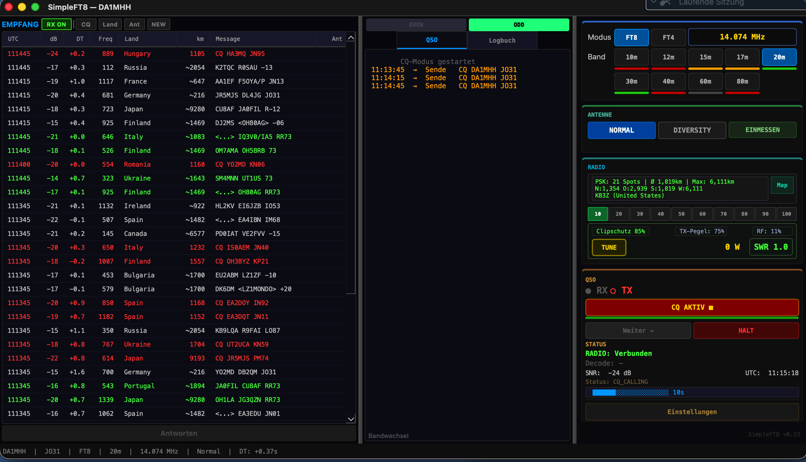
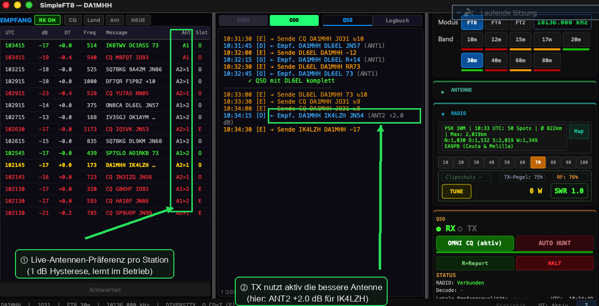
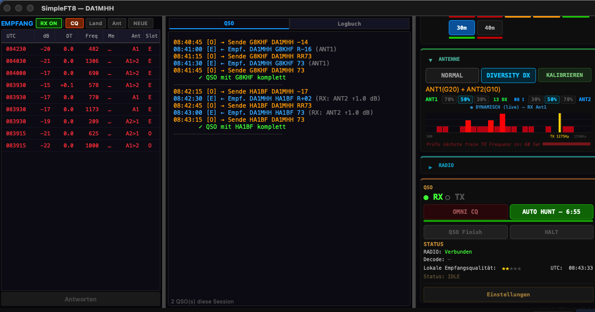
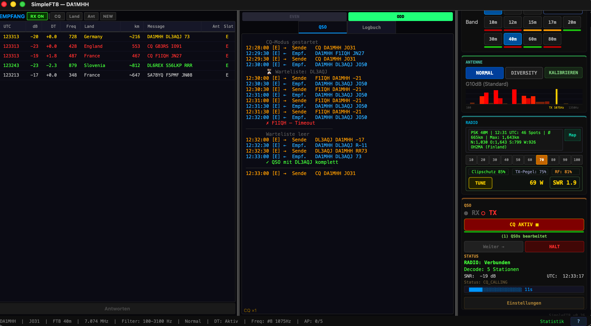
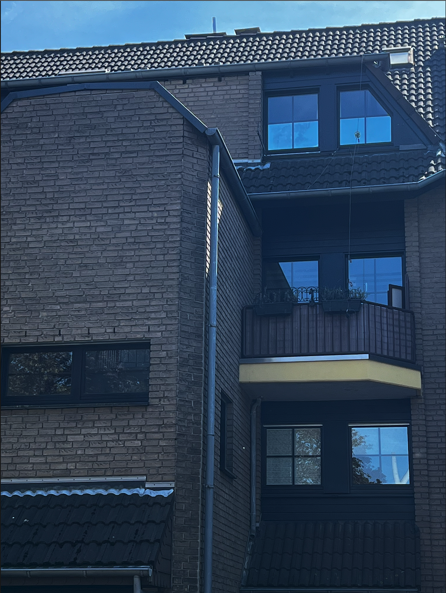
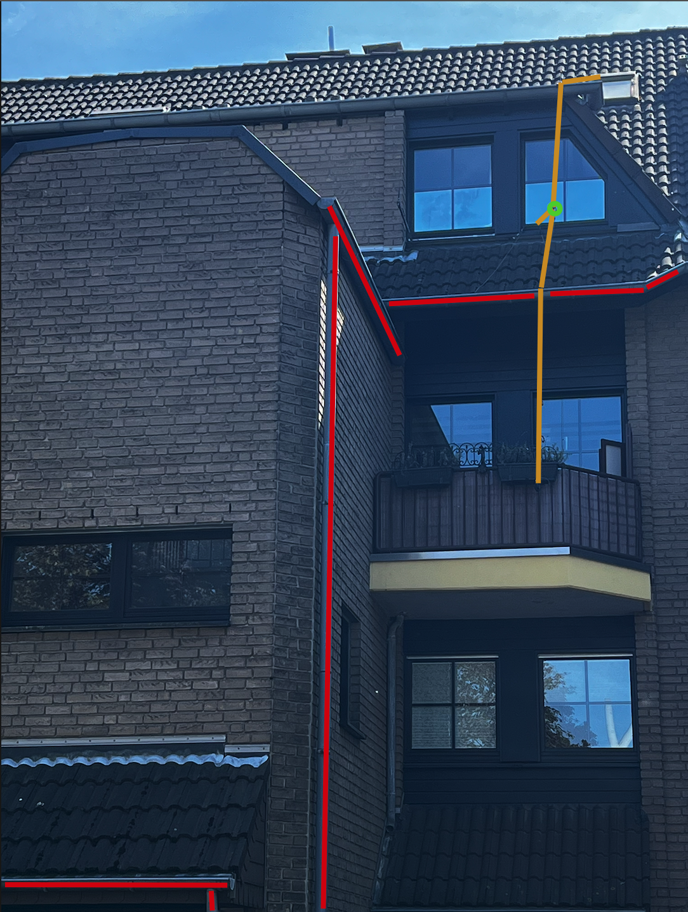
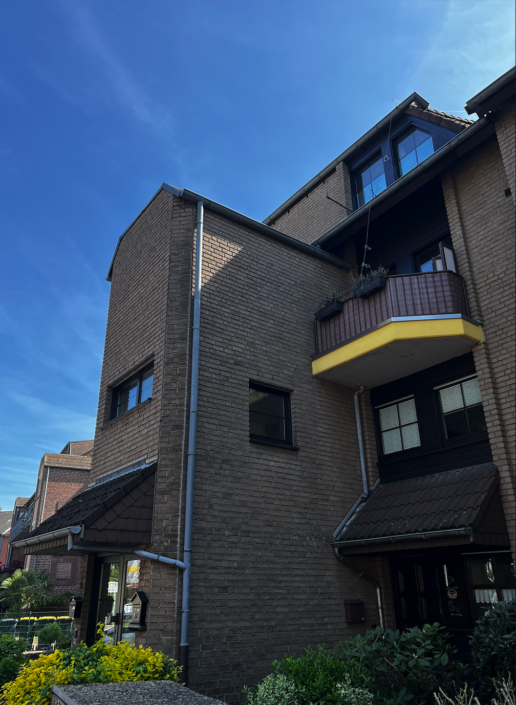
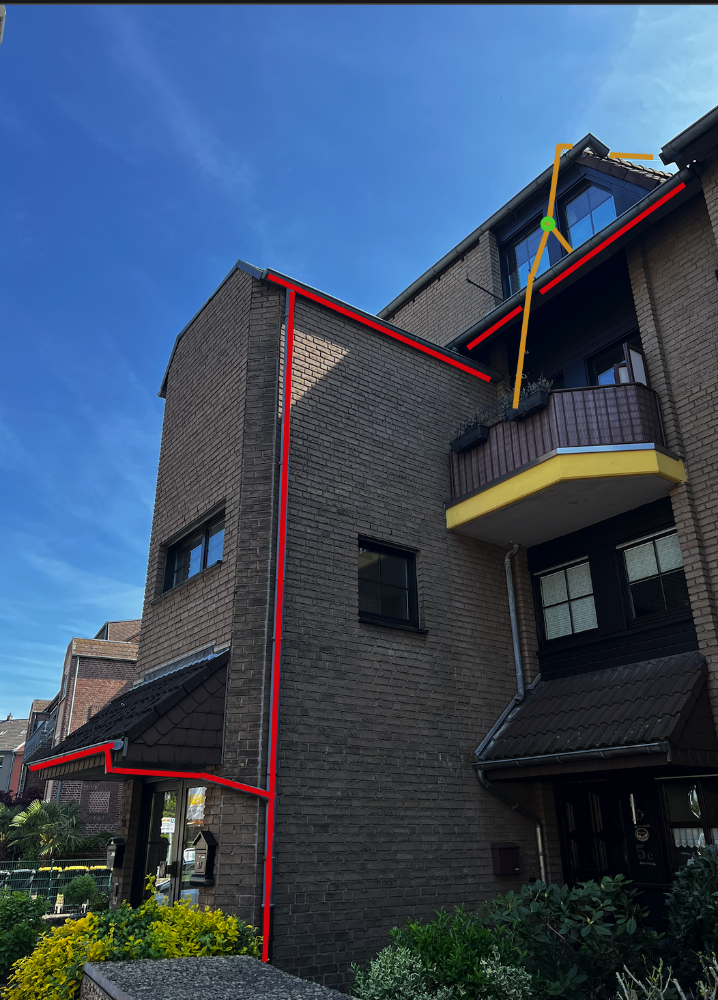

# SimpleFT8 — Diversity with One Signal Chain Unit (Feasibility Study)

[English](#english) | [Deutsch](#deutsch)

[](https://opensource.org/licenses/MIT)
[](https://www.python.org/downloads/)
[](https://www.apple.com/macos/)
[](https://www.physics.princeton.edu/pulsar/k1jt/wsjtx.html)
[]()

---

## TL;DR — Why does this exist?

**Does a working dual-antenna diversity system really require two SCUs in a FlexRadio
(€2000–3000 more for the second one)?**

**SimpleFT8 says: no.** One SCU + a second antenna that just has to *receive somehow*
— a gutter, a random wire, a balcony railing — gives real, measurable diversity gain.
In most real-world ham setups comparable to a two-SCU rig.

This is a **private feasibility study by DA1MHH** (Mike Hammerer), built together with
Claude (Anthropic) and DeepSeek as AI development partners. **Not a product. Not for
mass adoption. No tester recruitment.** The point is to show that **one SCU is enough**
— and that the algorithms inside (closed-loop TX power, temporal polarization diversity,
auto-gain per band, auto-CQ frequency) can be picked up by **WSJT-X, JTDX, MSHV, or
any other FT8 client**. MIT license. **Take the ideas. That's the entire point.**

📰 **Featured in CQ DL 6/2026** — see [CQ DL article note](#cq-dl-readers-note).

---

## English

### The Core Idea — Diversity Without the Second SCU

A real dual-antenna diversity system on FlexRadio needs **two Signal Chain Units (SCUs)**
to receive both antennas simultaneously. That second SCU costs **€2000–3000** at purchase
time. Most hams don't buy it.

SimpleFT8 simulates the effect with **one SCU** by switching ANT1 and ANT2 on a
per-cycle basis (Temporal Polarization Diversity), measuring SNR on both antennas and
weighting future cycles toward the better one. The result on Mike's station — a Kelemen
trap dipole running off-band on 40m, plus the **house gutter as a receive-only ANT2**:

**40m FT8 — 5–6 measurement days, 35,656 cycles:**

| Mode | Stations/15s (Pooled Mean) | vs Normal | 95% CI | Days | Cycles |
|------|:---:|:---:|:---:|:---:|:---:|
| Normal (ANT1 only) | 30.0 | — | — | 5 | 11,504 |
| Diversity Standard | 48.5 | **+62%** | +32 to +102% | 6 | 13,659 |
| Diversity DX | 40.8 | **+36%** | +11 to +70% | 5 | 10,493 |

*95% CIs via Block-Bootstrap over (date, hour) blocks, 5000 iterations, seed=42 —
captures intra-hour autocorrelation. Both Diversity modes have CIs entirely above 0
on the off-band 40m setup: statistically distinguishable from "no effect".*

**The honest caveat — on the resonant band (20m), the picture changes:**

| Mode | Stations/15s | vs Normal | 95% CI | Days | Cycles |
|------|:---:|:---:|:---:|:---:|:---:|
| Normal (resonant ANT1) | 47.8 | — | — | 8 | 11,088 |
| Diversity Standard | 46.2 | −3% | −14 to +10% | 9 | 14,672 |
| Diversity DX | 51.4 | +8% | −4 to +22% | 8 | 14,041 |

*CIs include 0 on 20m. When ANT1 is already resonant on the band, time-shared
Diversity costs some single-antenna decodes. The qualitative gain remains
(ANT2 wins 79–86% of direct dual-receives, +4 dB avg), but raw count is flat.*

**The twist — on 15m (also resonant), the gain comes back, and it's significant:**

| Mode | Stations/15s | vs Normal | 95% CI | Days | Cycles |
|------|:---:|:---:|:---:|:---:|:---:|
| Normal (resonant ANT1) | 26.8 | — | — | 5 | 10,895 |
| Diversity Standard | 35.1 | **+31%** | +2 to +67% | 7 | 11,496 |
| Diversity DX | 29.5 | +10% | −11 to +40% | 7 | 16,334 |

*On 15m the Standard CI is **entirely above 0** — statistically real, unlike flat 20m.
15m is the higher resonant band, and Faraday rotation scales with f²: shorter
wavelength → stronger polarization diversity. **The takeaway: even with ANT1 already
resonant, a plain house gutter as ANT2 still pulls in measurably more — on a resonant
band.** (When ANT2 wins a dual-receive it does so by +4.3 dB avg; DX's +10% still
includes 0 — not yet distinguishable.)*

**[See full statistics in `auswertung/`](auswertung/)** — automatically regenerated
from `statistics/` via `python3 scripts/generate_plots.py`.

### ANT2 — Can Be Anything That Receives

**This is the key part.** ANT2 is **receive-only**. No transmit, no SWR requirement,
no power handling, no matching network. Just clamp it on:

- 🏠 **House gutter** (Mike's setup — works surprisingly well)
- 🌳 **Random wire** thrown in the attic, into a tree, along a fence
- 🏢 **Balcony railing** (yes, the metal one, that's the point)
- 📡 **Old dipole in the attic** that's "not really good for anything"
- 🔌 **Second coax run** to anywhere you have a metallic object

> ⛔ **Hardware safety: ANT1 is always TX. ANT2 is NEVER TX.**
> ANT2 is not rated for transmit power. Sending 100 W into a non-matched gutter
> antenna may damage the PA's protection circuit, in the worst case the PA itself.
> The code hardcodes `set_tx_antenna("ANT1")` before every TX trigger; the Diversity
> RX-pattern (70:30 / 50:50 / 30:70) never assigns ANT2 as TX slot.

If you have **a resonant TX antenna and a wire / gutter / railing** lying around,
that's the typical use case. The Diversity layer makes the wire/gutter useful for
RX without needing to make it a proper antenna.

### The Four Algorithms — Free for Any FT8 Client to Adopt

These four algorithms are the **point of the study**. MIT license. **If you build
WSJT-X / JTDX / MSHV / your own FT8 client and want to integrate any of these:
please do.**

1. **Closed-Loop TX Power Regulation** — read FWDPWR from the radio, compare to
   target wattage, adjust drive level proportionally: `estimated = rfpower × (target / fwdpwr)`.
   No more manual ALC babysitting on band change, SWR drift, or PA temperature drift.
   Per-band calibration persisted. → [docs/explained/power-regulation.md](docs/explained/power-regulation.md)

2. **Temporal Polarization Diversity with 1 SCU** — switch ANT1/ANT2 per FT8 cycle,
   collect SNR scores, weight the better antenna 70:30 / 50:50 / 30:70 in subsequent
   cycles. Replaces a €2000–3000 second SCU. Two scoring strategies:
   *Standard* (total stations decoded) for CQ operation, *DX* (weak stations < −10 dB)
   for DX hunting. **Slot-by-slot adaptation** (v0.97+) — reacts to propagation changes
   within seconds, not 20 minutes. → [docs/explained/diversity-modes.md](docs/explained/diversity-modes.md)

3. **Auto-Gain Calibration per Band (Weather-Adaptive)** — during initial calibration,
   measure ANT1/ANT2 SNR over a fixed cycle count, store the ratio per band. Re-measure
   automatically when conditions change (rain on the antenna, snow, ice — all affect
   the gain ratio). No manual experimentation. → [docs/explained/gain-measurement.md](docs/explained/gain-measurement.md)

4. **Auto-CQ Frequency via Histogram** — analyse the spectrum, build a 50-Hz-bin
   histogram of decoded stations, find the widest free gap (≥ 150 Hz) in the
   dynamic search range (between lowest and highest active station). Set CQ frequency
   automatically. No waterfall needed — essential for radios without built-in display
   (e.g. FLEX-8400M headless). → [docs/explained/cq-frequency.md](docs/explained/cq-frequency.md)

**Bonus algorithms** that came along the way (also free for adoption):

- **Per-callsign antenna memory** — within an active QSO, RX path switches to whichever
  antenna heard the callsign best. Hysteresis 1 dB. Layers on top of global Diversity.
  *(I haven't seen this combination in any other FT8 client.)*
- **Caller Waitlist** — when multiple stations reply to CQ, queue them and serve sequentially.
- **DT Time Correction** — per-band+mode persistence, 70% damping, 2-cycle measurement.
- **Live Locator Mining** — extract Maidenhead grids from CQ/grid messages directly,
  persistent JSON cache survives restarts. Map shows exact positions, not country centroids.

### Architecture (Why It Works)

SimpleFT8 bypasses SmartSDR entirely. It talks **directly to the radio**:

- **VITA-49 UDP** for int16-mono 24 kHz audio streams (RX + TX)
- **TCP command channel (port 4992)** for radio control

No virtual sound cards (DAX), no SmartSDR panel, no GUI overhead. The FT8 decoder is
[`ft8_lib`](https://github.com/kgoba/ft8_lib) (MIT, by kgoba) extended with 5-pass
signal subtraction, spectral whitening, sinc anti-alias resampling, 50 LDPC iterations
— comparable to WSJT-X, runs on a normal MacBook.

```
SimpleFT8/
├── core/
│   ├── decoder.py / encoder.py     # FT8/FT4/FT2 decode + 5-pass subtraction
│   ├── qso_state.py                # Hunt + CQ + Waitlist state machine
│   ├── diversity.py                # Standard/DX scoring, 70:30 / 50:50
│   ├── diversity_merger.py         # ANT1+ANT2 merge, SNR-winner selection
│   ├── station_stats.py            # Async per-cycle logging → statistics/
│   ├── antenna_pref.py             # Per-callsign antenna preference
│   ├── locator_db.py               # Persistent Maidenhead cache (JSON)
│   ├── ntp_time.py                 # DT correction v2 (per-mode persistence)
│   ├── propagation.py              # HamQSL + time-of-day correction
│   └── bandpilot_md.py             # Hourly mode recommendation generator
├── radio/
│   └── flexradio.py                # SmartSDR TCP + VITA-49 + auto RX filter
├── ft8_lib/                        # C library (MIT, kgoba)
├── ui/                             # 3-panel layout (Empfang / QSO / Control)
├── scripts/generate_plots.py       # statistics/ → auswertung/ (PNG + PDF)
└── tests/                          # 1716 automated regression tests
```

### Quick Start

```bash
git clone https://github.com/mikewanne/SimpleFT8.git
cd SimpleFT8
python3 -m venv venv
source venv/bin/activate
pip install -r requirements.txt
python3 main.py
```

**Requirements:**
- macOS (developed and tested on macOS 15)
- Python 3.12+
- FlexRadio FLEX-6000 or FLEX-8000 series (field-tested: FLEX-8400M)
- Two antenna ports — TX-rated antenna on ANT1, anything-that-receives on ANT2

### Honest Limitations

- **One operator, one station, one antenna setup.** All statistics come from
  DA1MHH's rooftop (Kelemen DP-201510 on 20m/15m/10m, off-band on 40m/30m/17m;
  house gutter as ANT2). Numbers generalize physically but **not empirically**
  to other setups. Replicate before believing.
- **macOS-only, FlexRadio-only.** No Windows, no Linux, no ICOM/Yaesu/Kenwood
  (yet — `radio/base_radio.py` is the abstraction layer; IC-7300 stub exists).
  This is a deliberate choice: 1 developer, 1 hardware target, depth over breadth.
- **AI-assisted development.** Mike + Claude (Anthropic) + DeepSeek as a team.
  Architecture and bug reviews by both AIs in a V1→V2→R1→V3 workflow. 45 cycles
  with V4-pro reviews, 0 hallucinations caught in field — but the AI isn't sitting
  at the radio. **The operator is.**
- **Auto-Hunt is legally borderline in Germany.** § 13 AFuV regulates automated
  amateur stations. SimpleFT8 has a 10-min hard cap and 5-min mouse-inactivity
  timeout, but **the operator carries the legal responsibility**. WSJT-X and
  JTDX deliberately stop short of picking the next station — Auto-Hunt crosses
  that line on purpose, with documented caveats. Use only while actively
  watching the station.
- **Field bugs do happen.** 1716 unit tests catch regressions; the serious bugs
  (SIGBUS v0.97.38, OMNI-CQ phase v0.97.22, Auto-Hunt retry race v0.97.70) only
  showed up in real QSO sessions and were fixed there.

### CQ DL Readers Note

> 📰 **Article published in CQ DL 6/2026** — three details have evolved since
> the manuscript was finalized (~3 weeks before publication):
>
> - **Algorithm: UCB1 → dynamic per-slot scoring.** The article describes UCB1
>   (Upper Confidence Bound) with 80-cycle re-measurement (~20 min). We replaced
>   that in v0.97.19 with continuous per-slot SNR evaluation (15s reaction time
>   instead of 20 min). Same goal (explore vs. exploit), simpler code, smaller
>   bug surface.
> - **Diversity ratio adaptation:** follows from above — per-slot now, not per
>   80 cycles.
> - **Radio compatibility:** verified on FLEX-8400M. The VITA-49 / TCP API is
>   identical across FLEX-6000 and FLEX-8000 series, but only FLEX-8400M is
>   field-tested by the author.

### Detailed Feature Documentation

Every major feature has its own DE+EN explanation document. **20 features × 2
languages = 40 documents.**

| Feature | Deutsch | English |
|---------|---------|---------|
| Caller Waitlist | [waitlist_de.md](docs/explained/waitlist_de.md) | [waitlist.md](docs/explained/waitlist.md) |
| Per-Station Antenna Preference | [antenna-preference_de.md](docs/explained/antenna-preference_de.md) | [antenna-preference.md](docs/explained/antenna-preference.md) |
| Auto-Hunt | [auto-hunt_de.md](docs/explained/auto-hunt_de.md) | [auto-hunt.md](docs/explained/auto-hunt.md) |
| Bandpilot | [bandpilot_de.md](docs/explained/bandpilot_de.md) | [bandpilot.md](docs/explained/bandpilot.md) |
| CQ Frequency (Histogram) | [cq-frequency_de.md](docs/explained/cq-frequency_de.md) | [cq-frequency.md](docs/explained/cq-frequency.md) |
| Diversity Modes (Standard/DX) | [diversity-modes_de.md](docs/explained/diversity-modes_de.md) | [diversity-modes.md](docs/explained/diversity-modes.md) |
| DT Time Correction | [dt-correction_de.md](docs/explained/dt-correction_de.md) | [dt-correction.md](docs/explained/dt-correction.md) |
| DX Tuning (Antenna Measurement) | [dx-tuning_de.md](docs/explained/dx-tuning_de.md) | [dx-tuning.md](docs/explained/dx-tuning.md) |
| FT2 Mode (Decodium) | [ft2-mode_de.md](docs/explained/ft2-mode_de.md) | [ft2-mode.md](docs/explained/ft2-mode.md) |
| Gain Measurement | [gain-measurement_de.md](docs/explained/gain-measurement_de.md) | [gain-measurement.md](docs/explained/gain-measurement.md) |
| Live Locator Mining | [locator-mining_de.md](docs/explained/locator-mining_de.md) | [locator-mining.md](docs/explained/locator-mining.md) |
| Logbook & QRZ | [logbook_de.md](docs/explained/logbook_de.md) | [logbook.md](docs/explained/logbook.md) |
| OMNI-TX | [omni-tx_de.md](docs/explained/omni-tx_de.md) | [omni-tx.md](docs/explained/omni-tx.md) |
| Operator Presence | [operator-presence_de.md](docs/explained/operator-presence_de.md) | [operator-presence.md](docs/explained/operator-presence.md) |
| Power Regulation | [power-regulation_de.md](docs/explained/power-regulation_de.md) | [power-regulation.md](docs/explained/power-regulation.md) |
| Propagation Indicators | [propagation-indicators_de.md](docs/explained/propagation-indicators_de.md) | [propagation-indicators.md](docs/explained/propagation-indicators.md) |
| QSO Flow | [qso-flow_de.md](docs/explained/qso-flow_de.md) | [qso-flow.md](docs/explained/qso-flow.md) |
| Direction Map | [direction-map_de.md](docs/explained/direction-map_de.md) | [direction-map.md](docs/explained/direction-map.md) |
| Signal Processing | [signal-processing_de.md](docs/explained/signal-processing_de.md) | [signal-processing.md](docs/explained/signal-processing.md) |

### Screenshots

**CQ mode with DT correction, Propagation bars, PSKReporter spots:**



**Smart Antenna Selection — per-callsign antenna memory in action:**



**Auto-Hunt with Diversity active:**



**Caller Waitlist:**



### Antenna Setup (Reference)

| Photo | Annotated |
|:-----:|:---------:|
|  |  |
|  |  |

**ANT1:** Kelemen DP-201510 trap dipole (20m/15m/10m resonant, off-band on 40m/30m/17m via tuner).
**ANT2:** House gutter, L-shape ~15m, never installed as antenna — just clamped on.

### License & Credits

**MIT License** (c) 2026 DA1MHH (Mike Hammerer) — full text in [LICENSE](LICENSE).

**Project Team:**
- **Mike Hammerer, DA1MHH** — idea, concept, hardware, field testing, final decisions
- **Claude Opus / Claude Sonnet (Anthropic)** — architecture, algorithm implementation, security reviews
- **DeepSeek-R1** — code reviews, bug hunting, design discussions, second opinion

**External components:**
- `ft8_lib` C library (MIT) by kgoba — FT8/FT4/FT2 decode core
- HamQSL.com — solar / propagation indicators
- PSKReporter — RX/TX spot data

**The point of MIT licensing this project:** if you write FT8 software (WSJT-X,
JTDX, MSHV, or your own client), and want to integrate any of the 4 core algorithms
or the bonus features — please do. Attribution required, that's all.

---

> ⚠️ **Disclaimer / Haftungsausschluss**
>
> *EN:* SimpleFT8 is a private feasibility study and personal hobby project.
> Use at your own risk. No liability is accepted for damage to hardware (radio,
> PA, antennas), data loss, or regulatory violations. The software is provided
> "AS IS" without warranty of any kind — see [LICENSE](LICENSE) (MIT) for full
> terms.
>
> *DE:* SimpleFT8 ist eine private Machbarkeitsstudie und ein persönliches
> Hobby-Projekt. Nutzung auf eigene Gefahr. Es wird keine Haftung übernommen
> für Schäden an Hardware (Funkgerät, PA, Antennen), Datenverlust oder
> regulatorische Verstöße. Die Software wird "AS IS" ohne jegliche Garantie
> bereitgestellt — siehe [LICENSE](LICENSE) (MIT) für vollständige Bedingungen.

---

<a name="deutsch"></a>
## Deutsch

### Die Kernidee — Diversity ohne die zweite SCU

Ein echtes Zwei-Antennen-Diversity-System am FlexRadio braucht **zwei Signal
Chain Units (SCUs)**, um beide Antennen gleichzeitig empfangen zu können. Diese
zweite SCU kostet beim Kauf **2000–3000 €**. Die meisten Funkamateure leisten
sich das nicht.

SimpleFT8 simuliert den Effekt mit **einer SCU**, indem es ANT1 und ANT2 pro
FT8-Zyklus abwechselt (Temporal Polarization Diversity), SNR-Scores beider
Antennen sammelt und die folgenden Zyklen zugunsten der besseren Antenne
gewichtet. Das Ergebnis auf Mike's Station — Kelemen-Trap-Dipol, auf 40m
außerhalb des Auslegungsbandes über Tuner, plus **Regenrinne als reine
Empfangs-ANT2**:

**40m FT8 — 5–6 Messtage, 35.656 Zyklen:**

| Modus | Stationen/15s (Pooled Mean) | vs Normal | 95% CI | Tage | Zyklen |
|-------|:---:|:---:|:---:|:---:|:---:|
| Normal (nur ANT1) | 30,0 | — | — | 5 | 11.504 |
| Diversity Standard | 48,5 | **+62%** | +32 bis +102% | 6 | 13.659 |
| Diversity DX | 40,8 | **+36%** | +11 bis +70% | 5 | 10.493 |

*95%-CIs via Block-Bootstrap über (Datum, Stunde)-Blöcke, 5000 Iterationen,
seed=42. Beide Diversity-Modi haben CIs komplett über 0 auf dem off-band-40m-
Setup: statistisch von „kein Effekt" unterscheidbar.*

**Die ehrliche Einschränkung — auf dem Auslegungsband (20m) sieht das anders aus:**

| Modus | Stationen/15s | vs Normal | 95% CI | Tage | Zyklen |
|-------|:---:|:---:|:---:|:---:|:---:|
| Normal (resonante ANT1) | 47,8 | — | — | 8 | 11.088 |
| Diversity Standard | 46,2 | −3% | −14 bis +10% | 9 | 14.672 |
| Diversity DX | 51,4 | +8% | −4 bis +22% | 8 | 14.041 |

*CIs enthalten 0 auf 20m. Wenn ANT1 bereits auf dem Band resonant ist, kostet
das Time-Sharing Diversity einige Single-Antenna-Decodes. Der qualitative
Gewinn bleibt (ANT2 gewinnt 79–86% der direkten Doppel-Empfänge, +4 dB
Durchschnitt), aber der absolute Stations-Count ist flach.*

**Der Clou — auf 15m (ebenfalls resonant) kommt der Gewinn zurück, und zwar signifikant:**

| Modus | Stationen/15s | vs Normal | 95% CI | Tage | Zyklen |
|-------|:---:|:---:|:---:|:---:|:---:|
| Normal (resonante ANT1) | 26,8 | — | — | 5 | 10.895 |
| Diversity Standard | 35,1 | **+31%** | +2 bis +67% | 7 | 11.496 |
| Diversity DX | 29,5 | +10% | −11 bis +40% | 7 | 16.334 |

*Auf 15m liegt das Standard-CI **komplett über 0** — statistisch echt, anders als auf
dem flachen 20m. 15m ist das höhere resonante Band, und die Faraday-Rotation skaliert
mit f²: kürzere Wellenlänge → stärkere Polarisations-Diversity. **Die Kernaussage: selbst
wenn ANT1 schon resonant ist, holt eine simple Regenrinne als ANT2 noch messbar mehr
heraus — auf einem Auslegungsband.** (Gewinnt ANT2 einen Doppel-Empfang, dann im Schnitt
mit +4,3 dB; DX's +10% schließt 0 noch ein — noch nicht unterscheidbar.)*

**[Vollständige Statistiken in `auswertung/`](auswertung/)** — automatisch
neu generiert aus `statistics/` via `python3 scripts/generate_plots.py`.

### ANT2 — Kann alles sein was empfängt

**Das ist der zentrale Punkt.** ANT2 ist **nur Empfang**. Kein Senden, keine
SWR-Anforderung, keine Leistungsfestigkeit, keine Anpassung. Einfach
draufklemmen:

- 🏠 **Dachrinne** (Mike's Setup — funktioniert erstaunlich gut)
- 🌳 **Wurfantenne** auf den Dachboden, in einen Baum, an einem Zaun entlang
- 🏢 **Balkongeländer** (ja, das metallene, genau das ist der Punkt)
- 📡 **Alter Dipol auf dem Dachboden**, der „nicht mehr richtig taugt"
- 🔌 **Zweites Koax-Kabel** zu irgendeinem metallischen Gegenstand

> ⛔ **Hardware-Sicherheit: ANT1 ist immer TX. ANT2 ist NIEMALS TX.**
> ANT2 ist nicht für Sendeleistung ausgelegt. 100 W auf eine nicht-angepasste
> Regenrinne kann die PA-Schutzschaltung auslösen, im schlimmsten Fall die PA
> selbst beschädigen. Der Code verriegelt `set_tx_antenna("ANT1")` vor jedem
> TX-Trigger; das Diversity-RX-Pattern (70:30 / 50:50 / 30:70) weist NIE
> ANT2 als TX-Slot zu.

Wenn du **eine resonante TX-Antenne und einen Draht / eine Regenrinne / ein
Geländer** rumliegen hast, ist das der typische Anwendungsfall. Die
Diversity-Schicht macht den Draht/die Regenrinne nutzbar für RX, ohne dass
du daraus eine „richtige" Antenne machen musst.

### Die vier Algorithmen — frei zur Übernahme in jeden FT8-Client

Diese vier Algorithmen sind der **eigentliche Punkt der Studie**. MIT-Lizenz.
**Wenn du WSJT-X / JTDX / MSHV / einen eigenen FT8-Client baust und einen davon
integrieren willst: bitte gerne.**

1. **Closed-Loop TX-Leistungsregelung** — FWDPWR vom Radio lesen, mit
   Zielwattzahl vergleichen, Drive-Level proportional anpassen:
   `estimated = rfpower × (target / fwdpwr)`. Kein manuelles ALC-Babysitten
   mehr bei Bandwechsel, SWR-Drift, PA-Temperaturdrift. Pro Band gespeichert.
   → [docs/explained/power-regulation_de.md](docs/explained/power-regulation_de.md)

2. **Temporal Polarization Diversity mit 1 SCU** — ANT1/ANT2 pro FT8-Zyklus
   wechseln, SNR-Scores sammeln, die bessere Antenne mit 70:30 / 50:50 / 30:70
   in folgenden Zyklen gewichten. Ersetzt eine 2000–3000 € zweite SCU. Zwei
   Scoring-Strategien: *Standard* (Gesamtstationen dekodiert) für CQ-Betrieb,
   *DX* (schwache Stationen < −10 dB) für DX-Jagd. **Slot-für-Slot-Anpassung**
   (v0.97+) — reagiert auf Ausbreitungsänderungen in Sekunden, nicht 20 Minuten.
   → [docs/explained/diversity-modes_de.md](docs/explained/diversity-modes_de.md)

3. **Auto-Gain-Einmessung pro Band (Wetter-adaptiv)** — bei der initialen
   Kalibrierung ANT1/ANT2-SNR über eine feste Zyklenzahl messen, das Verhältnis
   pro Band speichern. Automatisch neu messen, wenn sich Bedingungen ändern
   (Regen, Schnee, Eis auf der Antenne — alles beeinflusst das Gain-Verhältnis).
   Kein manuelles Experimentieren. → [docs/explained/gain-measurement_de.md](docs/explained/gain-measurement_de.md)

4. **Auto-CQ-Frequenz per Histogramm** — Spektrum analysieren, 50-Hz-Bin-
   Histogramm der dekodierten Stationen aufbauen, die breiteste freie Lücke
   (≥ 150 Hz) im dynamischen Suchbereich finden (zwischen niedrigster und
   höchster aktiver Station). CQ-Frequenz automatisch setzen. Kein Wasserfall
   nötig — essentiell für Radios ohne eingebautes Display (z.B. FLEX-8400M
   headless). → [docs/explained/cq-frequency_de.md](docs/explained/cq-frequency_de.md)

**Bonus-Algorithmen** die unterwegs entstanden sind (auch frei zur Übernahme):

- **Per-Callsign-Antennen-Gedächtnis** — innerhalb eines aktiven QSOs schaltet
  der RX-Pfad auf die Antenne, die das Rufzeichen am besten gehört hat.
  Hysterese 1 dB. Liegt als Schicht über der globalen Diversity.
  *(Ich habe diese Kombination in keinem anderen FT8-Client gesehen.)*
- **Caller Waitlist** — wenn mehrere Stationen auf CQ antworten, in Queue
  einreihen und nacheinander bedienen.
- **DT-Zeit-Korrektur** — pro Band+Modus persistiert, 70% Dämpfung,
  2-Zyklen-Messung.
- **Live-Locator-Mining** — Maidenhead-Grids direkt aus CQ-/Grid-Nachrichten
  extrahieren, persistenter JSON-Cache übersteht Neustarts. Karte zeigt exakte
  Positionen, keine Länder-Schwerpunkte.

### Architektur (warum es funktioniert)

SimpleFT8 umgeht SmartSDR komplett. Es spricht **direkt mit dem Radio**:

- **VITA-49 UDP** für int16-Mono 24 kHz Audiostreams (RX + TX)
- **TCP-Befehlskanal (Port 4992)** für Radio-Steuerung

Keine virtuellen Soundkarten (DAX), kein SmartSDR-Panel, kein GUI-Overhead.
Der FT8-Decoder ist [`ft8_lib`](https://github.com/kgoba/ft8_lib) (MIT, von
kgoba) erweitert um 5-Pass-Signal-Subtraction, Spectral Whitening, Sinc-Anti-
Alias-Resampling, 50 LDPC-Iterationen — vergleichbar mit WSJT-X, läuft auf
einem normalen MacBook.

### Schnellstart

```bash
git clone https://github.com/mikewanne/SimpleFT8.git
cd SimpleFT8
python3 -m venv venv
source venv/bin/activate
pip install -r requirements.txt
python3 main.py
```

**Voraussetzungen:**
- macOS (entwickelt und getestet auf macOS 15)
- Python 3.12+
- FlexRadio FLEX-6000 oder FLEX-8000 Serie (feldgetestet: FLEX-8400M)
- Zwei Antennenanschlüsse — TX-fähige Antenne auf ANT1, irgendwas-das-empfängt auf ANT2

### Ehrliche Grenzen

- **Ein Operator, eine Station, eine Antennenkonfiguration.** Alle Statistiken
  kommen aus DA1MHH's Dach (Kelemen DP-201510 auf 20m/15m/10m, off-band auf
  40m/30m/17m; Hausregenrinne als ANT2). Die Zahlen verallgemeinern sich
  physikalisch, aber **nicht empirisch** auf andere Setups. Nachprüfen vor
  Glauben.
- **macOS-only, FlexRadio-only.** Kein Windows, kein Linux, keine
  ICOM/Yaesu/Kenwood (noch — `radio/base_radio.py` ist die Abstraktionsschicht,
  ein IC-7300-Stub existiert). Bewusste Entscheidung: 1 Entwickler, 1 Hardware-
  Ziel, Tiefe statt Breite.
- **KI-assistierte Entwicklung.** Mike + Claude (Anthropic) + DeepSeek als
  Team. Architektur und Bug-Reviews durch beide KIs in einem V1→V2→R1→V3-
  Workflow. 45 Cycles mit V4-pro-Reviews, 0 Halluzinationen im Feld gefangen
  — aber die KI sitzt nicht am Funkgerät. **Der Operator schon.**
- **Auto-Hunt ist in Deutschland juristisch grenzwertig.** § 13 AFuV regelt
  automatisierte Amateurstationen. SimpleFT8 hat 10-Min-Hard-Cap und 5-Min-
  Maus-Inaktivitäts-Timeout, aber **die rechtliche Verantwortung trägt der
  Operator**. WSJT-X und JTDX hören bewusst vor dem automatischen Picken der
  nächsten Station auf — Auto-Hunt überschreitet diese Linie absichtlich, mit
  dokumentierten Vorbehalten. Nur unter aktiver Beobachtung der Station nutzen.
- **Feld-Bugs passieren.** 1716 Unit-Tests fangen Regressionen ab; die ernsten
  Bugs (SIGBUS v0.97.38, OMNI-CQ-Phase v0.97.22, Auto-Hunt-Retry-Race v0.97.70)
  zeigten sich erst in echten QSO-Sessions und wurden dort behoben.

### Hinweis für CQ-DL-Leser

> 📰 **Artikel veröffentlicht in CQ DL 6/2026** — drei Details haben sich
> seit Manuskript-Abgabe entwickelt (~3 Wochen vor Erscheinen):
>
> - **Algorithmus: UCB1 → dynamisches Pro-Slot-Scoring.** Der Artikel
>   beschreibt UCB1 (Upper Confidence Bound) mit 80-Zyklen-Neueinmessung
>   (~20 Min). Wir haben das in v0.97.19 durch kontinuierliche Pro-Slot-
>   SNR-Bewertung ersetzt (15s Reaktionszeit statt 20 Min). Gleiches Ziel
>   (Explore vs. Exploit), einfacherer Code, kleinere Bug-Oberfläche.
> - **Diversity-Verhältnis-Anpassung:** folgt aus oben — pro Slot statt
>   alle 80 Zyklen.
> - **Funkgeräte-Kompatibilität:** verifiziert auf FLEX-8400M. Die VITA-49 /
>   TCP-API ist über FLEX-6000- und FLEX-8000-Serie identisch, aber nur
>   FLEX-8400M ist feldgetestet vom Autor.

### Lizenz & Credits

**MIT-Lizenz** (c) 2026 DA1MHH (Mike Hammerer) — vollständiger Text in [LICENSE](LICENSE).

**Projekt-Team:**
- **Mike Hammerer, DA1MHH** — Idee, Konzept, Hardware, Feldtests, finale Entscheidungen
- **Claude Opus / Claude Sonnet (Anthropic)** — Architektur, Algorithmus-Implementierung, Security-Reviews
- **DeepSeek-R1** — Code-Reviews, Bug-Suche, Design-Diskussionen, zweite Meinung

**Externe Komponenten:**
- `ft8_lib` C-Bibliothek (MIT) von kgoba — FT8/FT4/FT2 Decode-Kern
- HamQSL.com — Solar- / Ausbreitungsdaten
- PSKReporter — RX/TX-Spot-Daten

**Der Punkt der MIT-Lizenzierung:** wenn du FT8-Software schreibst (WSJT-X,
JTDX, MSHV oder eigenen Client) und einen der 4 Kern-Algorithmen oder die
Bonus-Features integrieren willst — bitte gerne. Namensnennung erforderlich,
das ist alles.

---

*73 de DA1MHH — Mike Hammerer*
