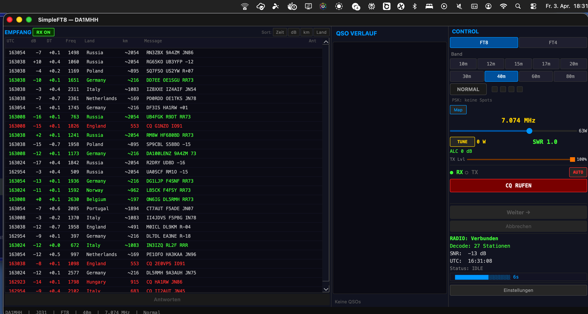

# Temporal Polarization Diversity

[Back to README](../README.md) | [DX Tuning](DX_TUNING.md) | [Power Regulation](POWER_REGULATION.md)

## The Idea

FT8 uses 15-second receive cycles. In each cycle, the decoder has exactly one chance to capture what's on the air. If your antenna happens to be in a fade at that moment, you miss stations that were perfectly decodable — you just weren't listening with the right antenna.

SimpleFT8 uses both antenna ports of the FlexRadio and switches between them every cycle. Stations decoded on ANT1 and ANT2 are accumulated into a single list. If a station appears on both antennas, the better SNR is kept.

This is not a new idea in RF engineering — temporal diversity is well established. What's new is applying it to FT8's fixed 15-second cycle structure, where the switching cost is zero (you lose nothing by switching between cycles).

## How It Works

1. **Cycle N** (even): Receive on ANT1, decode, add stations to list
2. **Cycle N+1** (odd): Receive on ANT2, decode, add new stations, update SNR for known ones
3. **Repeat**: The accumulated list grows with stations from both antennas

Each station in the RX panel shows which antenna decoded it:
- **A1** — only heard on ANT1
- **A2** — only heard on ANT2
- **A1>2** — heard on both, ANT1 had better SNR
- **A2>1** — heard on both, ANT2 had better SNR

Stations age out after 2 minutes of no contact.

## UCB1 Adaptive Ratio

In AUTO mode, SimpleFT8 doesn't always alternate 50:50. It uses the UCB1 (Upper Confidence Bound) algorithm — a multi-armed bandit approach — to find the optimal ratio.

If ANT1 consistently delivers more stations, the ratio shifts toward 70:30 (7 cycles ANT1, 3 cycles ANT2). If both perform equally, it stays at 50:50. The exploration bonus ensures the weaker antenna still gets tested regularly, so the system adapts when conditions change.

After 80 cycles (~20 minutes), the system re-measures automatically.

**Why not just pick the better antenna and stay on it?**
Because "better" changes. Ionospheric fading, wind moving antennas, local noise sources — what was the better antenna 5 minutes ago might not be now. UCB1 balances exploitation (use the currently better antenna more) with exploration (keep checking the other one).

## Measured Results

Controlled test on 40m, 3 April 2026, FlexRadio FLEX-8400M, same antennas (ANT1 + ANT2), 2 minutes apart:

| Mode | Stations | Time (UTC) |
|------|:---:|:---:|
| Normal (ANT1 only) | 27 | 16:31 |
| Diversity (ANT1+ANT2) | 37 | 16:33 |

**+37% more stations** with diversity, same hardware, near-identical conditions.

### Normal Mode — 27 Stations

### Diversity Mode — 37 Stations

Note the Ant column on the right: A1, A2, A1>2, A2>1 — showing which antenna contributed each station. Several stations (e.g., Kazakhstan at 4323 km) were only decoded via one specific antenna.

## What You Need

- Any FlexRadio with two antenna ports (works on single-SCU models too)
- Two antennas (can be very different — wire + vertical, beam + loop, etc.)
- SimpleFT8 handles antenna switching via the SmartSDR API

## Limitations

- Only works during RX cycles — TX always uses the antenna selected by the radio
- The improvement depends on how different your antennas are. Two identical antennas on the same mast won't help much
- Best results when antennas have different polarization, height, or orientation
