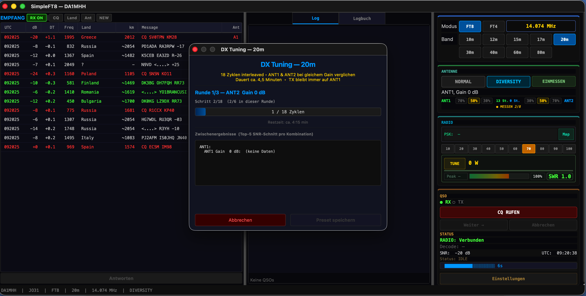
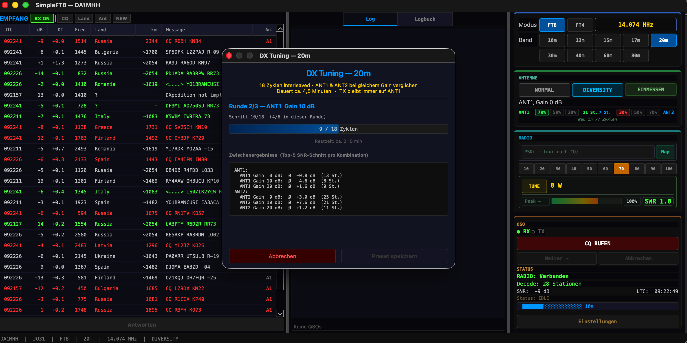

# DX Tuning — Automatic Gain Measurement

[Back to README](../README.md) | [Diversity](DIVERSITY.md) | [Power Regulation](POWER_REGULATION.md)

## The Problem

Every antenna performs differently on every band. The preamp gain that works well on 20m might add too much noise on 40m. And what worked yesterday might not work today — rain on the feedpoint, wet ground, atmospheric conditions, even temperature can shift the optimal settings.

Most operators set their preamp once and forget about it. They're leaving performance on the table.

## What DX Tuning Does

SimpleFT8's DX Tuning runs an automated measurement across both antennas at multiple gain settings. It takes about 4.5 minutes (18 FT8 cycles) and produces a clear recommendation: which antenna at which gain setting gives the best reception on this band, right now.

The results are saved as presets per band. Next time you switch to 20m, the optimal settings are loaded instantly.

## How It Works

1. Click **EINMESSEN** in the Antenna panel
2. SimpleFT8 runs 3 rounds of 6 cycles each (18 cycles total)
3. Each round tests a different gain setting (0 dB, 10 dB, 20 dB)
4. Within each round, cycles alternate between ANT1 and ANT2
5. For each combination (antenna + gain), the average SNR and station count are recorded
6. After all 18 cycles, the best combination is displayed

### Measurement Start


### Measurement Results


In this 20m measurement, the results were:

| Antenna | Gain 0 dB | Gain 10 dB | Gain 20 dB |
|---------|:---------:|:----------:|:----------:|
| ANT1 | -0.8 dB avg (13 St.) | -4.6 dB avg (8 St.) | +1.6 dB avg (9 St.) |
| ANT2 | **+3.0 dB avg (25 St.)** | +7.6 dB avg (21 St.) | +1.2 dB avg (11 St.) |

Winner: ANT2 at 0 dB gain — best average SNR with the most stations.

## Per-Band Presets

After measurement, the optimal settings are saved:

```
20m: ANT2, Gain 0 dB (measured 2026-04-04 11:50)
40m: ANT1, Gain 20 dB (measured 2026-04-04 14:46)
```

When you switch bands, SimpleFT8 automatically loads the preset and configures the radio. No manual adjustment needed.

## When to Re-Measure

- After significant weather changes (rain, storm)
- When you change antenna hardware
- Seasonally (propagation paths shift)
- When reception seems worse than usual

The measurement only takes 4.5 minutes and runs in the background while you continue receiving. You can abort at any time.

## Technical Details

- Measurement is interleaved: ANT1 and ANT2 alternate within each gain round to minimize the effect of changing propagation during the test
- SNR is calculated as the average of the top-5 decoded stations per combination
- Station count is a secondary metric — more stations at similar SNR confirms the measurement
- TX stays on ANT1 throughout the measurement (only RX antenna switches)
- The radio's `rfgain` parameter is set via SmartSDR API for each step
